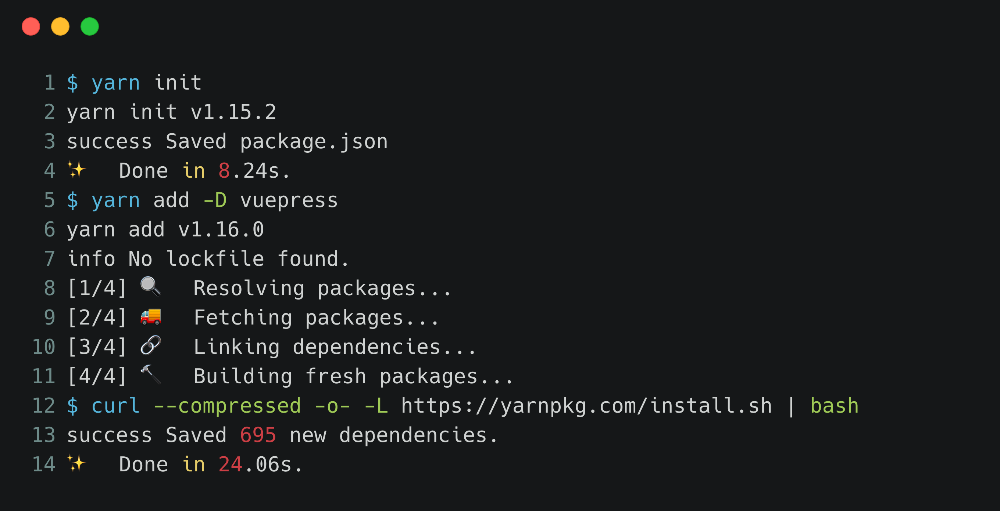
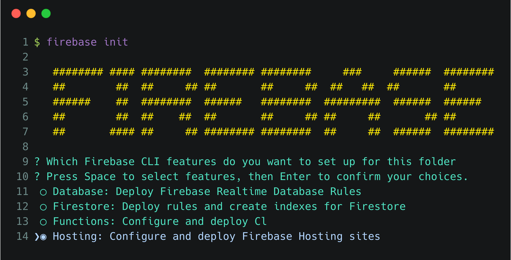
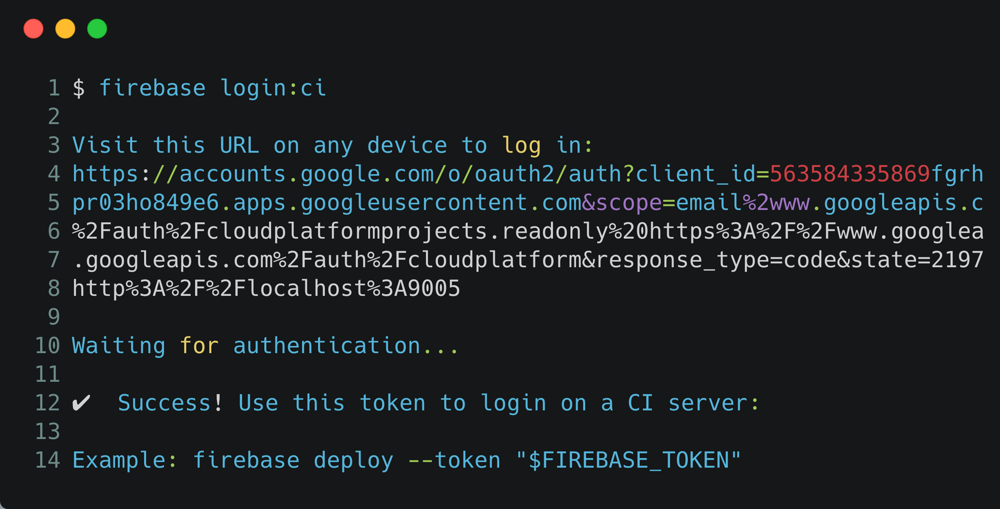

	

		<!--Left Col-->
		

    
ENHANCE ANY WEBSITE WITH JAMSTACK

			<h1 class="text-5xl font-bold leading-tight text-white">Webマニュアル30分クッキング</h1>
			
MarkdownにJAMstackを添えて

      <a href="./contents">
			<button class="mx-auto lg:mx-0 bg-yellow hover:bg-yellow-dark  text-black font-bold rounded-full z-10 mb-8 py-3 px-6 shadow-lg">Get Started</button>
      </a>
		

		<!--Right Col-->
		

			
		

	

	<svg viewBox="0 0 1428 174" version="1.1" xmlns="http://www.w3.org/2000/svg" xmlns:xlink="http://www.w3.org/1999/xlink">
	<g stroke="none" stroke-width="1" fill="none" fill-rule="evenodd">
	<g transform="translate(-2.000000, 44.000000)" fill="#FFFFFF" fill-rule="nonzero">
	<path d="M0,0 C90.7283404,0.927527913 147.912752,27.187927 291.910178,59.9119003 C387.908462,81.7278826 543.605069,89.334785 759,82.7326078 C469.336065,156.254352 216.336065,153.6679 0,74.9732496" opacity="0.100000001"></path>
	<path d="M100,104.708498 C277.413333,72.2345949 426.147877,52.5246657 546.203633,45.5787101 C666.259389,38.6327546 810.524845,41.7979068 979,55.0741668 C931.069965,56.122511 810.303266,74.8455141 616.699903,111.243176 C423.096539,147.640838 250.863238,145.462612 100,104.708498 Z" opacity="0.100000001"></path>
	<path d="M1046,51.6521276 C1130.83045,29.328812 1279.08318,17.607883 1439,40.1656806 L1439,120 C1271.17211,77.9435312 1140.17211,55.1609071 1046,51.6521276 Z" id="Path-4" opacity="0.200000003"></path>
	</g>
	<g transform="translate(-4.000000, 76.000000)" fill="#FFFFFF" fill-rule="nonzero">
	<path d="M0.457,34.035 C57.086,53.198 98.208,65.809 123.822,71.865 C181.454,85.495 234.295,90.29 272.033,93.459 C311.355,96.759 396.635,95.801 461.025,91.663 C486.76,90.01 518.727,86.372 556.926,80.752 C595.747,74.596 622.372,70.008 636.799,66.991 C663.913,61.324 712.501,49.503 727.605,46.128 C780.47,34.317 818.839,22.532 856.324,15.904 C922.689,4.169 955.676,2.522 1011.185,0.432 C1060.705,1.477 1097.39,3.129 1121.236,5.387 C1161.703,9.219 1208.621,17.821 1235.4,22.304 C1285.855,30.748 1354.351,47.432 1440.886,72.354 L1441.191,104.352 L1.121,104.031 L0.457,34.035 Z"></path>
	</g>
	</g>
	</svg>

<section class="bg-white border-b py-8">
	

		<h1 class="w-full text-5xl font-bold leading-tight text-center">VALUE</h1>
		
	
			

		

		

			

				<h3 class="text-3xl text-grey-darkest font-bold leading-none mb-3">もっと早く</h3>
				
Webサイトの読み込みに3秒以上かかると、53％の閲覧者が離脱します。Webサイトのパフォーマンスはコンテンツの品質と同様に重要な要素です。またWebサイト構築にかかるリードタイムの短さも大事な要素です。Webページ閲覧の「速さ」と構築の「早さ」の両方を実現する技術がJAMstackです。

			

			

				<svg class="w-full sm:h-64 mx-auto" viewBox="0 0 926 749"><title>to_the_moon</title><circle cx="237.90496" cy="226.93548" r="83.97916" fill="#ff6584"/><path d="M1063,276.46V497.34a325.99128,325.99128,0,0,1-326,326H137V602.46c0-118.03,62.73-221.42,156.68-278.63a323.57742,323.57742,0,0,1,50.88-25.18,320.09024,320.09024,0,0,1,31.76-10.53c.21-.07.43-.13.64-.18q4.77-1.305,9.6-2.46c.18-.05.35-.09.53-.13a326.11582,326.11582,0,0,1,60.47-8.53c2.41-.11005,4.82-.2,7.25-.25.87-.03,1.75-.05,2.64-.05q2.76-.06,5.55-.06Z" transform="translate(-137 -75.5)" fill="#3f3d56"/><path d="M569,681c-238.0863,0-431.181,64.20129-431.99048,143.5h863.981C1000.18091,745.20129,807.0863,681,569,681Z" transform="translate(-137 -75.5)" fill="#f2f2f2"/><g opacity="0.1"><ellipse cx="352" cy="692" rx="80" ry="22.22222"/></g><g opacity="0.1"><ellipse cx="525" cy="652" rx="80" ry="22.22222"/></g><g opacity="0.1"><ellipse cx="352" cy="692" rx="72" ry="20"/></g><g opacity="0.1"><ellipse cx="525" cy="652" rx="72" ry="20"/></g><circle cx="138" cy="290" r="7" fill="#f2f2f2"/><circle cx="740" cy="564" r="7" fill="#f2f2f2"/><circle cx="410" cy="339" r="7" fill="#f2f2f2"/><circle cx="757" cy="297" r="4" fill="#ff6584"/><circle cx="154" cy="497" r="4" fill="#ff6584"/><polygon points="94 581.322 92.178 581.322 92.178 579.5 91.822 579.5 91.822 581.322 90 581.322 90 581.678 91.822 581.678 91.822 583.5 92.178 583.5 92.178 581.678 94 581.678 94 581.322" fill="#f2f2f2"/><polygon points="679 433.322 677.178 433.322 677.178 431.5 676.822 431.5 676.822 433.322 675 433.322 675 433.678 676.822 433.678 676.822 435.5 677.178 435.5 677.178 433.678 679 433.678 679 433.322" fill="#f2f2f2"/><polygon points="830 403.322 828.178 403.322 828.178 401.5 827.822 401.5 827.822 403.322 826 403.322 826 403.678 827.822 403.678 827.822 405.5 828.178 405.5 828.178 403.678 830 403.678 830 403.322" fill="#f2f2f2"/><polygon points="505 483.322 503.178 483.322 503.178 481.5 502.822 481.5 502.822 483.322 501 483.322 501 483.678 502.822 483.678 502.822 485.5 503.178 485.5 503.178 483.678 505 483.678 505 483.322" fill="#f2f2f2"/><polygon points="786 493.322 784.178 493.322 784.178 491.5 783.822 491.5 783.822 493.322 782 493.322 782 493.678 783.822 493.678 783.822 495.5 784.178 495.5 784.178 493.678 786 493.678 786 493.322" fill="#f2f2f2"/><polygon points="447 536.322 445.178 536.322 445.178 534.5 444.822 534.5 444.822 536.322 443 536.322 443 536.678 444.822 536.678 444.822 538.5 445.178 538.5 445.178 536.678 447 536.678 447 536.322" fill="#f2f2f2"/><polygon points="575 538.322 573.178 538.322 573.178 536.5 572.822 536.5 572.822 538.322 571 538.322 571 538.678 572.822 538.678 572.822 540.5 573.178 540.5 573.178 538.678 575 538.678 575 538.322" fill="#f2f2f2"/><polygon points="96 368.322 94.178 368.322 94.178 366.5 93.822 366.5 93.822 368.322 92 368.322 92 368.678 93.822 368.678 93.822 370.5 94.178 370.5 94.178 368.678 96 368.678 96 368.322" fill="#f2f2f2"/><rect x="676.99708" y="230.68917" width="2.87443" height="58.06342" fill="#e6e6e6"/><polygon points="611.748 385.046 585.303 445.984 590.477 454.607 588.752 457.481 600.825 463.805 600.825 460.356 605.424 459.206 624.97 423.563 611.748 385.046" fill="#e6e6e6"/><path d="M728.05172,532.40654s-19.5461,30.46892,2.29954,35.068,4.0242-32.19358,4.0242-32.19358Z" transform="translate(-137 -75.5)" fill="#e6e6e6"/><path d="M756.2211,518.60929l-6.89862,22.42053-2.87443,28.74426-5.174,10.34794,5.74885,46.56571,9.19816,9.19816,4.0242,45.99083v20.69587l10.92282,18.97121-14.06578,19.96434a6.36092,6.36092,0,0,0,4.99044,10.03088c3.10539.08155,7.19907-.79588,12.52465-3.55049,16.67168-8.62328,16.09679-16.67168,16.09679-16.67168s10.34794,0,10.92282-8.04839-6.32374-65.53693-6.32374-65.53693l-6.32373-24.72006V565.74988h2.29954l1.14977,57.48854,5.174,21.27075.57488,9.19817,7.47351,91.98165s33.34335,9.19816,35.068,1.72465-12.64747-12.07259-12.64747-12.07259l8.62328-16.67167V686.4758l-2.87443-6.89862-5.174-46.56571,8.62328-9.19817,4.59908-5.74885V572.07362l-5.74885-17.82144-1.72465-14.947-9.19817-22.99541S783.24071,502.5125,756.2211,518.60929Z" transform="translate(-137 -75.5)" fill="#fff"/><path d="M830.95619,388.68521a43.69128,43.69128,0,1,1-78.75928-26.05956l.01151-.01151a43.6871,43.6871,0,0,1,78.74777,26.07107Z" transform="translate(-137 -75.5)" fill="#2bc2cf"/><g opacity="0.1"><path d="M824.7474,370.57057l-3.56426,20.41418c-26.784-69.52663-69.38863-26.81841-70.1245-26.07107a43.69088,43.69088,0,0,1,73.68876,5.65689Z" transform="translate(-137 -75.5)"/></g><path d="M825.89717,368.271l-3.56426,20.41418c-26.784-69.52663-69.38862-26.81841-70.12449-26.07107a43.69087,43.69087,0,0,1,73.68875,5.65689Z" transform="translate(-137 -75.5)" fill="#fff"/><path d="M819.90787,359.65262l5.9893,20.79027s-12.4326,37.26348-70.086,38.56225l-1.88957,5.323-6.32374,1.72466-2.87442,12.07259,8.04839,76.45974s-3.44931,7.47351,2.29954,6.89863c0,0,37.94243-12.64748,70.7109-1.14977,0,0,6.89862,2.87442,5.174-3.44932,0,0,22.99542-14.37213,21.27076-29.31915s1.72466-84.50814,1.72466-84.50814,3.44931-20.121-6.89863-24.72006C847.053,378.33728,831.855,357.06475,819.90787,359.65262Z" transform="translate(-137 -75.5)" fill="#fff"/><path d="M807.30443,504.91751s-36.01836,3.61713-26.04794,23.59148,27.725-16.85061,27.725-16.85061Z" transform="translate(-137 -75.5)" fill="#e6e6e6"/><path d="M825.78223,415.70482s-6.32374,7.47351-4.0242,19.5461,10.92282,39.0922,10.92282,39.0922L802.21193,502.5125,811.41009,515.16l41.39175-21.27076L862,488.14037v0A238.50666,238.50666,0,0,0,845.10813,420.5l-1.50446-3.64543S832.68085,412.25551,825.78223,415.70482Z" transform="translate(-137 -75.5)" fill="#e6e6e6"/><circle cx="685.9078" cy="309.16101" r="10.63538" fill="#e6e6e6"/><circle cx="678.43429" cy="230.40173" r="7.76095" fill="#e6e6e6"/><polygon points="481 352.322 479.178 352.322 479.178 350.5 478.822 350.5 478.822 352.322 477 352.322 477 352.678 478.822 352.678 478.822 354.5 479.178 354.5 479.178 352.678 481 352.678 481 352.322" fill="#f2f2f2"/><polygon points="645 296.322 643.178 296.322 643.178 294.5 642.822 294.5 642.822 296.322 641 296.322 641 296.678 642.822 296.678 642.822 298.5 643.178 298.5 643.178 296.678 645 296.678 645 296.322" fill="#f2f2f2"/><polygon points="627 313.322 625.178 313.322 625.178 311.5 624.822 311.5 624.822 313.322 623 313.322 623 313.678 624.822 313.678 624.822 315.5 625.178 315.5 625.178 313.678 627 313.678 627 313.322" fill="#f2f2f2"/><circle cx="556" cy="267" r="4" fill="#f2f2f2"/><path d="M495.9578,370.6945c0,279.044-35.08846,279.044-78.35963,279.044-22.37132,0-42.55355,0-56.82569-38.5458-4.10333-11.078-7.72825-25.36221-10.767-43.7498-6.843-41.3332-10.767-103.44665-10.767-196.74843,0-35.87794,4.247-71.05008,10.767-103.90133,3.13438-15.81545,6.79508-31.08064,10.767-45.64,4.85717-17.82535,10.18078-34.58595,15.55229-49.92291,3.601-10.31236,7.23786-19.99063,10.767-28.92726,16.306-41.24944,30.50643-66.803,30.50643-66.803S495.9578,216.58322,495.9578,370.6945Z" transform="translate(-137 -75.5)" fill="#f2f2f2"/><g opacity="0.1"><path d="M387.09174,142.303V628.80275h-10.767V171.2303C379.92574,160.91794,383.56263,151.23967,387.09174,142.303Z" transform="translate(-137 -75.5)"/></g><circle cx="278.2055" cy="192.60917" r="43.06789" fill="#3f3d56"/><path d="M509.71558,623.41925c-9.57593-23.57172-21.87134-27.63849-29.90821-27.28485v-3.81976H354.19263v3.81976c-8.03687-.35364-20.33228,3.71313-29.90821,27.28485C308.73218,661.70184,333.855,727.5,333.855,727.5s-13.42615-91.767,31.15833-92.371A52.76238,52.76238,0,0,0,379,647.8186V672.5h72V650.06592a52.707,52.707,0,0,0,17.98669-14.937C513.57117,635.733,500.145,727.5,500.145,727.5S525.26782,661.70184,509.71558,623.41925Z" transform="translate(-137 -75.5)" fill="#2bc2cf"/><circle cx="278.2055" cy="192.60917" r="33.49725" fill="#2bc2cf"/><path d="M983.01,276.46h-2A82.08452,82.08452,0,0,0,1063,358v-2A80.07862,80.07862,0,0,1,983.01,276.46Z" transform="translate(-137 -75.5)" fill="#2bc2cf"/><path d="M946.01,276.46h-2A119.11543,119.11543,0,0,0,1063,395v-2A117.12247,117.12247,0,0,1,946.01,276.46Z" transform="translate(-137 -75.5)" fill="#2bc2cf"/><path d="M908,276.46h-2C906.25,362.82,976.58,433,1063,433v-2C977.68,431,908.25,361.72,908,276.46Z" transform="translate(-137 -75.5)" fill="#2bc2cf"/></svg>
			

		

		
	
			

				<svg class="w-full sm:h-64 mx-auto" viewBox="0 0 1118 802.81944" xmlns="http://www.w3.org/2000/svg">
        <title>Savings</title>
        <ellipse cx="559" cy="734.87374" rx="559" ry="67.94571" fill="#ffc107" opacity="0.1"/><path d="M997.48613,816.76857s29.1545-37.09867,26.79711-73.90617a71.48961,71.48961,0,0,1,11.25042-43.79869,120.23213,120.23213,0,0,1,13.69883-17.199" transform="translate(-41 -48.59028)" fill="none" stroke="#535461" stroke-miterlimit="10" stroke-width="2"/><path d="M1047.88531,658.66009c-2.05564,5.152,1.31185,23.81438,1.31185,23.81438s15.28968-11.21824,17.34531-16.37028a10.04371,10.04371,0,0,0-18.65716-7.4441Z" transform="translate(-41 -48.59028)" fill="#ffc107"/><path d="M1021.07889,681.04583c1.07458,5.44191,14.04418,19.27711,14.04418,19.27711s6.73729-17.7266,5.66271-23.16851a10.04371,10.04371,0,1,0-19.70689,3.8914Z" transform="translate(-41 -48.59028)" fill="#ffc107"/><path d="M1002.29435,730.08232c3.67474,4.15516,21.85466,9.55092,21.85466,9.55092s-3.13276-18.70319-6.80751-22.85835a10.04371,10.04371,0,1,0-15.04715,13.30743Z" transform="translate(-41 -48.59028)" fill="#ffc107"/><path d="M996.43655,770.38483c2.9197,4.7164,19.92629,13.10683,19.92629,13.10683s.073-18.9636-2.8467-23.68a10.04371,10.04371,0,1,0-17.07959,10.57317Z" transform="translate(-41 -48.59028)" fill="#ffc107"/><path d="M1054.31214,709.13616c-5.12779,2.1154-23.828-1.03487-23.828-1.03487s11.03971-15.41908,16.1675-17.53448a10.04371,10.04371,0,1,1,7.66053,18.56935Z" transform="translate(-41 -48.59028)" fill="#ffc107"/><path d="M1046.86343,756.18335c-5.52582.48418-22.42673-8.11712-22.42673-8.11712s15.14753-11.40945,20.67335-11.89364a10.04372,10.04372,0,1,1,1.75338,20.01076Z" transform="translate(-41 -48.59028)" fill="#ffc107"/><path d="M1033.349,800.91729c-5.36452,1.411-23.47591-4.21042-23.47591-4.21042s13.00156-13.80518,18.36608-15.21622a10.04371,10.04371,0,0,1,5.10983,19.42664Z" transform="translate(-41 -48.59028)" fill="#ffc107"/><path d="M1047.88531,658.66009c-2.05564,5.152,1.31185,23.81438,1.31185,23.81438s15.28968-11.21824,17.34531-16.37028a10.04371,10.04371,0,0,0-18.65716-7.4441Z" transform="translate(-41 -48.59028)" opacity="0.25"/>
        <path d="M1021.07889,681.04583c1.07458,5.44191,14.04418,19.27711,14.04418,19.27711s6.73729-17.7266,5.66271-23.16851a10.04371,10.04371,0,1,0-19.70689,3.8914Z" transform="translate(-41 -48.59028)" opacity="0.25"/>
        <path d="M1002.29435,730.08232c3.67474,4.15516,21.85466,9.55092,21.85466,9.55092s-3.13276-18.70319-6.80751-22.85835a10.04371,10.04371,0,1,0-15.04715,13.30743Z" transform="translate(-41 -48.59028)" opacity="0.25"/>
        <path d="M996.43655,770.38483c2.9197,4.7164,19.92629,13.10683,19.92629,13.10683s.073-18.9636-2.8467-23.68a10.04371,10.04371,0,1,0-17.07959,10.57317Z" transform="translate(-41 -48.59028)" opacity="0.25"/>
        <path d="M1054.31214,709.13616c-5.12779,2.1154-23.828-1.03487-23.828-1.03487s11.03971-15.41908,16.1675-17.53448a10.04371,10.04371,0,1,1,7.66053,18.56935Z" transform="translate(-41 -48.59028)" opacity="0.25"/>
        <path d="M1046.86343,756.18335c-5.52582.48418-22.42673-8.11712-22.42673-8.11712s15.14753-11.40945,20.67335-11.89364a10.04372,10.04372,0,1,1,1.75338,20.01076Z" transform="translate(-41 -48.59028)" opacity="0.25"/>
        <path d="M1033.349,800.91729c-5.36452,1.411-23.47591-4.21042-23.47591-4.21042s13.00156-13.80518,18.36608-15.21622a10.04371,10.04371,0,0,1,5.10983,19.42664Z" transform="translate(-41 -48.59028)" opacity="0.25"/>
        <path d="M997.73313,815.224s41.6868-22.10219,54.44688-56.70754a71.48967,71.48967,0,0,1,28.03357-35.48261,120.23268,120.23268,0,0,1,19.49315-10.17255" transform="translate(-41 -48.59028)" fill="none" stroke="#535461" stroke-miterlimit="10" stroke-width="2"/>
        <path d="M1107.87816,691.10132c-3.967,3.87709-8.45082,22.30313-8.45082,22.30313s18.524-4.06019,22.491-7.93728a10.04371,10.04371,0,0,0-14.04019-14.36585Z" transform="translate(-41 -48.59028)" fill="#ffc107"/>
        <path d="M1074.3,700.70418c-1.22278,5.41054,5.02792,23.31451,5.02792,23.31451s13.34257-13.47587,14.56536-18.8864A10.04371,10.04371,0,0,0,1074.3,700.70418Z" transform="translate(-41 -48.59028)" fill="#ffc107"/>
        <path d="M1037.25615,737.9223c1.67576,5.28781,16.10967,17.58762,16.10967,17.58762s4.71494-18.36825,3.03919-23.65606a10.04371,10.04371,0,1,0-19.14886,6.06844Z" transform="translate(-41 -48.59028)" fill="#ffc107"/>
        <path d="M1015.56934,772.39385c.75805,5.49495,12.90579,20.05709,12.90579,20.05709s7.75122-17.30728,6.99318-22.80222a10.04371,10.04371,0,1,0-19.899,2.74513Z" transform="translate(-41 -48.59028)" fill="#ffc107"/>
        <path d="M1093.29962,739.85175c-5.54513-.144-21.36466-10.60177-21.36466-10.60177s16.34087-9.62285,21.886-9.47889a10.04371,10.04371,0,0,1-.52133,20.08066Z" transform="translate(-41 -48.59028)" fill="#ffc107"/>
        <path d="M1067.42527,779.84474c-5.248-1.79654-17.21368-16.50865-17.21368-16.50865s18.47152-4.29259,23.71952-2.496a10.04371,10.04371,0,0,1-6.50584,19.0047Z" transform="translate(-41 -48.59028)" fill="#ffc107"/>
        <path d="M1036.94291,815.265c-5.47612-.88383-19.75594-13.36222-19.75594-13.36222s17.48044-7.35241,22.95656-6.46858a10.04371,10.04371,0,0,1-3.20062,19.8308Z" transform="translate(-41 -48.59028)" fill="#ffc107"/>
        <path d="M678.139,143.66786c-55.23694-1.91782-107.84673-19.75-158.08325-39.25967S420.05863,63.28342,366.14447,52.94556c-34.67659-6.64912-74.3324-7.58988-102.27311,11.0022-26.88732,17.89113-35.5752,48.775-40.24617,77.43129-3.51427,21.56-5.58038,44.25117,4.04873,64.43513,6.68515,14.013,18.55538,25.7921,26.76376,39.21411,28.56248,46.70419,8.37426,104.29565-22.57894,149.89816-14.51955,21.39126-31.3609,41.79852-42.56505,64.57s-16.38724,48.86421-6.58463,72.09313c9.71618,23.0241,32.87083,40.31823,57.95274,52.48183,50.94227,24.70472,110.9724,31.77548,169.50971,35.78007,129.57911,8.86461,259.85027,5.02668,389.77341,1.18282,48.08151-1.42252,96.3749-2.86408,143.67524-10.29895,26.26671-4.12871,53.38535-10.68184,72.45464-26.50142,24.20831-20.08285,30.20875-54.08912,13.98737-79.27063-27.20955-42.23918-102.44087-52.7307-121.45881-98.06054-10.46833-24.9516.28208-52.74482,15.49507-75.88559,32.63531-49.64219,87.33654-93.19327,90.21783-149.93506,1.97891-38.97118-24.317-77.9997-64.9765-96.4385C906.7205,65.31607,847.62237,67.74728,816.1811,99.74087,783.80547,132.68522,726.90975,145.36117,678.139,143.66786Z" transform="translate(-41 -48.59028)" fill="#ffc107" opacity="0.1"/><ellipse cx="542.56303" cy="664.53343" rx="37.55691" ry="39.86537" fill="#fbd56f"/>
        <ellipse cx="542.56303" cy="664.53343" rx="37.55691" ry="39.86537" opacity="0.1"/>
        <ellipse cx="549.04466" cy="665.4213" rx="37.55691" ry="38.9775" fill="#fbd56f"/>
        <path d="M605.25656,749.33407l-3.90663-2.17528s-1.82727,7.62536-1.22995,13.05926a2.707,2.707,0,0,0,2.03428,2.33847c8.987,2.23181,51.82048,11.74046,81.27524-1.65234a2.70278,2.70278,0,0,0,1.56546-2.172c.36128-3.33959-.91772-10.23078-1.42825-11.57336C682.468,744.26931,605.25656,749.33407,605.25656,749.33407Z" transform="translate(-41 -48.59028)" fill="#fbd56f"/>
        <path d="M605.25656,749.33407l-3.90663-2.17528s-1.82727,7.62536-1.22995,13.05926a2.707,2.707,0,0,0,2.03428,2.33847c8.987,2.23181,51.82048,11.74046,81.27524-1.65234a2.70278,2.70278,0,0,0,1.56546-2.172c.36128-3.33959-.91772-10.23078-1.42825-11.57336C682.468,744.26931,605.25656,749.33407,605.25656,749.33407Z" transform="translate(-41 -48.59028)" opacity="0.1"/>
        <ellipse cx="601.45832" cy="698.56851" rx="41.10839" ry="9.26638" fill="#fbd56f"/>
        <path d="M620.96224,735.66238l-3.90663-2.17528s-1.82728,7.62536-1.23,13.05926a2.707,2.707,0,0,0,2.03429,2.33848c8.987,2.2318,51.82048,11.74045,81.27523-1.65235a2.70279,2.70279,0,0,0,1.56547-2.172c.36127-3.33959-.91772-10.23078-1.42825-11.57336C698.17365,730.59762,620.96224,735.66238,620.96224,735.66238Z" transform="translate(-41 -48.59028)" fill="#fbd56f"/>
        <path d="M620.96224,735.66238l-3.90663-2.17528s-1.82728,7.62536-1.23,13.05926a2.707,2.707,0,0,0,2.03429,2.33848c8.987,2.2318,51.82048,11.74045,81.27523-1.65235a2.70279,2.70279,0,0,0,1.56547-2.172c.36127-3.33959-.91772-10.23078-1.42825-11.57336C698.17365,730.59762,620.96224,735.66238,620.96224,735.66238Z" transform="translate(-41 -48.59028)" opacity="0.1"/>
        <ellipse cx="617.164" cy="684.89682" rx="41.10839" ry="9.26638" fill="#fbd56f"/>
        <path d="M634.84687,717.69359l-3.90663-2.17528s-1.82728,7.62536-1.23,13.05926a2.707,2.707,0,0,0,2.03429,2.33847c8.987,2.23181,51.82047,11.74046,81.27523-1.65234a2.70279,2.70279,0,0,0,1.56547-2.172c.36127-3.33958-.91773-10.23077-1.42825-11.57335C712.05828,712.62883,634.84687,717.69359,634.84687,717.69359Z" transform="translate(-41 -48.59028)" fill="#fbd56f"/>
        <path d="M634.84687,717.69359l-3.90663-2.17528s-1.82728,7.62536-1.23,13.05926a2.707,2.707,0,0,0,2.03429,2.33847c8.987,2.23181,51.82047,11.74046,81.27523-1.65234a2.70279,2.70279,0,0,0,1.56547-2.172c.36127-3.33958-.91773-10.23077-1.42825-11.57335C712.05828,712.62883,634.84687,717.69359,634.84687,717.69359Z" transform="translate(-41 -48.59028)" opacity="0.1"/>
        <ellipse cx="631.04863" cy="666.92803" rx="41.10839" ry="9.26638" fill="#fbd56f"/>
        <path d="M619.47062,698.98824,615.564,696.813s-1.82727,7.62536-1.23,13.05926a2.707,2.707,0,0,0,2.03429,2.33848c8.987,2.23181,51.82047,11.74045,81.27523-1.65234a2.70281,2.70281,0,0,0,1.56547-2.172c.36127-3.33959-.91773-10.23077-1.42825-11.57336C696.682,693.92348,619.47062,698.98824,619.47062,698.98824Z" transform="translate(-41 -48.59028)" fill="#fbd56f"/>
        <path d="M619.47062,698.98824,615.564,696.813s-1.82727,7.62536-1.23,13.05926a2.707,2.707,0,0,0,2.03429,2.33848c8.987,2.23181,51.82047,11.74045,81.27523-1.65234a2.70281,2.70281,0,0,0,1.56547-2.172c.36127-3.33959-.91773-10.23077-1.42825-11.57336C696.682,693.92348,619.47062,698.98824,619.47062,698.98824Z" transform="translate(-41 -48.59028)" opacity="0.1"/>
        <ellipse cx="615.67239" cy="648.22268" rx="41.10839" ry="9.26638" fill="#fbd56f"/>
        <path d="M654.06171,683.977l-3.90663-2.17528s-1.82727,7.62536-1.23,13.05926a2.707,2.707,0,0,0,2.03429,2.33847c8.987,2.23181,51.82047,11.74046,81.27523-1.65234a2.70276,2.70276,0,0,0,1.56546-2.172c.36128-3.33958-.91772-10.23077-1.42825-11.57335C731.27312,678.91221,654.06171,683.977,654.06171,683.977Z" transform="translate(-41 -48.59028)" fill="#fbd56f"/>
        <path d="M654.06171,683.977l-3.90663-2.17528s-1.82727,7.62536-1.23,13.05926a2.707,2.707,0,0,0,2.03429,2.33847c8.987,2.23181,51.82047,11.74046,81.27523-1.65234a2.70276,2.70276,0,0,0,1.56546-2.172c.36128-3.33958-.91772-10.23077-1.42825-11.57335C731.27312,678.91221,654.06171,683.977,654.06171,683.977Z" transform="translate(-41 -48.59028)" opacity="0.1"/>
        <ellipse cx="650.26347" cy="633.21142" rx="41.10839" ry="9.26638" fill="#fbd56f"/>
        <path d="M630.69041,673.88744l-3.90663-2.17528s-1.82728,7.62536-1.23,13.05926a2.707,2.707,0,0,0,2.03429,2.33847c8.987,2.23181,51.82047,11.74046,81.27523-1.65234a2.70279,2.70279,0,0,0,1.56547-2.172c.36127-3.33958-.91773-10.23077-1.42825-11.57335C707.90182,668.82268,630.69041,673.88744,630.69041,673.88744Z" transform="translate(-41 -48.59028)" fill="#fbd56f"/>
        <path d="M630.69041,673.88744l-3.90663-2.17528s-1.82728,7.62536-1.23,13.05926a2.707,2.707,0,0,0,2.03429,2.33847c8.987,2.23181,51.82047,11.74046,81.27523-1.65234a2.70279,2.70279,0,0,0,1.56547-2.172c.36127-3.33958-.91773-10.23077-1.42825-11.57335C707.90182,668.82268,630.69041,673.88744,630.69041,673.88744Z" transform="translate(-41 -48.59028)" opacity="0.1"/>
        <ellipse cx="626.89217" cy="623.12188" rx="41.10839" ry="9.26638" fill="#fbd56f"/>
        <path d="M646.29411,654.40937l-3.90663-2.17528s-1.82727,7.62536-1.23,13.05926a2.707,2.707,0,0,0,2.03428,2.33847c8.987,2.23181,51.82048,11.74046,81.27524-1.65234a2.70278,2.70278,0,0,0,1.56546-2.172c.36128-3.33958-.91772-10.23077-1.42825-11.57335C723.50552,649.34461,646.29411,654.40937,646.29411,654.40937Z" transform="translate(-41 -48.59028)" fill="#fbd56f"/>
        <path d="M646.29411,654.40937l-3.90663-2.17528s-1.82727,7.62536-1.23,13.05926a2.707,2.707,0,0,0,2.03428,2.33847c8.987,2.23181,51.82048,11.74046,81.27524-1.65234a2.70278,2.70278,0,0,0,1.56546-2.172c.36128-3.33958-.91772-10.23077-1.42825-11.57335C723.50552,649.34461,646.29411,654.40937,646.29411,654.40937Z" transform="translate(-41 -48.59028)" opacity="0.1"/>
        <ellipse cx="642.49587" cy="603.64381" rx="41.10839" ry="9.26638" fill="#fbd56f"/>
        <path d="M653.99087,631.28938l-3.90663-2.17528s-1.82727,7.62536-1.23,13.05926a2.707,2.707,0,0,0,2.03428,2.33847c8.987,2.23181,51.82048,11.74046,81.27524-1.65234a2.70278,2.70278,0,0,0,1.56546-2.172c.36128-3.33958-.91772-10.23077-1.42825-11.57335C731.20228,626.22462,653.99087,631.28938,653.99087,631.28938Z" transform="translate(-41 -48.59028)" fill="#fbd56f"/>
        <path d="M653.99087,631.28938l-3.90663-2.17528s-1.82727,7.62536-1.23,13.05926a2.707,2.707,0,0,0,2.03428,2.33847c8.987,2.23181,51.82048,11.74046,81.27524-1.65234a2.70278,2.70278,0,0,0,1.56546-2.172c.36128-3.33958-.91772-10.23077-1.42825-11.57335C731.20228,626.22462,653.99087,631.28938,653.99087,631.28938Z" transform="translate(-41 -48.59028)" opacity="0.1"/>
        <ellipse cx="650.19263" cy="580.52382" rx="41.10839" ry="9.26638" fill="#fbd56f"/>
        <path d="M723.38554,754.69624l-3.90663-2.17528s-1.82727,7.62536-1.23,13.05926a2.707,2.707,0,0,0,2.03429,2.33847c8.987,2.23181,51.82047,11.74046,81.27523-1.65234a2.70279,2.70279,0,0,0,1.56547-2.172c.36127-3.33958-.91773-10.23077-1.42825-11.57335C800.597,749.63148,723.38554,754.69624,723.38554,754.69624Z" transform="translate(-41 -48.59028)" fill="#fbd56f"/>
        <path d="M723.38554,754.69624l-3.90663-2.17528s-1.82727,7.62536-1.23,13.05926a2.707,2.707,0,0,0,2.03429,2.33847c8.987,2.23181,51.82047,11.74046,81.27523-1.65234a2.70279,2.70279,0,0,0,1.56547-2.172c.36127-3.33958-.91773-10.23077-1.42825-11.57335C800.597,749.63148,723.38554,754.69624,723.38554,754.69624Z" transform="translate(-41 -48.59028)" opacity="0.1"/>
        <ellipse cx="719.58731" cy="703.93068" rx="41.10839" ry="9.26638" fill="#fbd56f"/>
        <path d="M737.27017,736.72745l-3.90663-2.17529s-1.82727,7.62536-1.22995,13.05926a2.707,2.707,0,0,0,2.03429,2.33848c8.987,2.23181,51.82047,11.74045,81.27523-1.65234a2.70278,2.70278,0,0,0,1.56546-2.172c.36128-3.33959-.91772-10.23077-1.42825-11.57336C814.48158,731.66268,737.27017,736.72745,737.27017,736.72745Z" transform="translate(-41 -48.59028)" fill="#fbd56f"/>
        <path d="M737.27017,736.72745l-3.90663-2.17529s-1.82727,7.62536-1.22995,13.05926a2.707,2.707,0,0,0,2.03429,2.33848c8.987,2.23181,51.82047,11.74045,81.27523-1.65234a2.70278,2.70278,0,0,0,1.56546-2.172c.36128-3.33959-.91772-10.23077-1.42825-11.57336C814.48158,731.66268,737.27017,736.72745,737.27017,736.72745Z" transform="translate(-41 -48.59028)" opacity="0.1"/>
        <ellipse cx="733.47193" cy="685.96189" rx="41.10839" ry="9.26638" fill="#fbd56f"/>
        <path d="M721.89393,718.0221l-3.90663-2.17528s-1.82727,7.62536-1.23,13.05926a2.707,2.707,0,0,0,2.03428,2.33847c8.987,2.23181,51.82048,11.74046,81.27524-1.65234a2.70278,2.70278,0,0,0,1.56546-2.172c.36128-3.33958-.91772-10.23077-1.42825-11.57335C799.10534,712.95734,721.89393,718.0221,721.89393,718.0221Z" transform="translate(-41 -48.59028)" fill="#fbd56f"/>
        <path d="M721.89393,718.0221l-3.90663-2.17528s-1.82727,7.62536-1.23,13.05926a2.707,2.707,0,0,0,2.03428,2.33847c8.987,2.23181,51.82048,11.74046,81.27524-1.65234a2.70278,2.70278,0,0,0,1.56546-2.172c.36128-3.33958-.91772-10.23077-1.42825-11.57335C799.10534,712.95734,721.89393,718.0221,721.89393,718.0221Z" transform="translate(-41 -48.59028)" opacity="0.1"/>
        <ellipse cx="718.09569" cy="667.25654" rx="41.10839" ry="9.26638" fill="#fbd56f"/>
        <path d="M756.485,703.01083l-3.90663-2.17528s-1.82728,7.62536-1.23,13.05926a2.707,2.707,0,0,0,2.03429,2.33848c8.987,2.23181,51.82048,11.74045,81.27523-1.65234a2.70281,2.70281,0,0,0,1.56547-2.172c.36127-3.33959-.91772-10.23077-1.42825-11.57336C833.69643,697.94607,756.485,703.01083,756.485,703.01083Z" transform="translate(-41 -48.59028)" fill="#fbd56f"/>
        <path d="M756.485,703.01083l-3.90663-2.17528s-1.82728,7.62536-1.23,13.05926a2.707,2.707,0,0,0,2.03429,2.33848c8.987,2.23181,51.82048,11.74045,81.27523-1.65234a2.70281,2.70281,0,0,0,1.56547-2.172c.36127-3.33959-.91772-10.23077-1.42825-11.57336C833.69643,697.94607,756.485,703.01083,756.485,703.01083Z" transform="translate(-41 -48.59028)" opacity="0.1"/>
        <ellipse cx="752.68678" cy="652.24527" rx="41.10839" ry="9.26638" fill="#fbd56f"/>
        <path d="M733.11371,692.92129l-3.90663-2.17528s-1.82727,7.62536-1.23,13.05926a2.707,2.707,0,0,0,2.03429,2.33848c8.987,2.23181,51.82047,11.74045,81.27523-1.65234a2.70281,2.70281,0,0,0,1.56547-2.172c.36127-3.33959-.91773-10.23077-1.42825-11.57336C810.32512,687.85653,733.11371,692.92129,733.11371,692.92129Z" transform="translate(-41 -48.59028)" fill="#fbd56f"/>
        <path d="M733.11371,692.92129l-3.90663-2.17528s-1.82727,7.62536-1.23,13.05926a2.707,2.707,0,0,0,2.03429,2.33848c8.987,2.23181,51.82047,11.74045,81.27523-1.65234a2.70281,2.70281,0,0,0,1.56547-2.172c.36127-3.33959-.91773-10.23077-1.42825-11.57336C810.32512,687.85653,733.11371,692.92129,733.11371,692.92129Z" transform="translate(-41 -48.59028)" opacity="0.1"/>
        <ellipse cx="729.31548" cy="642.15573" rx="41.10839" ry="9.26638" fill="#fbd56f"/>
        <path d="M748.71742,673.44323l-3.90663-2.17529s-1.82728,7.62537-1.23,13.05927a2.707,2.707,0,0,0,2.03429,2.33847c8.987,2.23181,51.82047,11.74045,81.27523-1.65234a2.70281,2.70281,0,0,0,1.56547-2.172c.36127-3.33958-.91773-10.23077-1.42825-11.57336C825.92883,668.37846,748.71742,673.44323,748.71742,673.44323Z" transform="translate(-41 -48.59028)" fill="#fbd56f"/>
        <path d="M748.71742,673.44323l-3.90663-2.17529s-1.82728,7.62537-1.23,13.05927a2.707,2.707,0,0,0,2.03429,2.33847c8.987,2.23181,51.82047,11.74045,81.27523-1.65234a2.70281,2.70281,0,0,0,1.56547-2.172c.36127-3.33958-.91773-10.23077-1.42825-11.57336C825.92883,668.37846,748.71742,673.44323,748.71742,673.44323Z" transform="translate(-41 -48.59028)" opacity="0.1"/>
        <ellipse cx="744.91918" cy="622.67767" rx="41.10839" ry="9.26638" fill="#fbd56f"/>
        <path d="M756.41418,650.32324l-3.90663-2.17528s-1.82728,7.62536-1.23,13.05926a2.707,2.707,0,0,0,2.03429,2.33847c8.987,2.23181,51.82048,11.74046,81.27523-1.65234a2.70279,2.70279,0,0,0,1.56547-2.172c.36127-3.33958-.91772-10.23077-1.42825-11.57335C833.62559,645.25848,756.41418,650.32324,756.41418,650.32324Z" transform="translate(-41 -48.59028)" fill="#fbd56f"/>
        <path d="M756.41418,650.32324l-3.90663-2.17528s-1.82728,7.62536-1.23,13.05926a2.707,2.707,0,0,0,2.03429,2.33847c8.987,2.23181,51.82048,11.74046,81.27523-1.65234a2.70279,2.70279,0,0,0,1.56547-2.172c.36127-3.33958-.91772-10.23077-1.42825-11.57335C833.62559,645.25848,756.41418,650.32324,756.41418,650.32324Z" transform="translate(-41 -48.59028)" opacity="0.1"/>
        <ellipse cx="752.61594" cy="599.55768" rx="41.10839" ry="9.26638" fill="#fbd56f"/>
        <path d="M1004.19119,809.234c-5.7223-.2017-5.92664-2.42-13.28367-6.25148-4.15269-2.16183-10.45932-8.44156-15.15979-13.49521q-.56457-.60741-1.09357-1.186c1.24289-.02721,1.94786-.04007,1.94786-.04007s-1.8392-16.13283-.20434-19.9644.4088-26.61921.4088-26.61921,1.02171-17.34285-.81761-21.37606.61315-29.84586.61315-29.84586,1.63485-15.32622,2.04366-46.58362-17.984-32.26578-17.984-32.26578-2.45234-.18957-6.17576-.54447c-.35754-.03385-.73578-.07048-1.11577-.10734,2.41142-5.048,3.81736-8.82626,3.81736-8.82626s-3.06537-29.24082-3.883-34.28235c-.81736-5.04146-5.72205-25.81254-5.72205-25.81254s-3.4743-8.87309-5.51783-15.12457-8.17452-13.51128-8.17452-13.51128-11.03567-21.77939-14.10116-25.006c-1.42228-1.49635-3.41691-3.38385-5.14583-4.977-.31175-.28744-.60965-.56017-.8992-.82434a36.518,36.518,0,0,0,.73154-6.9033s-11.44435-11.293-12.26172-14.11625S890.56505,448.261,890.56505,448.261s-6.131-11.293-13.07933-11.49471a56.68235,56.68235,0,0,0-9.84156.29834c1.42665-5.28206,3.11452-10.81544,4.63024-15.564.16879-.52921.33446-1.04507.49838-1.55335A34.99737,34.99737,0,0,0,885.327,404.76247c.145-.32757.27595-.65846.40731-.98942.0736.00185.14658.01385.22019.01287a5.48659,5.48659,0,0,0,.85978-.07793c2.28742-.39287,4.22354-2.976,3.1689-5.01456a.74746.74746,0,0,0,.66642.36622c.76235-.02536,1.69261-1.12828,1.87126-2.09862.03093-.16828.04778-.33859.07385-.5076.03243-.21057.06711-.4207.09206-.63225.02346-.19881.03843-.39811.05514-.59759.01747-.20576.03356-.41134.04392-.6176.00973-.193.01572-.38573.01908-.579.00412-.2222.00287-.44415-.00112-.66634-.00337-.17788-.00549-.35546-.014-.53315-.01273-.27033-.03518-.53986-.06-.80939-.0101-.1106-.01235-.22189-.02457-.33231l-.00225.01594a18.109,18.109,0,0,0-.65843-3.25213c-1.12937-3.74841-3.4985-7.46575-2.58558-11.27115.01-.041.02807-.07836.03868-.119l.00124.00738c.76073-2.95312,3.31612-5.09864,4.87974-7.73712.14908-.25168.28006-.51136.40918-.77171.02358-.04764.0519-.09331.07485-.14126.09406-.19616.17365-.39768.25649-.59809.05339-.12882.1119-.25568.16068-.3861.06574-.17579.12026-.3549.17777-.53334.05252-.16243.10765-.324.15356-.4884.04392-.15812.07947-.31809.11727-.47781.04578-.19241.09107-.38457.128-.57894.02645-.13935.047-.2795.06886-.41972.03444-.22035.06587-.44082.08933-.66283.01272-.12021.022-.24048.03131-.36112.01958-.24761.03343-.49523.03954-.744.0025-.09958.0035-.199.00375-.2987q.00149-.40772-.02071-.81529c-.00449-.08168-.00873-.163-.01472-.24467-.02046-.28965-.05065-.57826-.08858-.86663-.00548-.04166-.007-.08364-.013-.12531l-.00212.01145a14.53163,14.53163,0,0,0-2.927-6.95063,17.91132,17.91132,0,0,0-14.71006-6.36234,24.64481,24.64481,0,0,1-4.62512.08507c-2.56575-.376-4.73553-2.00574-6.78031-3.58069q-8.55874-6.59278-17.11775-13.18556a21.123,21.123,0,0,0-6.47043-3.84671c-2.419-.74032-5.319-.48489-7.10965,1.28241-3.20483,3.16288-1.16766,8.60584-2.45434,12.89448-1.11452,3.71456-4.70209,6.23184-8.41628,7.48655s-7.68837,1.53008-11.50485,2.43837a6.34988,6.34988,0,0,0-3.07859,1.41461,5.95545,5.95545,0,0,0-1.3377,4.28741,23.1183,23.1183,0,0,0,2.65731,10.90512c.72168,1.36955,1.5958,2.7532,2.36352,4.15649.06337.1159.125.23211.18662.34825.08583.161.17191.322.25387.48366q.19929.39323.37974.78871c.0519.11387.09843.22829.14758.3424q.12051.28012.22879.56128c.04579.11941.09032.23888.13224.35859.07734.22066.146.442.20883.66376a7.38075,7.38075,0,0,1,.111,4.02108c-.58857,2.16762-2.28094,3.8376-3.7732,5.5311a10.759,10.759,0,0,0-2.52158,4.6745l-.00711.03871a3.75722,3.75722,0,0,0-.04641,1.2328c.00736.05114.01347.10278.0237.152a2.15891,2.15891,0,0,0,.07548.27,1.87035,1.87035,0,0,0,.08.18779,1.7407,1.7407,0,0,0,.10629.20878,1.60072,1.60072,0,0,0,.25973.30652,1.68959,1.68959,0,0,0,.14334.10655,1.73817,1.73817,0,0,0,.26235.161c.05614.02764.11327.05392.17465.07712a2.42158,2.42158,0,0,0,.41866.11424c.04017.00739.07423.02007.116.026a3.83834,3.83834,0,0,0,.65768.02789c.06338-.0021.13236-.00991.19861-.01471a6.24239,6.24239,0,0,0,.62774-.0794c.07635-.01336.15095-.02542.23041-.04186.30128-.0621.61714-.13861.96445-.24669a21.62464,21.62464,0,0,0,3.33882-1.32c-.00125.12286-.00936.24405-.00936.36715,0,.21179,0,.43362.02046.64542a33.98647,33.98647,0,0,0,2.20746,11.56684,34.93447,34.93447,0,0,0,10.65717,14.72511q-.0887.52256-.19486,1.04918c-.98515,4.83589-3.04515,9.68784-4.31624,9.31275a17.33266,17.33266,0,0,0-3.78891-.41546c-.38586-.01145-.75973-.01662-1.11465-.01878l-.00125-.00135a15.11015,15.11015,0,0,0-3.474,0,3.76531,3.76531,0,0,1-1.52046-.2097,20.72951,20.72951,0,0,0-10.21007-.57279c-7.06686,1.448-17.81635,4.09777-20.76333,7.26786-4.496,4.83989-11.03554,9.47807-18.3927,29.64417,0,0-3.67851,12.30132-6.53966,13.91461a19.09761,19.09761,0,0,1,1.94149-.87266,5.178,5.178,0,0,1-1.53268,1.67928,22.55366,22.55366,0,0,1,3.21856-1.34216c-2.23329,13.13871,1.073,50.72157,1.073,50.72157s-2.65668,6.4807.81749,10.3122c2.06475,2.27718,3.1865,5.82783,3.7606,8.34093q-.24213.37761-.50311.78224v.00407c-1.8392,2.85144-4.29978,6.57006-5.91417,8.619-2.86115,3.62987-2.04366,15.12457-2.04366,15.12457s-.61315,5.44486-2.65669,7.46144-1.635,9.47807-1.635,9.47807l-5.31337,19.56112s-4.90481,4.43654-4.90481,6.45311-3.88286,7.66314-3.88286,7.66314-5.92664,9.67971,0,8.26812a18.59535,18.59535,0,0,0,5.98365-3.00877l-.00287.14489q-.0131.53208-.02158,1.08113c-.16754,10.54283.98091,25.37707,8.75486,25.37707,12.0575,0,43.12072,14.3179,43.12072,14.3179,6.33532,4.83988,14.91864,3.22659,14.91864,3.22659s-15.123,15.12457-14.7143,21.376-8.5832,16.53617-8.5832,16.53617l-27.79351,54.24681a41.60631,41.60631,0,0,0,1.99226,11.11881c-.132.11529-.269.2254-.3982.34358-10.67988,9.75634-11.60778,29.07144-11.60778,29.07144l-2.45234,9.88135L788.792,830.40834s48.22974,1.00831,56.60872-1.21,6.53967-11.49464-4.496-13.30964-13.69235-6.65476-17.37087-8.873c-2.481-1.49635-11.29315-11.168-16.76183-17.29847-.08371-.0938-.15918-.17892-.24127-.27107l1.26709-7.0331c2.45234-1.21,6.13086-13.30964,6.13086-13.30964s0-4.83983,2.45234-6.25148,7.5615-15.93119,7.5615-15.93119,11.03566-18.35116,10.42252-20.77108,7.9703-14.72123,7.9703-14.72123S856.845,697.3122,856.232,694.7914s11.64869-15.427,11.64869-15.427a40.92327,40.92327,0,0,0,10.85166-12.495c1.10354-.17745,2.2888-.367,3.53954-.57672,16.04665-2.62962,42.712-7.38481,45.69158-8.70771,4.08732-1.81493,3.26995,6.25148,1.635,13.10794s-2.861,39.72721-1.02183,43.96206,1.02183,11.09136,1.02183,11.09136l-2.45235,36.904,1.63486,7.86477s-5.51784,4.43655-3.26984,7.0581.20435,13.91462.20435,13.91462c.19311-.07146.4219-.14132.67876-.21-.19685.44273-.3841.89759-.552,1.37565-3.16766,9.03035-1.35279,23.84034-1.35279,23.84034v11.69628s56.6086,1.00832,69.07478,1.00832,29.63271-6.04984,30.65454-10.88967S1009.91324,809.43562,1004.19119,809.234ZM843.18461,599.29579l-3.70858.31194A30.78883,30.78883,0,0,1,843.18461,599.29579Zm22.608-154.78831c.51921-2.33282,1.14945-4.842,1.84418-7.41565Zm6.99276,160.444a15.00237,15.00237,0,0,1-11.0111.01213l-.02457-.01213s.20434-14.11625,1.83932-19.96439,3.883-16.53617,3.883-16.53617,1.83919-14.72129,3.67839-21.37605,8.992-43.76042,12.67064-46.1804,5.72206,1.815,5.72206,1.815.54965-.0112,1.47055-.11326q.25917.58028.58546,1.23446c4.36114,8.81259,17.1543,26.90967,17.1543,26.90967a29.46706,29.46706,0,0,1,9.40069,9.27637c3.47417,5.84814,4.496,19.56112,4.496,19.56112s7.76571,30.45078,11.44435,34.68563c1.83932,2.11745,1.0217,3.37985-.25349,4.1099a18.10626,18.10626,0,0,0-6.4496,5.957c-.52358.83062-1.07784,1.7431-1.64022,2.71523-1.40618-.32572-2.66529-.66382-3.71419-1.01724C912.02311,602.66462,878.30321,602.53155,872.78538,604.95146Z" transform="translate(-41 -48.59028)" fill="url(#b604d933-963c-47a0-8899-51e94ba39cbc)"/>
        <path d="M923.14849,816.61211v11.59844s55.39253.99987,67.59089.99987,28.99609-5.9992,29.996-10.79855-13.99812-8.79881-19.59736-8.99879-5.79922-2.39967-12.99825-6.19916c-4.06342-2.14371-10.23466-8.37087-14.834-13.38221-3.54747-3.86747-6.16313-7.015-6.16313-7.015s-29.796-.59992-38.39483,4.19943c-1.97971,1.10784-3.34755,3.27556-4.2754,5.95521C921.37275,801.92608,923.14849,816.61211,923.14849,816.61211Z" transform="translate(-41 -48.59028)" fill="#434175"/>
        <path d="M924.47233,792.97131c6.24711-2.17173,42.82221-3.01561,48.83336-3.1396-3.54747-3.86747-6.16313-7.015-6.16313-7.015s-29.796-.59992-38.39483,4.19943C926.768,788.12394,925.40018,790.29166,924.47233,792.97131Z" transform="translate(-41 -48.59028)" opacity="0.1"/>
        <path d="M763.77,608.04022s1.15585.6999,3.2316,1.95174c.37592.224.77987.47193,1.2118.73188,1.31583.79591,2.8956,1.74378,4.69936,2.83163,25.1326,15.14595,93.69138,56.20443,97.44288,55.87648.98385-.084,3.93946-.52794,8.01894-1.19186,1.07983-.176,2.23969-.36394,3.4635-.57192,15.70188-2.60763,41.79436-7.323,44.71-8.63482,3.99946-1.79976,3.19957,6.19916,1.59978,12.99825s-2.79962,39.39469-.99986,43.59412.99986,10.99852.99986,10.99852l-2.39967,36.59507,1.59978,7.799s-5.39927,4.3994-3.19957,6.999.2,13.79814.2,13.79814c6.39914-2.39967,49.79329-3.19956,49.79329-3.19956s-1.79975-15.99785-.2-19.79734.39995-26.39644.39995-26.39644.99986-17.19768-.79989-21.19714.59991-29.596.59991-29.596,1.59979-15.19795,1.99974-46.19377-17.59763-31.99569-17.59763-31.99569-2.39968-.188-6.04318-.53994c-7.127-.68389-19.00545-1.99173-26.94037-3.71549a44.89987,44.89987,0,0,1-4.81136-1.27583c-9.79868-3.33556-42.79423-3.46753-48.19351-1.06785a14.50073,14.50073,0,0,1-10.77452.012l-.024-.012-4.19944-6.79908-40.11061,3.41953-4.25138.36394-39.48672,3.36756-2.7156.23195Z" transform="translate(-41 -48.59028)" fill="#565387"/>
        <path d="M924.5483,638.71609c11.65043,5.67921,22.7689-14.45406,27.95224-25.81654-7.127-.68389-19.00545-1.99173-26.94037-3.71549C920.34086,617.94289,913.37783,633.2728,924.5483,638.71609Z" transform="translate(-41 -48.59028)" opacity="0.1"/>
        <path d="M889.553,502.65442a12.214,12.214,0,0,0,1.41182,3.91146c4.2674,8.73884,16.78573,26.68442,16.78573,26.68442a28.991,28.991,0,0,1,9.19876,9.19876c3.39954,5.79921,4.39941,19.39738,4.39941,19.39738s7.599,30.19593,11.19849,34.39537c1.79976,2.09971.99986,3.35155-.248,4.07545a17.81172,17.81172,0,0,0-6.31116,5.90719c-5.24328,8.43087-13.61413,25.15261-1.83974,30.89185,15.99785,7.79895,30.99582-33.07554,30.99582-33.07554s-2.99959-28.9961-3.79948-33.99542-5.59925-25.59655-5.59925-25.59655-3.39954-8.79882-5.39927-14.998-7.99892-13.3982-7.99892-13.3982S921.5487,494.45552,918.54911,491.256c-1.39181-1.48381-3.34355-3.35555-5.03536-4.93534-1.95569-1.82776-3.56349-3.26355-3.56349-3.26355S889.353,497.85506,889.553,502.65442Z" transform="translate(-41 -48.59028)" fill="#ee8e9e"/>
        <path d="M753.97128,814.21244l36.3951,16.19781s47.19364.99987,55.39253-1.19983,6.39914-11.39847-4.3994-13.19823-13.3982-6.59911-16.99771-8.79881c-2.4277-1.48381-11.05052-11.07451-16.4018-17.15369-2.57563-2.92761-4.3954-5.04332-4.3954-5.04332s-6.99906-18.59749-26.39644-14.39806a19.876,19.876,0,0,0-9.43872,4.96732c-10.4506,9.6747-11.35848,28.82813-11.35848,28.82813Z" transform="translate(-41 -48.59028)" fill="#434175"/>
        <path d="M768.21336,610.72384c1.31583.79591,2.8956,1.74378,4.69936,2.83163,25.1326,15.14595,93.69138,56.20443,97.44288,55.87648.98385-.084,3.93946-.52794,8.01894-1.19186,1.07983-.176,2.23969-.36394,3.4635-.57192.048-.076.092-.152.136-.228a45.96453,45.96453,0,0,0,4.57937-11.20648c4.19943-15.99784-16.59777-28.1962-16.59777-28.1962l-4.3994-3.41953c-4.99933-8.41889-40.99448-16.3778-40.99448-16.3778l-4.63937-3.1156-2.47569-1.66376-.65186-.43595-5.63127-3.78348-28.19621,1.99973-8.37484,5.38326-.88392.56794-3.10754,1.99973Z" transform="translate(-41 -48.59028)" opacity="0.1"/>
        <path d="M767.72944,775.58563c7.655,26.47644,39.63465,17.82961,39.63465,17.82961l.59591-3.35555c-2.57563-2.92761-4.3954-5.04332-4.3954-5.04332s-6.99906-18.59749-26.39644-14.39806A19.876,19.876,0,0,0,767.72944,775.58563Z" transform="translate(-41 -48.59028)" opacity="0.1"/>
        <path d="M759.37055,655.43383c11.79841,0,42.19432,14.19809,42.19432,14.19809,6.19916,4.79935,14.598,3.19957,14.598,3.19957s-14.798,14.998-14.39806,21.19714-8.39887,16.39779-8.39887,16.39779l-27.19633,53.79275c1.99973,38.19486,41.19445,27.59628,41.19445,27.59628l1.59978-8.99878c2.39968-1.19984,5.99919-13.19822,5.99919-13.19822s0-4.79936,2.39968-6.19917,7.399-15.79787,7.399-15.79787,10.79855-18.19755,10.19863-20.59722,7.79895-14.598,7.79895-14.598,14.19808-13.99811,13.59817-16.49777S867.756,680.63044,867.756,680.63044a40.38128,40.38128,0,0,0,10.61859-12.39035,45.96461,45.96461,0,0,0,4.57936-11.20647c3.38353-12.88228-9.44672-23.30487-14.57-26.86838-1.23987-.8639-2.02775-1.32782-2.02775-1.32782l-4.39941-3.41954c-2.27167-3.83149-10.95853-7.563-19.75334-10.49461-6.34314-2.1157-12.74628-3.81547-16.83772-4.83533-2.70765-.67191-4.40342-1.04786-4.40342-1.04786l-4.63936-3.11559-1.63176-1.09585-1.4958-1.00387-5.63127-3.78347-12.54631.88786L779.36786,602.041l-8.37485,5.38325-3.99145,2.56768L751.37163,620.0386s-.41195,3.84748-.54392,9.01077c-.008.39995-.016.8039-.024,1.21983C750.6397,640.7238,751.76357,655.43383,759.37055,655.43383Z" transform="translate(-41 -48.59028)" fill="#565387"/>
        <path d="M819.56244,431.464l4.19944,14.998s7.399,25.79652,8.19889,27.59628,20.19728,19.99731,20.99717,20.39725,11.36244,6.39914,11.36244,6.39914.83592-32.99555.036-42.59426a27.40535,27.40535,0,0,1,.51995-6.28714c1.2758-7.523,4.50339-18.55351,7.179-27.04836,2.23969-7.11906,4.09945-12.45833,4.09945-12.45833s-46.7937-1.99973-45.19391,2.59965c.60392,1.73976.408,4.64737-.176,7.563-.96388,4.79537-2.97962,9.60671-4.22345,9.23477a16.74457,16.74457,0,0,0-3.70751-.412C821.1262,431.4,819.56244,431.464,819.56244,431.464Z" transform="translate(-41 -48.59028)" fill="#ee8e9e"/>
        <path d="M830.785,422.62919a34.60953,34.60953,0,0,0,41.27042,2.29571c2.23969-7.11906,4.09945-12.45833,4.09945-12.45833s-46.7937-1.99973-45.19391,2.59965C831.56483,416.806,831.36886,419.71359,830.785,422.62919Z" transform="translate(-41 -48.59028)" opacity="0.1"/>
        <path d="M887.5575,394.87684a34.46269,34.46269,0,0,1-1.73,10.8,28.26947,28.26947,0,0,1-1,2.65,34.59827,34.59827,0,0,1-64.28-1.34,34.09973,34.09973,0,0,1-2.16-11.47c-.02-.21-.02-.43-.02-.64a34.595,34.595,0,1,1,69.19007,0Z" transform="translate(-41 -48.59028)" fill="#ee8e9e"/>
        <path d="M819.56244,431.464l4.19944,14.998s7.399,25.79652,8.19889,27.59628,20.19728,19.99731,20.99717,20.39725,11.36244,6.39914,11.36244,6.39914.83592-32.99555.036-42.59426a27.40535,27.40535,0,0,1,.51995-6.28714l-2.71966,11.08649.2,22.197,1.59978,1.19984-3.59951,5.39927v-3.99946s-12.79828-12.39833-14.798-17.59763-9.19876-14.614-9.19876-14.614-8.1989-13.78215-8.39887-16.18183c-.156-1.87174-3.59951-6.19916-5.10732-8.01093C821.1262,431.4,819.56244,431.464,819.56244,431.464Z" transform="translate(-41 -48.59028)" opacity="0.1"/>
        <path d="M889.553,502.65442a12.214,12.214,0,0,0,1.41182,3.91146c4.37139-.44794,19.26938-3.22757,22.54892-20.24527-1.95569-1.82776-3.56349-3.26355-3.56349-3.26355S889.353,497.85506,889.553,502.65442Z" transform="translate(-41 -48.59028)" opacity="0.1"/>
        <path d="M750.80374,630.2692c4.03539-2.85559,7.87491-6.75106,10.1666-7.83092,3.39954-1.59979,8.59884-6.79909,8.59884-6.79909s1.31984-.89587,3.34354-2.08372c3.71151-2.17571,9.79468-5.32729,14.45406-5.71523,4.17542-.34795,18.04557-1.23584,28.95611-1.91575,7.89493-.49593,14.23807-.88387,14.23807-.88387s12.99825-4.59938,18.5975-1.59978a58.76014,58.76014,0,0,0,12.5983,4.59938s.004-.43595.024-1.18786l-.024-.012-4.19944-6.79908-44.362,3.78347-5.63127-3.78347-28.1962,1.99973-8.37485,5.38325-7.22305.61594s1.15585.6999,3.2316,1.95174L751.37163,620.0386S750.89172,624.506,750.80374,630.2692Z" transform="translate(-41 -48.59028)" opacity="0.1"/>
        <path d="M744.97249,632.037a18.10327,18.10327,0,0,0,5.85522-2.9836v-.004c4.02744-2.85161,7.855-6.73507,10.14263-7.81093,3.39954-1.59979,8.59884-6.79908,8.59884-6.79908s10.59857-7.199,17.7976-7.79895c1.9637-.164,6.06715-.44794,10.99852-.76792,5.04732-.33594,10.95453-.71189,16.32583-1.04385,3.09558-.196,6.01115-.38,8.47483-.53191,4.41542-.272,7.395-.456,7.395-.456s12.99825-4.59938,18.5975-1.59978a58.76014,58.76014,0,0,0,12.5983,4.59938s.2-13.99811,1.79976-19.79733,3.79948-16.39779,3.79948-16.39779,1.79976-14.598,3.59952-21.19715,8.79881-43.39415,12.39833-45.79383,5.59924,1.79976,5.59924,1.79976,23.99677-.4,24.39672-26.79639c0,0-11.19849-11.19849-11.99839-13.99811S889.953,451.46132,889.953,451.46132s-5.99919-11.1985-12.79828-11.39847a54.7025,54.7025,0,0,0-9.63073.296l-5.76719,23.50084.2,22.197,1.59979,1.19984-3.59952,5.39927V488.6563s-12.79828-12.39833-14.798-17.59762-9.19876-14.614-9.19876-14.614-8.19889-13.78215-8.39886-16.18183-5.79922-8.83081-5.79922-8.83081a14.59526,14.59526,0,0,0-3.39954,0,3.63848,3.63848,0,0,1-1.48779-.208,20.02651,20.02651,0,0,0-9.99065-.56794c-6.91508,1.43582-17.43368,4.06347-20.31728,7.207-4.39941,4.79935-10.79855,9.39873-17.99758,29.396l38.79478,13.99811-3.31958,6.31114-30.87582,58.6801s-1.02388,1.66777-2.41168,3.84748v.004c-1.79976,2.82762-4.20744,6.51511-5.78721,8.54684-2.79962,3.59952-1.99973,14.998-1.99973,14.998s-.59992,5.39927-2.59965,7.399-1.59979,9.39873-1.59979,9.39873L753.57134,609.84s-4.79936,4.3994-4.79936,6.39913-3.79949,7.599-3.79949,7.599S739.17328,633.4368,744.97249,632.037Z" transform="translate(-41 -48.59028)" fill="#434175"/>
        <path d="M949.7449,646.435s-12.5983,4.19944-15.99784,10.19863S949.7449,646.435,949.7449,646.435Z" transform="translate(-41 -48.59028)" opacity="0.1"/>
        <path d="M943.34576,633.23682c-.39994.59992-17.25509,17.51311-16.19781,21.59709S943.34576,633.23682,943.34576,633.23682Z" transform="translate(-41 -48.59028)" opacity="0.1"/>
        <path d="M850.75824,645.23521S831.96077,654.1,830.361,657.9665,850.75824,645.23521,850.75824,645.23521Z" transform="translate(-41 -48.59028)" opacity="0.1"/>
        <path d="M849.5584,656.63367s-16.96416,7.199-19.28063,8.99879S849.5584,656.63367,849.5584,656.63367Z" transform="translate(-41 -48.59028)" opacity="0.1"/>
        <path d="M841.75945,672.0316s-7.5132,5.59924-11.65554,1.19983S841.75945,672.0316,841.75945,672.0316Z" transform="translate(-41 -48.59028)" opacity="0.1"/>
        <path d="M869.95894,526.05127c-.40323.59991-25.39986,45.59385-31.999,48.99339S869.95894,526.05127,869.95894,526.05127Z" transform="translate(-41 -48.59028)" opacity="0.1"/>
        <path d="M868.75581,543.049c0,.99987-24.39671,53.19284-28.39617,53.79276S868.75581,543.049,868.75581,543.049Z" transform="translate(-41 -48.59028)" opacity="0.1"/>
        <path d="M775.96832,576.64445s-11.78285,25.16161-16.39779,26.59641S775.96832,576.64445,775.96832,576.64445Z" transform="translate(-41 -48.59028)" opacity="0.1"/>
        <path d="M773.96859,565.446s-4.06191,8.79881-6.53035,8.79881S773.96859,565.446,773.96859,565.446Z" transform="translate(-41 -48.59028)" opacity="0.1"/>
        <path d="M887.5575,394.87684a34.46269,34.46269,0,0,1-1.73,10.8,28.26947,28.26947,0,0,1-1,2.65,10.17243,10.17243,0,0,1-4.8501-2.13,12.00764,12.00764,0,0,1-3.62988-3.88,48.61159,48.61159,0,0,1-1.77-5.05,11.74816,11.74816,0,0,0-9.49-7.19c1.1499,1.96-.68006,4.65-2.93006,5-2.25.34-4.44006-1-5.99-2.67s-2.67-3.7-4.21008-5.37c-1.54993-1.67-3.74-3.01-5.99-2.67-1.99.3-3.53,1.82-5.19995,2.95-1.65991,1.13-3.99,1.89-5.6.68-.9-.67-1.34-1.81-2.20007-2.54-2.21-1.85-5.6499.06-7.28,2.45-2.51,3.7-4.03992,5.94-7.29993,7.61-.02-.21-.02-.43-.02-.64a34.595,34.595,0,1,1,69.19007,0Z" transform="translate(-41 -48.59028)" opacity="0.1"/>
        <path d="M825.6906,386.90634c1.62718-2.39179,5.065-4.30409,7.28122-2.44484.86018.72163,1.29914,1.86275,2.19587,2.53842,1.6072,1.211,3.94041.45116,5.60278-.68291s3.20652-2.64717,5.196-2.94988c2.25047-.34244,4.44354.99889,5.989,2.67028s2.66569,3.69912,4.21158,5.37007,3.74,3.01111,5.9902,2.66675,4.08463-3.03692,2.928-4.99753a11.75059,11.75059,0,0,1,9.48761,7.18953,48.68984,48.68984,0,0,0,1.77158,5.04921,11.97717,11.97717,0,0,0,3.63442,3.87646c1.83506,1.34511,4.05888,2.47941,6.30044,2.08931s4.1389-2.95858,3.09718-4.98136c.7163,1.08793,2.25414-.4275,2.48674-1.70913a18.28969,18.28969,0,0,0-.46235-8.44019c-1.10509-3.71706-3.42328-7.40323-2.52995-11.17679.70727-2.98761,3.2604-5.13283,4.81025-7.78312,2.74749-4.69829,2.01834-11.02728-1.32279-15.32373a17.42237,17.42237,0,0,0-14.394-6.30906,23.79953,23.79953,0,0,1-4.52582.08432c-2.51062-.37282-4.6338-1.9889-6.63456-3.55069l-16.75017-13.07518a20.61143,20.61143,0,0,0-6.33131-3.81453c-2.36706-.73412-5.20465-.48084-6.957,1.27168-3.136,3.13639-1.14257,8.53378-2.40165,12.78656-1.09052,3.68345-4.601,6.17966-8.23538,7.42386s-7.52324,1.51731-11.25766,2.418a6.17672,6.17672,0,0,0-3.01257,1.40276,5.95866,5.95866,0,0,0-1.30891,4.25152A23.173,23.173,0,0,0,813.14952,371.57c1.93977,3.73042,5.01411,7.56469,3.926,11.62606-.57589,2.14948-2.23192,3.80549-3.692,5.48482-3.16537,3.64058-4.23373,9.02,1.72246,7.14084C820.84333,394.01156,822.45273,391.66568,825.6906,386.90634Z" transform="translate(-41 -48.59028)" fill="#434175"/>
        <g opacity="0.1"><path d="M891.86675,396.64816c-.23266,1.28168-1.77051,2.79706-2.48681,1.70917,1.04174,2.02276-.8556,4.59124-3.09717,4.98132s-4.46533-.7442-6.30042-2.0893a11.976,11.976,0,0,1-3.6344-3.87646,48.691,48.691,0,0,1-1.7716-5.04919,11.75062,11.75062,0,0,0-9.48767-7.18952c1.15673,1.96057-.67774,4.65314-2.928,4.9975s-4.44422-.99579-5.99011-2.66675-2.66614-3.69867-4.21155-5.37006-3.73853-3.01269-5.989-2.67028c-1.9895.30273-3.53357,1.81579-5.196,2.94989s-3.99548,1.89392-5.60278.68292c-.89673-.67566-1.3357-1.81683-2.19581-2.53845-2.21618-1.85926-5.654.0531-7.28125,2.44482-3.23779,4.7594-4.84716,7.10523-10.58471,8.91541-1.88343.59423-3.06092.45983-3.69531-.1131-1.259,2.89142-.68567,5.43786,3.69531,4.05566,5.73755-1.81018,7.34692-4.15607,10.58471-8.9154,1.6272-2.39179,5.06507-4.30408,7.28125-2.44483.86011.72162,1.29908,1.86273,2.19581,2.53839,1.6073,1.211,3.94043.45118,5.60278-.68286s3.20654-2.64721,5.196-2.94989c2.25049-.34247,4.44361.9989,5.989,2.67029s2.66565,3.6991,4.21155,5.37006,3.74,3.0111,5.99011,2.66674,4.08471-3.03692,2.928-4.99755a11.75067,11.75067,0,0,1,9.48767,7.18957,48.701,48.701,0,0,0,1.7716,5.0492,11.97657,11.97657,0,0,0,3.6344,3.87646c1.83509,1.34509,4.059,2.47937,6.30042,2.08929s4.13891-2.95855,3.09717-4.98138c.7163,1.088,2.25415-.42749,2.48681-1.70911a18.26312,18.26312,0,0,0,.18042-5.23108C892.00079,395.791,891.94414,396.22122,891.86675,396.64816Z" transform="translate(-41 -48.59028)"/>
        <path d="M817.02788,379.40536c.01526-.05145.03736-.09979.05127-.15186,1.08814-4.06134-1.98632-7.89563-3.926-11.626a23.17661,23.17661,0,0,1-2.4856-8.44593,11.226,11.226,0,0,0-.11462,1.57459A23.17266,23.17266,0,0,0,813.15313,371.57C814.47906,374.12008,816.33367,376.71884,817.02788,379.40536Z" transform="translate(-41 -48.59028)"/>
        <path d="M893.68462,369.24807c-1.5498,2.65033-4.103,4.79553-4.8103,7.78314a8.682,8.682,0,0,0,.0354,3.83179c.74439-2.9284,3.24487-5.056,4.7749-7.67236a13.14208,13.14208,0,0,0,1.53992-8.44263A12.3725,12.3725,0,0,1,893.68462,369.24807Z" transform="translate(-41 -48.59028)"/>
        </g><path d="M770.757,550.096v.004a30.53357,30.53357,0,0,1,.61193,3.34754s15.79787,36.995,17.7976,39.19472c.61593.67591,2.93564,4.00347,5.85121,8.28687,1.05587,1.54779,2.1877,3.22357,3.34755,4.94333,6.04718,8.97479,12.79828,19.16544,12.79828,19.16544l14.798,12.99825s32.19166,2.57565,42.42231-7.87094c-1.23987-.8639-2.02775-1.32782-2.02775-1.32782l-4.39941-3.41954c-2.27167-3.83149-10.95853-7.563-19.75334-10.49461-8.10292.06-14.73.71592-14.73.71592l-2.10772-5.55125-2.19971-5.79121-11.18648-29.452s-7.215-37.195-9.61472-38.99475-1.79976-7.399-1.79976-7.399,4.39941-15.79787,2.79963-17.99757,2.59965-18.39752,2.59965-18.39752a16.77811,16.77811,0,0,0-1.91977-4.48741l-30.87582,58.6801S772.14481,547.91631,770.757,550.096Z" transform="translate(-41 -48.59028)" opacity="0.1"/><path d="M806.36422,490.856s-4.19943,16.19781-2.59965,18.39752S800.965,527.2511,800.965,527.2511s-.59992,5.59925,1.79976,7.399,9.61423,38.99474,9.61423,38.99474l15.49349,40.79451s48.48236-4.79936,43.483,10.39859-44.99393,11.99839-44.99393,11.99839l-14.798-12.99825s-19.9973-30.19593-21.997-32.39564-17.79761-39.19471-17.79761-39.19471-.79989-7.399-4.19943-11.1985-.79989-10.22591-.79989-10.22591-4.19944-48.36619.2-54.16541S801.76484,473.45835,806.36422,490.856Z" transform="translate(-41 -48.59028)" fill="#ee8e9e"/><path d="M781.56756,460.4601l-12.5983,7.599s-3.59951,12.19836-6.39914,13.79814c0,0,25.19661-13.99811,44.19405,18.19755,0,0-.59992-4.19944,1.99973-6.19917s1.99973-10.59857,1.99973-10.59857a34.62783,34.62783,0,0,0,1.79976-4.19943C814.36314,474.65819,804.96441,449.46159,781.56756,460.4601Z" transform="translate(-41 -48.59028)" opacity="0.1"/><path d="M781.16762,459.66021l-12.59831,7.599s-3.59951,12.19835-6.39913,13.79814c0,0,25.1966-13.99812,44.194,18.19755,0,0-.59992-4.19944,1.99973-6.19917s1.99973-10.59857,1.99973-10.59857a34.628,34.628,0,0,0,1.79976-4.19944C813.9632,473.8583,804.56446,448.66169,781.16762,459.66021Z" transform="translate(-41 -48.59028)" fill="#434175"/><ellipse cx="627.87865" cy="721.4106" rx="37.55691" ry="39.86537" fill="#fbd56f"/><ellipse cx="627.87865" cy="721.4106" rx="37.55691" ry="39.86537" opacity="0.1"/><ellipse cx="634.36028" cy="722.29847" rx="37.55691" ry="38.9775" fill="#fbd56f"/><ellipse cx="90.14278" cy="735.4768" rx="46.38569" ry="7.84147" fill="#ffc107"/><path d="M150.323,771.23847c1.9865-1.84587,3.85-4.02343,4.42238-6.67409s-.55733-5.82918-3.09023-6.79772c-2.83814-1.08534-5.87095.882-8.17033,2.86845s-4.93467,4.254-7.944,3.83335a12.09383,12.09383,0,0,0,3.74017-11.319,4.72823,4.72823,0,0,0-1.04018-2.29856c-1.57548-1.68433-4.43155-.961-6.318.36591-5.99917,4.21978-7.67313,12.36876-7.70577,19.70332-.605-2.64562-.09543-5.40251-.11036-8.11641s-.75865-5.72232-3.048-7.17991a9.182,9.182,0,0,0-4.64878-1.09267c-2.69672-.09919-5.7002.17116-7.54186,2.14353-2.28826,2.45069-1.69479,6.56252.29593,9.26048s5.01878,4.38843,7.806,6.252a17.30858,17.30858,0,0,1,5.57844,5.32076,5.26669,5.26669,0,0,1,.41355.95058H139.868A47.11021,47.11021,0,0,0,150.323,771.23847Z" transform="translate(-41 -48.59028)" fill="#ffc107"/><path d="M550.62131,732.93427a40.43626,40.43626,0,0,1,5.02749,9.18054c.33594.84417.66474,1.73114.97583,2.66168,4.99732,14.93518-2.92108,32.845-5.18487,30.91315s-9.31824-5.5163-10.68228-.47931-6.40284,10.1853-6.40284,10.1853c-9.18017,9.23346-17.48977-.7428-22.94418-11.05048a99.84636,99.84636,0,0,1-4.74548-10.48523c-1.211-3.16558-1.90656-5.35339-1.90656-5.35339l38.23682-32.57873S546.69174,727.62488,550.62131,732.93427Z" transform="translate(-41 -48.59028)" fill="#ffc107"/><path d="M490.3573,753.7663a40.43668,40.43668,0,0,1,5.0275,9.18054c.33593.84418.66473,1.73114.97583,2.66168,4.99731,14.93518-2.92109,32.845-5.18485,30.91315s-9.31824-5.5163-10.68228-.47931-6.40283,10.1853-6.40283,10.1853c-9.18018,9.23346-17.48978-.7428-22.94419-11.05047A99.84934,99.84934,0,0,1,446.401,784.692c-1.211-3.16559-1.90655-5.3534-1.90655-5.3534l38.23681-32.57873S486.42773,748.45685,490.3573,753.7663Z" transform="translate(-41 -48.59028)" fill="#ffc107"/><path d="M369.35394,782.5459a40.43562,40.43562,0,0,1-1.98837,10.27637c-.28012.86431-.59305,1.757-.94739,2.672-5.68417,14.6875-23.21017,23.42243-23.72018,20.49042s-3.65347-10.19366-7.91815-7.18634-11.42957,3.75519-11.42957,3.75519c-12.96033,1.25-12.991-11.73371-10.61188-23.15033a99.84576,99.84576,0,0,1,3.03812-11.10083c1.08792-3.2099,1.94867-5.3382,1.94867-5.3382l50.22916-.67926S369.71707,775.9505,369.35394,782.5459Z" transform="translate(-41 -48.59028)" fill="#ffc107"/><path d="M304.45518,766.17792a40.4359,40.4359,0,0,1-1.98837,10.27636c-.2801.86432-.593,1.757-.9474,2.672-5.68416,14.6875-23.21022,23.42243-23.72022,20.49042s-3.65347-10.19367-7.91816-7.18634-11.42957,3.75519-11.42957,3.75519c-12.96033,1.25-12.991-11.73371-10.61189-23.15033a99.84793,99.84793,0,0,1,3.03812-11.10083c1.08793-3.2099,1.94866-5.3382,1.94866-5.3382l50.22915-.67926S304.81831,759.58246,304.45518,766.17792Z" transform="translate(-41 -48.59028)" fill="#ffc107"/><path d="M550.62131,732.93427a40.43626,40.43626,0,0,1,5.02749,9.18054c.33594.84417.66474,1.73114.97583,2.66168,4.99732,14.93518-2.92108,32.845-5.18487,30.91315s-9.31824-5.5163-10.68228-.47931-6.40284,10.1853-6.40284,10.1853c-9.18017,9.23346-17.48977-.7428-22.94418-11.05048a99.84636,99.84636,0,0,1-4.74548-10.48523c-1.211-3.16558-1.90656-5.35339-1.90656-5.35339l38.23682-32.57873S546.69174,727.62488,550.62131,732.93427Z" transform="translate(-41 -48.59028)" opacity="0.2" style="isolation:isolate"/><path d="M490.3573,753.7663a40.43668,40.43668,0,0,1,5.0275,9.18054c.33593.84418.66473,1.73114.97583,2.66168,4.99731,14.93518-2.92109,32.845-5.18485,30.91315s-9.31824-5.5163-10.68228-.47931-6.40283,10.1853-6.40283,10.1853c-9.18018,9.23346-17.48978-.7428-22.94419-11.05047A99.84934,99.84934,0,0,1,446.401,784.692c-1.211-3.16559-1.90655-5.3534-1.90655-5.3534l38.23681-32.57873S486.42773,748.45685,490.3573,753.7663Z" transform="translate(-41 -48.59028)" opacity="0.2" style="isolation:isolate"/><path d="M369.35394,782.5459a40.43562,40.43562,0,0,1-1.98837,10.27637c-.28012.86431-.59305,1.757-.94739,2.672-5.68417,14.6875-23.21017,23.42243-23.72018,20.49042s-3.65347-10.19366-7.91815-7.18634-11.42957,3.75519-11.42957,3.75519c-12.96033,1.25-12.991-11.73371-10.61188-23.15033a99.84576,99.84576,0,0,1,3.03812-11.10083c1.08792-3.2099,1.94867-5.3382,1.94867-5.3382l50.22916-.67926S369.71707,775.9505,369.35394,782.5459Z" transform="translate(-41 -48.59028)" opacity="0.2" style="isolation:isolate"/><path d="M304.45518,766.17792a40.4359,40.4359,0,0,1-1.98837,10.27636c-.2801.86432-.593,1.757-.9474,2.672-5.68416,14.6875-23.21022,23.42243-23.72022,20.49042s-3.65347-10.19367-7.91816-7.18634-11.42957,3.75519-11.42957,3.75519c-12.96033,1.25-12.991-11.73371-10.61189-23.15033a99.84793,99.84793,0,0,1,3.03812-11.10083c1.08793-3.2099,1.94866-5.3382,1.94866-5.3382l50.22915-.67926S304.81831,759.58246,304.45518,766.17792Z" transform="translate(-41 -48.59028)" opacity="0.2" style="isolation:isolate"/><path d="M652.616,546.04413c0,134.15881-45.384,242.91608-254.82007,242.91608-140.73325,0-249.61209-34.968-254.82008-242.91608-3.359-134.11682,114.08677-242.91611,254.82-242.91611S652.616,411.88525,652.616,546.04413Z" transform="translate(-41 -48.59028)" fill="#ffc107"/><path d="M349.99387,307.3688h.02978a.05793.05793,0,0,1-.02234.00742Z" transform="translate(-41 -48.59028)" opacity="0.2" style="isolation:isolate"/><path d="M350.4924,307.287c.64728-.10413,1.92694-.28272,3.78693-.42411l-4.14411.49106q.08926-.02233.22318-.04464C350.40308,307.30185,350.44031,307.2944,350.4924,307.287Z" transform="translate(-41 -48.59028)" opacity="0.2" style="isolation:isolate"/><path d="M538.78394,406.544l-18.6,6.696a415.47072,415.47072,0,0,0-30.55609-36.42627,298.49667,298.49667,0,0,0-38.69541-34.66293c-47.62347-35.29538-84.45892-36.19562-96.62335-35.288l27.95954-3.28845a227.31886,227.31886,0,0,1,75.06219,27.1337,247.97733,247.97733,0,0,1,45.10873,33.32376C526.78323,386.62717,538.78394,406.544,538.78394,406.544Z" transform="translate(-41 -48.59028)" opacity="0.2" style="isolation:isolate"/><path d="M370.63989,419.19205s-24.552-81.84-3.72-104.16c0,0,32.736-11.16,57.288,52.08Z" transform="translate(-41 -48.59028)" opacity="0.2" style="isolation:isolate"/><path d="M494.96191,342.75363s65.10956-55.32931,93.91315-45.20471c0,0,23.3584,25.50644-24.71442,73.37195Z" transform="translate(-41 -48.59028)" fill="#ffc107"/><path d="M494.96191,342.75363s65.10956-55.32931,93.91315-45.20471c0,0,23.3584,25.50644-24.71442,73.37195Z" transform="translate(-41 -48.59028)" opacity="0.2" style="isolation:isolate"/><path d="M698,607.79614c0,72.113-51.74841,129.084-100.44,129.084s-75.888-56.97107-75.888-129.084,39.554-127.75406,88.164-130.57205C686.84,472.76007,698,535.68317,698,607.79614Z" transform="translate(-41 -48.59028)" fill="#ffc107"/><path d="M698,607.79614c0,72.113-51.74841,129.084-100.44,129.084s-75.888-56.97107-75.888-129.084,39.554-127.75406,88.164-130.57205C686.84,472.76007,698,535.68317,698,607.79614Z" transform="translate(-41 -48.59028)" opacity="0.2" style="isolation:isolate"/><ellipse cx="553.58395" cy="569.99383" rx="16.36801" ry="20.83203" fill="#ffc107"/><ellipse cx="611.61597" cy="552.13787" rx="16.36798" ry="20.83203" fill="#ffc107"/><path d="M505.61646,350.59521a29.70279,29.70279,0,0,1-3.17692,13.43665,28.55141,28.55141,0,0,1-12.8117,12.78192,298.49667,298.49667,0,0,0-38.69541-34.66293,29.161,29.161,0,0,1,6.39838-11.44272,27.42912,27.42912,0,0,1,20.34094-9.114C493.10236,321.59412,505.61646,334.57687,505.61646,350.59521Z" transform="translate(-41 -48.59028)" fill="#fad46f"/></svg>
			

			

				

					<h3 class="text-3xl text-grey-darkest font-bold leading-none mb-3">もっと安く</h3>
					
高価なシステムは必要ありません。OSS（オープンソース）や、Webサービスの無料枠をうまく使うことで、限りなく「安く」Webマニュアルを構築できます。全部盛りではなく、特定の機能に特化したマイクロサービスを組み合わせて使うことで、モダンな技術のヨイトコドリができるのです。

				

			

		

    

			

				<h3 class="text-3xl text-grey-darkest font-bold leading-none mb-3">もっと簡単に</h3>
				
Webサイトの読み込みに3秒以上かかると、53％の閲覧者が離脱します。Webサイトのパフォーマンスはコンテンツの品質と同様に重要な要素です。またWebサイト構築にかかるリードタイムの短さも大事な要素です。Webページ閲覧の「速さ」と構築の「早さ」の両方を実現する技術がJAMstackです。

			

			

				<svg class="w-full sm:h-64 mx-auto" viewBox="0 0 1126.81 633.59">
        <title>status update</title>
        <path d="M687,263.23c-70.76.54-138.73-15.45-203.73-33.27s-129.47-37.83-198.84-46c-44.62-5.28-95.4-4.45-130.48,16-33.75,19.66-43.73,51.88-48.66,81.62-3.71,22.38-5.52,45.86,7.54,66.23,9.07,14.13,24.69,25.73,35.68,39.19,38.26,46.84,14.54,107.11-23.4,155.51C107.34,565.18,86.54,587,73,611s-19.18,51.11-5.79,74.6c13.28,23.29,43.54,40.06,76.08,51.45,66.1,23.14,143.17,27.7,218.23,29.17,166.14,3.24,332.71-6.64,498.82-16.51,61.48-3.65,123.23-7.33,183.48-17.15,33.46-5.45,67.93-13.43,91.75-30.6,30.24-21.8,36.68-57.12,15-82.34-36.37-42.29-133-49.68-159-95.53-14.31-25.24-1.57-54.37,17-78.91,39.94-52.65,108.34-100,109.95-158.63,1.11-40.25-34-79.28-86.68-96.43-55.24-18-130.78-12.79-169.84,21.62C821.84,247.11,749.5,262.76,687,263.23Z" transform="translate(-36.6 -133.2)" fill="#ff6347" opacity="0.1"/>
        <path d="M965.57,684.13s-12.29-8.11-24.47-2.35c0,0,3.75,7.23,19.17,6.54Z" transform="translate(-36.6 -133.2)" fill="#ff6347"/>
        <path d="M967.08,684.56s3.74,14.24-5.63,23.93c0,0-5.64-5.87-.05-20.25Z" transform="translate(-36.6 -133.2)" fill="#ff6347"/>
        <path d="M982.41,670.89s-.91-12.11-28.26-8.1c0,0-.12,7.82,9.48,11.52S977.62,674.89,982.41,670.89Z" transform="translate(-36.6 -133.2)" fill="#ff6347"/>
        <path d="M984.09,670.81s11.56,3.71,1.25,29.36c0,0-7.62-1.7-9-11.91S979.08,674.52,984.09,670.81Z" transform="translate(-36.6 -133.2)" fill="#ff6347"/>
        <path d="M999.57,653.62s1.57-19.93-26.38-17.88c0,0-2,18,21.45,22.68Z" transform="translate(-36.6 -133.2)" fill="#ff6347"/>
        <path d="M1018,631.13s-3.83-22.59-31.76-15.86c0,0-.11,19.53,27.2,21.24Z" transform="translate(-36.6 -133.2)" fill="#ff6347"/>
        <path d="M1031.54,607.87s-6.42-22-34.1-15.42c0,0,6.59,19.79,32.26,19.48Z" transform="translate(-36.6 -133.2)" fill="#ff6347"/>
        <path d="M1044.36,585.15s-6.27-22.83-33-16c0,0,8.92,21.69,31.23,19.87Z" transform="translate(-36.6 -133.2)" fill="#ff6347"/>
        <path d="M1052.63,563.57s-4.82-27.92-29.74-21.74c0,0,7.23,25.4,27.9,25.8Z" transform="translate(-36.6 -133.2)" fill="#ff6347"/>
        <path d="M1060.37,537.5s-5.78-28.15-31-20c0,0,9.89,26.6,29.22,23.85Z" transform="translate(-36.6 -133.2)" fill="#ff6347"/>
        <path d="M1065.17,513.23s-9.19-28.14-28.68-27.38c0,0,9.4,29.73,27,33Z" transform="translate(-36.6 -133.2)" fill="#ff6347"/>
        <path d="M1068.22,489.56s-10-33.88-25.87-31.27c0,0,6.93,25.9,25.3,36.55Z" transform="translate(-36.6 -133.2)" fill="#ff6347"/>
        <path d="M1070,461.28s-9.37-28.23-25-29.36c0,0,6.37,27.78,24.68,36.69Z" transform="translate(-36.6 -133.2)" fill="#ff6347"/>
        <path d="M1071.84,435s-11.69-28.26-22-28.9c0,0,5.08,27.83,21,33.54Z" transform="translate(-36.6 -133.2)" fill="#ff6347"/>
        <path d="M1073.14,410.43s-7.18-30.7-17.52-33.24c0,0,1.41,25.11,16.48,35.54Z" transform="translate(-36.6 -133.2)" fill="#ff6347"/>
        <path d="M1077,378.34s-7.56-24.46-15.93-28.19c0,0,1.66,28.84,14,34.18Z" transform="translate(-36.6 -133.2)" fill="#ff6347"/>
        <path d="M1080.26,357.27l1.53-43.14s-15.62,32.56-2.68,50.75Z" transform="translate(-36.6 -133.2)" fill="#ff6347"/>
        <path d="M1092.35,314.4s11.26-31.5,14-33.26c0,0-22.1,20.44-19.94,46.73Z" transform="translate(-36.6 -133.2)" fill="#ff6347"/>
        <path d="M1000.34,653.48s19.82-2.6,19.22,25.42c0,0-17.91,2.91-23.75-20.25Z" transform="translate(-36.6 -133.2)" fill="#ff6347"/>
        <path d="M1019,630.37s22.91-.07,21,28.6c0,0-19.22,3.43-25.57-23.18Z" transform="translate(-36.6 -133.2)" fill="#ff6347"/>
        <path d="M1031.76,609.72s20.79-9.75,34.1,15.42c0,0-19.21,8.12-35.93-11.35Z" transform="translate(-36.6 -133.2)" fill="#ff6347"/>
        <path d="M1044.82,585.36s21.29-10.37,33.79,14.21c0,0-22.17,7.64-35.54-10.32Z" transform="translate(-36.6 -133.2)" fill="#ff6347"/>
        <path d="M1052.35,564.18s20.49-19.58,36.85.22c0,0-20.94,16.1-37.79,4.14Z" transform="translate(-36.6 -133.2)" fill="#ff6347"/>
        <path d="M1059.21,536.83s20.62-20,36.84.92c0,0-23.14,16.43-37.57,3.28Z" transform="translate(-36.6 -133.2)" fill="#ff6347"/>
        <path d="M1063.07,512.43s15.88-25,34.57-19.41c0,0-16.47,26.47-34.4,25.29Z" transform="translate(-36.6 -133.2)" fill="#ff6347"/>
        <path d="M1067.75,489.4s16-31.49,31.13-26c0,0-11.53,24.2-31.54,31.31Z" transform="translate(-36.6 -133.2)" fill="#ff6347"/>
        <path d="M1068.85,459.67s16.45-24.78,31.86-21.76c0,0-13.45,25.13-33.45,28.93Z" transform="translate(-36.6 -133.2)" fill="#ff6347"/>
        <path d="M1070.1,434.39s12.75-27.8,23.12-28c0,0-6.13,27.61-22.26,32.72Z" transform="translate(-36.6 -133.2)" fill="#ff6347"/>
        <path d="M1072.63,409.83s14.17-28.17,24.82-28.22c0,0-7.25,24.08-24.35,30.69Z" transform="translate(-36.6 -133.2)" fill="#ff6347"/>
        <path d="M1074.76,380.07s10.6-23.3,19.38-25.94c0,0-5.3,28.4-18.21,32.12Z" transform="translate(-36.6 -133.2)" fill="#ff6347"/>
        <path d="M1081.52,356.45l23.69-36.08s-6.07,35.6-27.14,43Z" transform="translate(-36.6 -133.2)" fill="#ff6347"/>
        <path d="M1097.78,317.3s27.54-19,28.53-22.08c0,0-14,26.62-40,31.32Z" transform="translate(-36.6 -133.2)" fill="#ff6347"/>
        <path d="M1099.43,308.75s31.61-30.38,39.68-30.35c0,0-26.07,1.19-40.44,28.74Z" transform="translate(-36.6 -133.2)" fill="#ff6347"/>
        <path d="M1075.07,384.58l1.15.15c5.94-46.5,14.6-74,24.39-77.37l-.38-1.1C1089.85,309.86,1081.15,336.94,1075.07,384.58Z" transform="translate(-36.6 -133.2)" fill="#444053"/>
        <path d="M1066.34,495.75l1.74.15c.36-4.34.64-8.79.83-13.21,1.66-38.48,4.23-73.82,7.62-100.31l-1-1.25c-3.39,26.54-6.69,62.95-8.35,101.49C1067,487,1066.7,491.44,1066.34,495.75Z" transform="translate(-36.6 -133.2)" fill="#444053"/>
        <path d="M933.11,706.26c.31-.13,30.94-13.81,62.73-46.44a252.42,252.42,0,0,0,45.85-65c14.69-29.93,23.65-66.71,26.66-102.44l-1.82.85c-6.74,80.2-43.26,135-72.29,164.85-31.48,32.33-61.76,45.87-62.06,46Z" transform="translate(-36.6 -133.2)" fill="#444053"/>
        <path d="M1006.45,164.39V682.81c0,15.41-14.87,28-33.23,28H269.85c-18.36,0-33.23-12.54-33.23-28V164.39c0-15.44,14.87-31.19,33.23-31.19l703.33,1.71C991.54,134.91,1006.45,149,1006.45,164.39Z" transform="translate(-36.6 -133.2)" fill="#fff"/>
        <path d="M1006.45,164.55v24H236.62v-24A31.35,31.35,0,0,1,268,133.2H975.11A31.35,31.35,0,0,1,1006.45,164.55Z" transform="translate(-36.6 -133.2)" fill="#3f3d56"/>
        <circle cx="237.32" cy="27.67" r="11.08" fill="#fa5959" opacity="0.8"/>
        <circle cx="269.55" cy="27.67" r="11.08" fill="#fed253" opacity="0.8"/>
        <circle cx="301.78" cy="27.67" r="11.08" fill="#8ccf4d" opacity="0.8"/>
        <g opacity="0.2"><path d="M690,323v56c0,1.67-3.13,3-7,3H535.28c-3.86,0-7-1.35-7-3V323c0-1.67,3.12-3.37,7-3.37H683C686.88,319.62,690,321.32,690,323Z" transform="translate(-36.6 -133.2)" fill="#ff6347"/>
        </g><rect x="562.67" y="206.42" width="76.96" height="2.72" fill="#ff6347"/>
        <path d="M560.33,333.66a18.25,18.25,0,0,0-10.06,33.47v-1.21a4.15,4.15,0,0,1,3.65-4.11,7.24,7.24,0,0,0,12.7,0,4.15,4.15,0,0,1,3.65,4.11v1.29a18.25,18.25,0,0,0-9.94-33.55Zm7.16,23.14a7.23,7.23,0,0,1-14.43,0,7.92,7.92,0,0,1,4.15-10.61,2.46,2.46,0,0,1-.39-1.31,2.41,2.41,0,0,1,2.42-2.41h.17a2.41,2.41,0,0,0-2.24,2.4,2.44,2.44,0,0,0,.32,1.2l.07,0a2.61,2.61,0,0,1,0-.48,2.35,2.35,0,0,1,.46-1.4,2.4,2.4,0,0,1,2.3-1.7h.17a2.39,2.39,0,0,0-1.84,1.08,2.34,2.34,0,0,1,1.33-.4,2.41,2.41,0,0,1,2.41,2.41,2.45,2.45,0,0,1,0,.27,7.93,7.93,0,0,1,5.88,7.66A8.07,8.07,0,0,1,567.49,356.8Z" transform="translate(-36.6 -133.2)" fill="#ff6347" opacity="0.2"/>
        <rect x="562.67" y="213.04" width="76.96" height="2.72" fill="#ff6347" opacity="0.2"/>
        <rect x="562.67" y="219.66" width="76.96" height="2.72" fill="#ff6347" opacity="0.2"/>
        <rect x="562.67" y="226.29" width="76.96" height="2.72" fill="#ff6347" opacity="0.2"/>
        <g opacity="0.2"><path d="M516.59,432.67v56c0,1.66-3.12,3-7,3H361.87c-3.86,0-7-1.36-7-3v-56c0-1.67,3.12-3.37,7-3.37H509.61C513.47,429.3,516.59,431,516.59,432.67Z" transform="translate(-36.6 -133.2)" fill="#ff6347"/>
        </g><rect x="389.25" y="316.1" width="76.96" height="2.72" fill="#ff6347"/>
        <path d="M386.92,443.33a18.25,18.25,0,0,0-10.06,33.48v-1.22a4.14,4.14,0,0,1,3.65-4.1,7.24,7.24,0,0,0,12.7,0,4.14,4.14,0,0,1,3.65,4.1v1.3a18.25,18.25,0,0,0-9.94-33.56Zm7.15,23.14a7.23,7.23,0,0,1-14.43,0,8,8,0,0,1-.71-3.29,7.94,7.94,0,0,1,4.86-7.32,2.39,2.39,0,0,1-.38-1.3,2.42,2.42,0,0,1,2.41-2.42H386a2.41,2.41,0,0,0-1.93,3.6l.08,0a2.42,2.42,0,0,1,0-.47,3.54,3.54,0,0,1,2.76-3.11H387a2.42,2.42,0,0,0-1.84,1.08,2.39,2.39,0,0,1,1.32-.4,2.42,2.42,0,0,1,2.42,2.42,2.45,2.45,0,0,1,0,.27,7.92,7.92,0,0,1,5.16,11Z" transform="translate(-36.6 -133.2)" fill="#ff6347" opacity="0.2"/>
        <rect x="389.25" y="322.72" width="76.96" height="2.72" fill="#ff6347" opacity="0.2"/>
        <rect x="389.25" y="329.34" width="76.96" height="2.72" fill="#ff6347" opacity="0.2"/>
        <rect x="389.25" y="335.96" width="76.96" height="2.72" fill="#ff6347" opacity="0.2"/>
        <g opacity="0.2"><path d="M476.7,255.08v56c0,1.66-3.12,3-7,3H322c-3.85,0-7-1.36-7-3v-56c0-1.67,3.13-3.37,7-3.37H469.72C473.58,251.71,476.7,253.41,476.7,255.08Z" transform="translate(-36.6 -133.2)" fill="#ff6347"/>
        </g><rect x="349.36" y="138.51" width="76.96" height="2.72" fill="#ff6347"/>
        <rect x="349.36" y="145.13" width="76.96" height="2.72" fill="#ff6347" opacity="0.2"/>
        <rect x="349.36" y="151.75" width="76.96" height="2.72" fill="#ff6347" opacity="0.2"/>
        <rect x="349.36" y="158.37" width="76.96" height="2.72" fill="#ff6347" opacity="0.2"/>
        <path d="M347,265.74A18.26,18.26,0,0,0,337,299.22v-3.09a4.15,4.15,0,0,1,3.65-4.11,7.24,7.24,0,0,0,12.7,0,4.14,4.14,0,0,1,3.65,4.11v3.16A18.25,18.25,0,0,0,347,265.74Zm8,22.28a1.23,1.23,0,0,1-.24.31,1,1,0,0,1-.53.18l-.37,0a7.25,7.25,0,0,1-14.19-2.06,7.14,7.14,0,0,1,.95-3.56l-.08-.05a2.41,2.41,0,0,1,.24-3.35,4.82,4.82,0,0,1,1.5-.55,6.7,6.7,0,0,0,3.8-2.91,8,8,0,0,1,0,1.1,1.61,1.61,0,0,1,2.29-.08,4.6,4.6,0,0,0,.65.74,2,2,0,0,0,.81.23l1.82.23a3.48,3.48,0,0,1,2.07.75,3.28,3.28,0,0,1,.69,1.22,18.24,18.24,0,0,1,1.19,3.85A6.17,6.17,0,0,1,355.05,288Z" transform="translate(-36.6 -133.2)" fill="#ff6347" opacity="0.2"/>
        <g opacity="0.2"><path d="M730.37,520v56c0,1.67-3.12,3-7,3H575.64c-3.86,0-7-1.35-7-3V520c0-1.67,3.12-3.36,7-3.36H723.39C727.25,516.59,730.37,518.28,730.37,520Z" transform="translate(-36.6 -133.2)" fill="#ff6347"/>
        </g><rect x="603.03" y="403.38" width="76.96" height="2.72" fill="#ff6347"/>
        <rect x="603.03" y="410" width="76.96" height="2.72" fill="#ff6347" opacity="0.2"/>
        <rect x="603.03" y="416.63" width="76.96" height="2.72" fill="#ff6347" opacity="0.2"/>
        <rect x="603.03" y="423.25" width="76.96" height="2.72" fill="#ff6347" opacity="0.2"/>
        <path d="M600.69,530.62a18.25,18.25,0,0,0-10.06,33.47V561a4.15,4.15,0,0,1,3.65-4.1,7.24,7.24,0,0,0,12.7,0,4.14,4.14,0,0,1,3.65,4.1v3.17a18.25,18.25,0,0,0-9.94-33.55Zm8,22.27a1.12,1.12,0,0,1-.24.32,1,1,0,0,1-.53.18h-.38a7.24,7.24,0,1,1-13.23-5.62l-.08,0a2.41,2.41,0,0,1,.24-3.35,4.82,4.82,0,0,1,1.5-.55,6.69,6.69,0,0,0,3.8-2.9,8,8,0,0,1,0,1.1,1.61,1.61,0,0,1,2.29-.08,4.14,4.14,0,0,0,.65.73,1.91,1.91,0,0,0,.81.24l1.82.23a3.42,3.42,0,0,1,2.07.75,3.28,3.28,0,0,1,.69,1.22,18.06,18.06,0,0,1,1.19,3.85A6.14,6.14,0,0,1,608.72,552.89Z" transform="translate(-36.6 -133.2)" fill="#ff6347" opacity="0.2"/>
        <path d="M556.16,703.48l-21.94-31.81s-.41-7.88-1.85-9.72-.31-5.93-.31-5.93,1.54-2.25.21-2.46-.21-5.22-.21-5.22l-.1-8s1.23-7.68.21-9.52a3,3,0,0,1,.1-3.27s1.23-4.4,0-5.53-.93-8-.62-13.4-2.15-8.49-2.15-9.31-8.1-8.79-8.1-9.51-5.13-3.68-8.21-4.5-4.61-1.43-4.51-1.84-4.82-2-4.82-2-4.3-.31-5.95-2.45-6.65-2.78-6.8-2.79l-.09-.43-.09-.46c.38-.65.74-1.32,1.07-2,.1-.21.19-.41.28-.62a8.78,8.78,0,0,0,5.05-1.57,6.85,6.85,0,0,0,2.45-4.91,10.83,10.83,0,0,0-1.19-5.45c-.9-1.84-2.22-3.75-1.77-5.75.2-.86.72-1.62,1-2.46a6.5,6.5,0,0,0-.74-4.85c-.77-1.48-1.85-2.79-2.72-4.23a16.42,16.42,0,0,1-2.16-6,9.24,9.24,0,0,0-.8-3.26,6.24,6.24,0,0,0-1.8-1.82,18,18,0,0,0-11-3.34c-2.79.1-5.58.85-8.35.51a30.6,30.6,0,0,1-4.87-1.27c-3.44-1-7.41-1.44-10.4.53s-4.19,5.84-6.22,8.87c-1.8,2.67-4.42,4.92-5.79,7.76,0-.06,0-.11,0-.17a9.86,9.86,0,0,0-.76,2.07,14.74,14.74,0,0,0,.45,6.78,4.72,4.72,0,0,0,1.66,3c1,.65,2.4.5,3.59.71-.05.19-.1.39-.14.58a23,23,0,0,0-.51,4.87A23.44,23.44,0,0,0,464,585.78c0,.21,0,.42,0,.62a16.37,16.37,0,0,1-.1,1.76h0s-10.31-2.12-13.07-.68-8.21,2.55-9,3.37-2.87.21-4.72,5-2.05,9.72-4.4,12-3.59,3.79-3.7,5.43.31,2-.61,2.55-2.26,2.66-1.85,3.48a2.9,2.9,0,0,1-1.13,3.07,3.41,3.41,0,0,0-1.43,3.07s-.62,2.25-2.05,2.76-2.36,3.89-2.36,3.89l-4.65,5.35-9.22-10.2a3.89,3.89,0,0,0-5.48-.28L395.69,631a8.94,8.94,0,0,0-4.53,2.7,11.75,11.75,0,0,0-2.34,3.49l-2.48,2.23a6.28,6.28,0,0,0-.64,6.95l5.91,6.53,0,.06a10.33,10.33,0,0,0-5.71,2.32c-8.81,7.78-8.92,14.94-7.58,18.21s12.51,15.86,12.51,15.86,6.49,8.44,15.86,12.93h0l-.07.07c-.19.2-.37.41-.55.64l-.15.2a1.43,1.43,0,0,0-.14.2l-.17.24-.13.2-.18.3-.11.19-.21.4s-.05.09-.07.13-.17.37-.25.56l-.09.21c0,.13-.1.27-.16.4l-.09.27c0,.13-.09.26-.13.4l-.09.29q-.06.21-.12.45c0,.09-.05.18-.07.27s-.11.49-.16.74a2.5,2.5,0,0,0,0,.29,4.51,4.51,0,0,0-.09.53c0,.12,0,.24-.05.37s-.05.33-.07.51,0,.25,0,.39,0,.38,0,.58l0,.36c0,.32,0,.65,0,1-.21,12,.49,13.71.49,13.71a6.64,6.64,0,0,0,5.44,4.08,7.17,7.17,0,0,0,1.76-.09c5.33-.93,17.84-3.07,22.25-2.25,2.65.49,7.56-.24,11.05-.9l.92-.18.64,2,2-.56,1.72,1,1.09.62c2,6.86,10.24,4.52,10.24,4.52l1.95,1.13,19.79.51a39.78,39.78,0,0,0,7,3.36,6.29,6.29,0,0,0,1,.22,44.38,44.38,0,0,0,5.51.1c1.52,0,2.69-.1,2.69-.1s-.2-5.37-.49-11.39a161.45,161.45,0,0,0,18.33-1.5c10.57-1.86,15-11.47,16.6-16.6a46.9,46.9,0,0,1,1,6.37,46.46,46.46,0,0,0,1.64,5.52,18.45,18.45,0,0,0,2.26,4.1c7.79-2.66,3.07-6.65,1.43-8.39s1.13-3.17,1.13-3.17,2.16-1.44,2-2.77-.31-2.76,6.67-2.66S556.16,703.48,556.16,703.48ZM447.88,638.16c.09.59,1.06,6.89,1.94,8.55a10.9,10.9,0,0,1,.23,3.37c-4.13-.33-8.43-.51-8.43-.51a1,1,0,0,1,.22.53l-.65-.15-.95-.23,7.62-11.57Zm-15.08,24,7.15,1.14.6.09a25.52,25.52,0,0,0-.37,3.38c0,.1.16.23.39.38a10.74,10.74,0,0,0-.14,1.69c.12.57,3.46,1.79,7.3,2.81-.06.2-.11.4-.16.58h0c-3.39-1.78-8.72-2.61-9.34-3.93s-18.76-7.67-18.76-7.67-.67-.35-1.81-.9l4.78.9,1.31-.13A71.46,71.46,0,0,0,432.8,662.15Z" transform="translate(-36.6 -133.2)" fill="url(#ebf7d176-5ffd-4420-bcca-304f4f77ac7a)"/>
        <path d="M532.82,707.93s-2.85,17.18-17.28,19.72-62.6,2-62.6,2-27.54-4-37.5-27.23-16.37-32.53-7.83-32.93,54.58,15.55,57.22,15.75S535.36,649.9,532.82,707.93Z" transform="translate(-36.6 -133.2)" fill="#65617d"/>
        <path d="M532.82,707.93s-2.85,17.18-17.28,19.72-62.6,2-62.6,2-27.54-4-37.5-27.23-16.37-32.53-7.83-32.93,54.58,15.55,57.22,15.75S535.36,649.9,532.82,707.93Z" transform="translate(-36.6 -133.2)" opacity="0.05"/>
        <path d="M403.63,727A6.59,6.59,0,0,0,409,731.1a7,7,0,0,0,1.74-.1c5.28-.91,17.68-3,22.05-2.23,2.63.49,7.5-.24,11-.89,2.3-.43,4-.84,4-.84s-4.06-13.52-4.57-13.92S424.89,702,424.89,702l-14.09-1h0a7.41,7.41,0,0,0-4.77,2.81c-1.49,1.8-2.77,4.75-2.85,9.59C402.93,725.31,403.63,727,403.63,727Z" transform="translate(-36.6 -133.2)" fill="#3f3d56"/>
        <path d="M403.63,727A6.59,6.59,0,0,0,409,731.1a57.66,57.66,0,0,1-3.82-5.58l.07-9.86A17.38,17.38,0,0,1,410.8,701h0s-7.42.51-7.62,12.4S403.63,727,403.63,727Z" transform="translate(-36.6 -133.2)" opacity="0.05"/>
        <path d="M464.73,705.49l13.11-10.26,20.63-20.33-5.59-.25c-.84.53-3.18,2.21-3.27,4.25-.1,2.48-5.57.17-8.42,1.59S464.42,699.73,462,699.62s-4.37-1.24-5.38.49a1,1,0,0,1-.08.11Z" transform="translate(-36.6 -133.2)" opacity="0.1"/>
        <path d="M406,703.83l1.42.65c10,4.27,22.25,13.21,23.17,14.84.56,1,7.69,5.32,13.19,8.56,2.3-.43,4-.84,4-.84s-4.06-13.52-4.57-13.92S424.89,702,424.89,702l-14.09-1h0A7.41,7.41,0,0,0,406,703.83Z" transform="translate(-36.6 -133.2)" opacity="0.1"/>
        <path d="M378.34,674.7c1.32,3.25,12.4,15.75,12.4,15.75s7,9.15,17,13.42,22.26,13.21,23.17,14.84c.59,1,8.53,5.82,14.12,9.11l1.26.73,2.77,1.61,1.47.84s3.4-2.73,6.79-5.48,6.68-5.44,6.73-5.59c.1-.31,1.42-3.76,1.11-4-.16-.1-.85-1.51-2.14-3.14a14.41,14.41,0,0,0-5.17-4.28,14.68,14.68,0,0,1-6.71-7s-.45-.32-1.12-.75a13.6,13.6,0,0,0-4.57-2c-2.24-.28-6.4-4.85-6.4-4.85a12.53,12.53,0,0,1-4-4.17c-1.07-2.23-16.83-13-18.29-14L455,700.23l9.15,5.87,13.11-10.26,20.63-20.33-6.81-.3c-10-.44-27.83-1.12-30.08-.61a17,17,0,0,1-5.59.36s-5.08.23-8.43-1.54-8.65-2.6-9.26-3.91-18.6-7.62-18.6-7.62-24.49-13-33.23-5.28S377,671.45,378.34,674.7Z" transform="translate(-36.6 -133.2)" fill="#65617d"/>
        <path d="M457.31,600.1l3.15,10.47,4.06,23.58,14.94,1,4.33-7.18,4.31-7.15s2.69-9.53,4.63-18.75c1.71-8.15,2.82-16.07,1-16.93-1.65-.76-2.73-3.51-3.44-6.46-.09-.36-.17-.73-.24-1.1a57.52,57.52,0,0,1-1-7.58s-31.31-1.63-26.94,11.28a20.38,20.38,0,0,1,1.18,6.86,16.33,16.33,0,0,1-.1,1.75A14.63,14.63,0,0,1,457.31,600.1Z" transform="translate(-36.6 -133.2)" fill="#ee8e9e"/>
        <path d="M450.8,598.37l1.12,17.79,2.54,15.14,2.85,7,2.54,38.36s24.5,2.84,30.46,0a2.61,2.61,0,0,0,1.08-.84c7.2-10.87,4.84-42.35,4.84-42.35L499,613.11l-1.83-10.55-4.42-.47-3.41-.36s-.77.94-1.87,2.41c-3,4-8.56,11.8-8.19,15.07.51,4.47-.61,9-2.34,9.75s-3.15,1.94-3.45.72a5.5,5.5,0,0,1-.31-3.25c.31-1.73-1.32-7-1.32-7s-2.74-6.2-2.54-8.84-.3-5.69-1.12-6.4-1.93-1.43-1-4.68-4-9.58-4-9.58Z" transform="translate(-36.6 -133.2)" fill="#e3e8f4"/>
        <path d="M483.17,642.79l1,30.39,5.87,3.26a2.54,2.54,0,0,0,1.08-.85c7.2-10.87,4.84-42.35,4.84-42.35l2.74-20.33-1.83-10.55-4.42-.47c1.71-8.15,2.83-16.06,1-16.92-1.65-.77-2.74-3.51-3.44-6.46h0L486.83,600s.27,1.93.36,3.93a11.13,11.13,0,0,1-.26,3.79c-.71,1.83-.2,5.08-.2,5.08-1.83,3.23-2.75,9.21-3.19,15C482.94,635.48,483.17,642.79,483.17,642.79Z" transform="translate(-36.6 -133.2)" opacity="0.1"/>
        <path d="M490.1,578s5.12.64,6.74,2.77,5.9,2.44,5.9,2.44,4.88,1.63,4.77,2,1.43,1,4.48,1.83,8.13,3.76,8.13,4.48,8,8.63,8,9.45,2.43,3.86,2.13,9.25-.61,12.19.61,13.31,0,5.49,0,5.49a3,3,0,0,0-.1,3.25c1,1.83-.21,9.45-.21,9.45l.11,7.93s-1.12,5,.2,5.18-.2,2.44-.2,2.44-1.12,4.07.3,5.9,1.83,9.65,1.83,9.65l21.75,31.61s.3,5.79-6.61,5.69-6.81,1.32-6.6,2.64-1.93,2.75-1.93,2.75-2.75,1.42-1.12,3.15,6.3,5.69-1.42,8.33a18.38,18.38,0,0,1-2.24-4.06,47.34,47.34,0,0,1-1.63-5.49s-.71-7.73-2.13-8.74-1.22-5.9-1.22-5.9,2-4-.81-5.59-44.11-24.49-44.11-24.49l-1-30.39s-.71-22.46,3.56-30c0,0-.51-3.25.2-5.08s-.1-7.73-.1-7.73Z" transform="translate(-36.6 -133.2)" fill="#3f3d56"/>
        <path d="M463.46,590.22s-10.22-2.11-13-.69-8.13,2.54-8.94,3.36-2.85.2-4.68,5-2,9.65-4.37,11.89-3.56,3.76-3.66,5.38.31,2-.61,2.54-2.23,2.65-1.83,3.46,21.14,18.7,21.14,18.7,1,6.81,1.93,8.54-1,25.51-3.05,27.13S460.15,677,460.15,677s.72-15.6,1.33-16.42-.41-17.48-.41-17.48-.1-14.23,1.22-18,1.17-16.26,1.17-16.26,1.17-7.5,2.59-9.25S463.46,590.22,463.46,590.22Z" transform="translate(-36.6 -133.2)" opacity="0.1"/>
        <path d="M463.16,589.91s-10.22-2.1-13-.68-8.13,2.54-8.94,3.35-2.85.21-4.67,5-2,9.66-4.37,11.89-3.56,3.76-3.66,5.39.3,2-.61,2.54-2.24,2.64-1.83,3.46,21.14,18.7,21.14,18.7,1,6.81,1.93,8.53-1,25.51-3.05,27.14,13.72,1.47,13.72,1.47.71-15.6,1.32-16.41-.41-17.48-.41-17.48-.1-14.23,1.22-18,1.18-16.26,1.18-16.26,1.16-7.5,2.58-9.25S463.16,589.91,463.16,589.91Z" transform="translate(-36.6 -133.2)" fill="#3f3d56"/>
        <path d="M462.08,581.3a20.38,20.38,0,0,1,1.18,6.86A23.28,23.28,0,0,0,490,577.6a57.52,57.52,0,0,1-1-7.58S457.71,568.39,462.08,581.3Z" transform="translate(-36.6 -133.2)" opacity="0.1"/>
        <path d="M446.64,565.24a23.22,23.22,0,1,0,.5-4.84A23.27,23.27,0,0,0,446.64,565.24Z" transform="translate(-36.6 -133.2)" fill="#ee8e9e"/>
        <path d="M431.7,619.11l-5.59,1.73a2.88,2.88,0,0,1-1.12,3,3.39,3.39,0,0,0-1.42,3s-.61,2.24-2,2.75-2.33,3.86-2.33,3.86l-4.68,5.39s-1.73,1.42-1.42,2.13-1.83.91-1.83.91l1.12,18.1,9.65,1.82,6-.61,4.88-1.82,4.27-2.55,1.93-5,8.53-13Z" transform="translate(-36.6 -133.2)" fill="#3f3d56"/>
        <path d="M412.69,643.4s-12.4-17.89-21.65-8.23,3.76,25.3,6.81,24.79,17.59-1.32,17.59-1.32Z" transform="translate(-36.6 -133.2)" fill="#ee8e9e"/>
        <path d="M447.14,560.4a2.82,2.82,0,0,1,1.71.77c.78.83.82,2.3,1.85,2.82a2.16,2.16,0,0,0,1.21.14c2.7-.39,4.26-3.44,6.86-4.28a7,7,0,0,1,4.55.39,3.46,3.46,0,0,1,1.5,1c.87,1.13.26,2.78.66,4.14.56,1.89,2.81,2.64,4.77,2.88s4.15.39,5.45,1.86a5,5,0,0,1,1,3.93,3.14,3.14,0,0,0,0,1.46c.54,1.52,3.18,1.3,3.87.09.5-.87.35-1.6,1.53-1.84a5,5,0,0,1,2.49.43,18.11,18.11,0,0,0,6.44,1,23.28,23.28,0,1,0-43.84-14.74Z" transform="translate(-36.6 -133.2)" opacity="0.1"/>
        <path d="M476.65,574.87a3.14,3.14,0,0,1,0-1.46,5,5,0,0,0-1-3.93c-1.3-1.47-3.5-1.61-5.45-1.86s-4.21-1-4.77-2.88c-.4-1.36.21-3-.66-4.14a3.35,3.35,0,0,0-1.5-1,7,7,0,0,0-4.55-.4c-2.6.84-4.16,3.89-6.86,4.28a2.17,2.17,0,0,1-1.21-.14c-1-.52-1.07-2-1.85-2.82-1.24-1.31-3.58-.47-5.09-1.44a4.63,4.63,0,0,1-1.64-3,14.57,14.57,0,0,1-.45-6.74c.88-3.78,4.26-6.37,6.42-9.6,2-3,3.14-6.81,6.16-8.81s6.9-1.54,10.31-.53a28.86,28.86,0,0,0,4.83,1.27c2.74.34,5.5-.41,8.27-.5a17.72,17.72,0,0,1,10.92,3.32,6,6,0,0,1,1.78,1.8,9.08,9.08,0,0,1,.8,3.24,16.44,16.44,0,0,0,2.14,5.94c.86,1.43,1.93,2.73,2.7,4.21a6.43,6.43,0,0,1,.73,4.81c-.26.84-.77,1.59-1,2.45-.45,2,.86,3.88,1.75,5.71a10.78,10.78,0,0,1,1.19,5.42,6.84,6.84,0,0,1-2.44,4.87,8.72,8.72,0,0,1-5.15,1.56,18.33,18.33,0,0,1-6.57-1,5,5,0,0,0-2.48-.43c-1.19.24-1,1-1.54,1.84C479.83,576.17,477.19,576.39,476.65,574.87Z" transform="translate(-36.6 -133.2)" fill="#3f3d56"/>
        <path d="M464.12,706.1l13.11-10.26,20.63-20.33-6.81-.3a4.44,4.44,0,0,0-1.44,2.77c-.1,2.49-5.57.18-8.42,1.6S464.42,698.82,462,698.7s-4.37-1.23-5.38.49l-.08.12a2.89,2.89,0,0,1-1.55.92Z" transform="translate(-36.6 -133.2)" opacity="0.1"/>
        <path d="M437.69,705.39l6.59,21,1,3.3,3.14-.86,6.92-1.9,30.8-8.46a26.72,26.72,0,0,0,11.09-3,33.53,33.53,0,0,1,19.14-4.18c4.07.38,8.6-1.37,12.36-8.32,0,0,8.53-25.2-13-32.41s-22.58,3.83-22.58,3.83l-.29.18c-.84.53-3.18,2.21-3.27,4.25-.1,2.48-5.57.17-8.42,1.59S464.42,699.73,462,699.62s-4.37-1.24-5.38.49a1,1,0,0,1-.08.11c-.75,1-3,1.28-4.51,1.32-.82,0-1.41,0-1.41,0l-.19.06-1.56.46Z" transform="translate(-36.6 -133.2)" fill="#65617d"/>
        <path d="M439.4,664.54l3.17.51,1.32-13.11s-1.45-.22-3.27-.64C441.1,653.12,440,660.2,439.4,664.54Z" transform="translate(-36.6 -133.2)" opacity="0.1"/>
        <path d="M522.5,603.28s9.45-2.74,7.12,24.09-19.82,43.8-19.82,43.8-20.13,8.84-29.17,7.42S465,676.86,465,676.86a23.13,23.13,0,0,0-9.15-2.44c-5.08-.2-15.75-3.35-16-4.37s2.65-15.95,1.43-17.07c0,0,14.23.58,15.65,1.61s3.45.29,5,0,6.2-4.35,15.45-.8c0,0,3.15.31,4.37-.51a4.38,4.38,0,0,1,3.18-.2,8.74,8.74,0,0,0,2.2-1.12c.31-.4,2.75,0,2.75,0a1.08,1.08,0,0,0,1.52-.71,6.66,6.66,0,0,1,1.42-2.23s2.75-15.45,7.93-21.24a3.32,3.32,0,0,0,1.12-2.95C501.46,623.2,510.3,600,522.5,603.28Z" transform="translate(-36.6 -133.2)" opacity="0.1"/>
        <path d="M448.85,702.05l13.42,16.25.09-.1c.1-.3,1.42-3.76,1.11-4s-2.64-5.29-7.32-7.42a13.93,13.93,0,0,1-5.74-5.23Z" transform="translate(-36.6 -133.2)" opacity="0.1"/>
        <path d="M449,730.16l1.47.84s3.4-2.73,6.79-5.48,6.68-5.44,6.73-5.59c.1-.31,1.42-3.76,1.11-4-.16-.1-.85-1.51-2.14-3.14-9.1-2.55-3.3,3.77-2.53,4.06,0,0-11.08-2.54-11.69,9.52A14.4,14.4,0,0,0,449,730.16Z" transform="translate(-36.6 -133.2)" opacity="0.1"/>
        <path d="M460.25,735.27l1.94,1.12,19.61.51a39.61,39.61,0,0,0,6.94,3.34,6.44,6.44,0,0,0,1,.22,45.73,45.73,0,0,0,5.47.1c1.5,0,2.66-.1,2.66-.1s-.93-24.74-1.63-27.34c-.33-1.25-2-1-3.6-.35a23.21,23.21,0,0,0-3.51,1.78s-8.33.8-9.66,1.52-5.08-.41-7.42,0-6.5-2.75-6.5-2.75c-11.38-3.76-5,3.25-4.17,3.56,0,0-11.07-2.54-11.68,9.52S460.25,735.27,460.25,735.27Z" transform="translate(-36.6 -133.2)" fill="#3f3d56"/>
        <path d="M488.61,725.72c.21,5.12,4.2,11.48,6.59,14.84,1.5,0,2.66-.1,2.66-.1s-.93-24.74-1.63-27.34c-.33-1.25-2-1-3.6-.35C490.66,716.46,488.44,721.59,488.61,725.72Z" transform="translate(-36.6 -133.2)" fill="#565387"/>
        <path d="M488.61,725.72c.21,5.12,4.2,11.48,6.59,14.84,1.5,0,2.66-.1,2.66-.1s-.93-24.74-1.63-27.34c-.33-1.25-2-1-3.6-.35C490.66,716.46,488.44,721.59,488.61,725.72Z" transform="translate(-36.6 -133.2)" opacity="0.1"/>
        <path d="M485.26,726.4c1.35,4.94,1.33,10.49,3.48,13.84a6.44,6.44,0,0,0,1,.22,45.73,45.73,0,0,0,5.47.1c1.5,0,2.66-.1,2.66-.1s-.93-24.74-1.63-27.34c-.33-1.25-2-1-3.6-.35a23.21,23.21,0,0,0-3.51,1.78S483.53,720.07,485.26,726.4Z" transform="translate(-36.6 -133.2)" opacity="0.05"/>
        <path d="M417.59,676.26s9.74,3.16,18,14.39Z" transform="translate(-36.6 -133.2)" opacity="0.1"/>
        <g opacity="0.1"><path d="M496.76,554.3l-.06.22a6.85,6.85,0,0,1-.34.85A6,6,0,0,1,496.76,554.3Z" transform="translate(-36.6 -133.2)"/>
        <path d="M441.64,549.37a9.14,9.14,0,0,1,.75-2c-.05.17-.1.35-.14.53a14.58,14.58,0,0,0,.45,6.74,4.63,4.63,0,0,0,1.64,3c1.51,1,3.85.13,5.08,1.43.79.83.83,2.31,1.85,2.82a2,2,0,0,0,1.22.14c2.7-.38,4.26-3.43,6.86-4.27a6.86,6.86,0,0,1,4.54.39,3.35,3.35,0,0,1,1.51,1c.87,1.12.26,2.78.66,4.14.56,1.88,2.81,2.63,4.76,2.88s4.15.38,5.46,1.86a4.92,4.92,0,0,1,1,3.93,3.23,3.23,0,0,0,0,1.45c.54,1.53,3.18,1.3,3.87.1.5-.88.35-1.6,1.53-1.85a5.1,5.1,0,0,1,2.49.43,18.31,18.31,0,0,0,6.57,1,8.86,8.86,0,0,0,5.15-1.56,6.15,6.15,0,0,0,1.58-1.93,6.5,6.5,0,0,1-2.19,3.45,8.72,8.72,0,0,1-5.15,1.56,18.3,18.3,0,0,1-6.57-1,5,5,0,0,0-2.49-.43c-1.18.24-1,1-1.53,1.84-.69,1.21-3.33,1.43-3.87-.09a3.27,3.27,0,0,1,0-1.46,4.92,4.92,0,0,0-1-3.93c-1.31-1.47-3.5-1.61-5.46-1.86s-4.2-1-4.76-2.88c-.4-1.36.21-3-.66-4.14a3.35,3.35,0,0,0-1.5-1,7,7,0,0,0-4.55-.4c-2.6.84-4.16,3.89-6.86,4.28a2.2,2.2,0,0,1-1.22-.14c-1-.52-1.06-2-1.85-2.82-1.23-1.31-3.57-.47-5.08-1.44a4.63,4.63,0,0,1-1.64-3A14.57,14.57,0,0,1,441.64,549.37Z" transform="translate(-36.6 -133.2)"/>
        </g><path d="M498.33,630.72c-1.86,2.51-4,4.84-5.63,7.5a14.23,14.23,0,0,0-2.47,8.87c1.7-1.75,2.48-4.17,3.56-6.36,1.82-3.72,4.54-6.87,6.83-10.28.44-.65,3.25-4.42,1.83-4.6C501.28,625.7,499,629.86,498.33,630.72Z" transform="translate(-36.6 -133.2)" opacity="0.1"/>
        <path d="M446.88,589.68l20.37,38.52c.61,1.14-1.05,3.21-3.7,4.62L361.88,686.59c-2.65,1.4-5.3,1.61-5.9.46l-20.37-38.51c-.61-1.15.92-3.46,3.57-4.86l101.67-53.77C443.51,588.5,446.28,588.53,446.88,589.68Z" transform="translate(-36.6 -133.2)" fill="#fff"/>
        <g opacity="0.2"><path d="M446.88,589.68l20.37,38.52c.61,1.14-1.05,3.21-3.7,4.62L361.88,686.59c-2.65,1.4-5.3,1.61-5.9.46l-20.37-38.51c-.61-1.15.92-3.46,3.57-4.86l101.67-53.77C443.51,588.5,446.28,588.53,446.88,589.68Z" transform="translate(-36.6 -133.2)" fill="#ff6347"/>
        </g><rect x="387.51" y="620.03" width="59.91" height="2.11" transform="translate(-278.54 134.04) rotate(-27.87)" fill="#ff6347"/>
        <rect x="389.92" y="624.59" width="59.91" height="2.11" transform="translate(-280.39 135.7) rotate(-27.87)" fill="#ff6347" opacity="0.2"/>
        <rect x="392.33" y="629.14" width="59.91" height="2.11" transform="translate(-282.24 137.35) rotate(-27.87)" fill="#ff6347" opacity="0.2"/>
        <rect x="394.74" y="633.7" width="59.91" height="2.11" transform="translate(-284.09 139.01) rotate(-27.87)" fill="#ff6347" opacity="0.2"/>
        <path d="M361.53,644.22a14.2,14.2,0,0,0,5.26,26.69l-1.12-2.12a3.23,3.23,0,0,1,1-4.16,5.63,5.63,0,0,0,8.74-4.62,3.24,3.24,0,0,1,4,1.5l1.15,2.18a14.2,14.2,0,0,0-19.05-19.47Zm13.63,12.41a.76.76,0,0,1-.05.3.84.84,0,0,1-.3.32l-.25.14a5.64,5.64,0,1,1-11.16,1h-.07a1.89,1.89,0,0,1-1.05-2.4,3.61,3.61,0,0,1,.83-.92,5.21,5.21,0,0,0,1.56-3.38,6,6,0,0,1,.37.77,1.26,1.26,0,0,1,1.54-.89,4.22,4.22,0,0,0,.72.27,1.64,1.64,0,0,0,.65-.13l1.33-.51a2,2,0,0,1,2.62.36,14.5,14.5,0,0,1,2.22,2.21A4.79,4.79,0,0,1,375.16,656.63Z" transform="translate(-36.6 -133.2)" fill="#ff6347" opacity="0.2"/>
        <path d="M404.66,647.16c-.1,13.41,27.65,16.26,27.65,16.26l7.09,1.12,3.17.51,1.32-13.11s-1.45-.22-3.27-.64c-2.68-.63-6.16-1.71-6.89-3.23C432.51,645.53,404.76,633.74,404.66,647.16Z" transform="translate(-36.6 -133.2)" fill="#ee8e9e"/>
        <path d="M522.25,601.22s9.45-2.74,7.12,24.09-19.82,43.8-19.82,43.8-20.13,8.84-29.17,7.42-15.65-1.73-15.65-1.73a23.13,23.13,0,0,0-9.15-2.44c-5.08-.2-15.75-3.35-16-4.37s2.65-16,1.43-17.07c0,0,14.23.58,15.65,1.61s3.45.29,5,0,6.2-4.36,15.45-.8c0,0,3.15.31,4.37-.51a4.38,4.38,0,0,1,3.18-.2,8.74,8.74,0,0,0,2.2-1.12c.31-.4,2.75,0,2.75,0a1.07,1.07,0,0,0,1.52-.71,6.76,6.76,0,0,1,1.42-2.24s2.75-15.44,7.93-21.24a3.29,3.29,0,0,0,1.12-2.94C501.21,621.14,510.06,598,522.25,601.22Z" transform="translate(-36.6 -133.2)" fill="#3f3d56"/>
        <path d="M914.76,269.34v56c0,1.67-3.12,3-7,3H760c-3.86,0-7-1.35-7-3v-56c0-1.67,3.12-3.37,7-3.37H907.78C911.64,266,914.76,267.67,914.76,269.34Z" transform="translate(-36.6 -133.2)" fill="#fff"/>
        <g opacity="0.1"><path d="M897.45,279.53v56c0,1.66-3.13,3-7,3H742.72c-3.86,0-7-1.36-7-3v-56c0-1.67,3.12-3.37,7-3.37H890.47C894.32,276.16,897.45,277.86,897.45,279.53Z" transform="translate(-36.6 -133.2)" fill="#ff6347"/>
        </g><path d="M914.76,269.34v56c0,1.67-3.12,3-7,3H760c-3.86,0-7-1.35-7-3v-56c0-1.67,3.12-3.37,7-3.37H907.78C911.64,266,914.76,267.67,914.76,269.34Z" transform="translate(-36.6 -133.2)" fill="#fff"/>
        <g opacity="0.2"><path d="M914.76,269.34v56c0,1.67-3.12,3-7,3H760c-3.86,0-7-1.35-7-3v-56c0-1.67,3.12-3.37,7-3.37H907.78C911.64,266,914.76,267.67,914.76,269.34Z" transform="translate(-36.6 -133.2)" fill="#ff6347"/>
        </g><rect x="787.42" y="152.77" width="76.96" height="2.72" fill="#ff6347"/>
        <rect x="787.42" y="159.39" width="76.96" height="2.72" fill="#ff6347" opacity="0.2"/>
        <rect x="787.42" y="166.01" width="76.96" height="2.72" fill="#ff6347" opacity="0.2"/>
        <rect x="787.42" y="172.63" width="76.96" height="2.72" fill="#ff6347" opacity="0.2"/>
        <path d="M785.09,280A18.25,18.25,0,0,0,775,313.48v-3.09a4.16,4.16,0,0,1,3.65-4.11,7.24,7.24,0,0,0,12.7,0,4.16,4.16,0,0,1,3.65,4.11v3.17A18.25,18.25,0,0,0,785.09,280Zm8,22.27a.79.79,0,0,1-.77.49,2.3,2.3,0,0,1-.37,0,7.24,7.24,0,0,1-14.18-2.06,7.16,7.16,0,0,1,.94-3.56l-.08-.05a2.42,2.42,0,0,1,.24-3.35,4.91,4.91,0,0,1,1.5-.55,6.65,6.65,0,0,0,3.8-2.9,6.79,6.79,0,0,1,0,1.1,1.61,1.61,0,0,1,2.29-.08c.23.23.38.55.66.73a1.73,1.73,0,0,0,.81.23l1.81.24a2.56,2.56,0,0,1,2.76,2,17.51,17.51,0,0,1,1.19,3.85A6.08,6.08,0,0,1,793.11,302.28Z" transform="translate(-36.6 -133.2)" fill="#ff6347" opacity="0.2"/>
        <path d="M961.57,727.42c-1.38-5-2.28-9.38-2.28-9.38s.06-5.49-2.56-9.51l-.05-1.37h0L956.28,697a34.22,34.22,0,0,1,2.36-5.4c1.7-3.25-.57-14.85-.57-14.85s-7.4-16.19-6.15-26.68-15.67-45.79-15.67-45.79A46,46,0,0,1,937.32,594a8.18,8.18,0,0,0,.11-2.16,2.26,2.26,0,0,0,0-.26s0,0,0,.08c-.5-6.87-6.43-19.55-6.43-19.55l-.22-24.61s2.92-14.63-3.5-33.86c-2.24-6.71-3.71-12.1-4.67-16.26-.11-.47-.22-.92-.31-1.36,11.59-2.22,20.43-4,20.43-4s-7.84-28-12.6-32.8-9-20.19-9-20.19-3.14-19.89.47-25.87S925.35,397,925.35,397s8.52-6.71,9.51-9.58,2.57-9.31,2.44-12.66-1.34-6.33-1-8.11-2.89-8.39-1.55-11.63a8.62,8.62,0,0,0,.47-3.09v-.13a43.13,43.13,0,0,0-1.09-8.26,23.54,23.54,0,0,0-8.86-4.31l-.22-.75-.57-2c-.3-.18-.59-.34-.88-.48l0-.72-.19-2.87,1.12-6.51c2.27-11.33-12.78-12.43-12.78-12.43a7.82,7.82,0,0,0-4.38-3.55c-3.06-1,.14,16.91,1.6,18,1.09.82,4.58,6.32,6.26,9h0l.28.44a6.82,6.82,0,0,0-.66.75l.72,3.87.11.6a15.68,15.68,0,0,0-2.23,4.16s2.85,2.9,2.43,6.28,1.13,7.52,1.21,7.74c-.17-.18-2.18-2.19-4.08-1.6s-7.23,2.4-7.23,2.4-4,.86-3.59,1.73-2.55,4.88-2.55,4.88l-11.2-9.82c-.12-.3-.24-.6-.35-.91a25.63,25.63,0,0,1-1.11-4.45,24.33,24.33,0,0,0,3.41-1.23,7.47,7.47,0,0,0,2.92-2c1-1.33,1.18-3.1,1.56-4.72.73-3.18,2.46-6.05,3.66-9.09A29.07,29.07,0,0,0,900,319.89a10.66,10.66,0,0,0-1.84-4.63c-1.86-2.36-5.09-3.23-7.49-5.07s-4-4.74-6.78-6.09c-2.5-1.22-5.48-1-8.22-.39a43.87,43.87,0,0,0-15.1,6.15c-1.53,1-3.22,2.14-5,1.88-1.56-.22-2.74-1.42-3.79-2.57a.83.83,0,0,1,0-.15l-.13-.13a19.09,19.09,0,0,0-1.36,8.14c0,.43,0,.86.1,1.29,0,.15,0,.3,0,.45a2.41,2.41,0,0,1,0,.38v0a2.29,2.29,0,0,1-.06.58,4.16,4.16,0,0,1-1,1.49,9,9,0,0,0-.84,1.24c0-.15.08-.3.13-.45a6.32,6.32,0,0,0-1,3.45,3.4,3.4,0,0,0,.9,2.41,11.76,11.76,0,0,0,1.82,1.35,19.53,19.53,0,0,0-.19,3.6,20.91,20.91,0,0,0,10.86,17.43c.14.3.27.6.41.91,1.52,3.58,2.72,7.77,2.41,11.7,0,.29-.06.58-.1.86s-.26.31-.37.47h0s-17.83.86-22.17-2.78-10.24,9.69-10.24,9.69-6.34,1.49-7.67.3-8.78.16-8.78.16a16.08,16.08,0,0,0-11.29-3.64,33.09,33.09,0,0,0-8.36-4.23h0l-.21-.06h0a9.18,9.18,0,0,0-4-.36s-9.05-6.91-11.76-10.7-15.44-17.75-15.5-17.82l-.07-.69-.22-2.1a7.55,7.55,0,0,1-1.09.14l-.27-.72a38.49,38.49,0,0,0-2.82-5.84s-.1-2.66.65-3.35-.72-10.38-.72-10.38-8.61-18.17-15.16-4.1c0,0-13,9.44-1.41,19.39,0,0,4.57,2,5.27,3.7.46,1.1,2.1,4.16,3.2,6.19.18.34.35.64.49.91l-.12.11.23,1.73.09.67c-2.06,1.28-3.45,2.53-3.07,3.42a19.33,19.33,0,0,1,1.46,4.72s16.28,18.85,18.61,27.09c0,0,42.6,23.15,56.37,24.39L823,412.47a98.66,98.66,0,0,0-.16,10.1c.28,2.65-1.08,14.74-1.08,14.74s-1.7,17.77-3.61,20.33S817,470.78,817,470.78a89.34,89.34,0,0,1-2.16,15.14c-1.75,6.79,0,15.05,0,15.05s-6.33,16.18,9.88,4.75c0,0,8.14-.82,17.52-1.5,0,.31,0,.62,0,.94,0,1.21.06,2.52.1,3.9.22,9.12.65,21.68,1.43,31.17C845.16,557,851.55,590,851.55,590l.64,16.7a22.94,22.94,0,0,0-.29,4.79A31,31,0,0,0,857,628.08l1.71,11.08s3.28,7.23,3.51,11.61a6,6,0,0,1-.09,1.07,7.4,7.4,0,0,0-.08,1.71c0,5.06,3.54,17.05,3.54,17.05s.65,12.19,2.5,12.83c1.59.54-1.81,7.11-2.83,9a3.59,3.59,0,0,1-.08-.35c-.13.25-.21.38-.21.38a8.69,8.69,0,0,0-.45,3.11,4.42,4.42,0,0,0,2.19,4.21c3.55,2,5.48,3.68,2.57,4.5a31,31,0,0,0-3.2.81c0-.14-.12-.28-.17-.41a2,2,0,0,0-1.12,2.18,9.2,9.2,0,0,0,1.25,4.1c3.18,6.43,5.3,8.83,5.3,8.83l1.39-.21a7.27,7.27,0,0,1-.75,1.54,5.93,5.93,0,0,1-2,1.91,6.31,6.31,0,0,1-2.46,1,7,7,0,0,0-5.08,2.72c-1.73,2.42-2.75,5.68,1,8.36l13.24,4s22.58,2.06,21.19-2.94-2.28-9.38-2.28-9.38a20,20,0,0,0-2.17-8.87,11,11,0,0,0-.84-1.29l.79-.12s1.21-11.2,3.32-13.41c.49-.5.59-.88.46-1.17.2-.62-.38-1-1.13-1.12,0,.14-.09.29-.14.44a11.21,11.21,0,0,0-2.19-.16s-1-5.8,1.34-8a2.24,2.24,0,0,0,.39-1.75,9.47,9.47,0,0,0-.34-2.36.61.61,0,0,0-.07.14c-1.41-5.25-5.78-13.51-5.78-13.51s-.38-5.3,1-7.47-1.3-28.82-1.3-28.82.06-12.93-1.82-18.87,1.51-13.16,1.51-13.16,0-.14-.06-.39l0-.09s-.11-.79-.29-2a.65.65,0,0,1,0,.13c-.49-3.4-1.43-9.56-2-12.41-.89-4-.72-23.52-.72-23.52l3-8.44,6.4,14.1,6.95,18.86s3.23,3.91,3.46,8c0,.2,0,.4,0,.6a11,11,0,0,0,0,1.28,11.38,11.38,0,0,0,2.15,6.72s2,9,4.64,11.16,2.82,6.62,2.82,6.62,3.61,13,5.16,15.21c1.3,1.89,1.57,7.21,1.62,8.84h0c0,.3,0,.48,0,.48s.62,4.66.75,8.59c0,.48,0,1,0,1.4,0,0,0-.07,0-.1a14.23,14.23,0,0,1-.26,3.19c0,.06,0,.12,0,.19q0-.35,0-.66a33.61,33.61,0,0,0-.62,8.18c.1,4.71,1,10.25,4,13.41,5.15,5.47,8.23,4.64,8.23,4.64s-2.1,7.16-5,8.69a2.11,2.11,0,0,0-.31.21c0-.13-.06-.27-.08-.4a3.42,3.42,0,0,0-.76,2.66c-.09,3.12,2.07,8.1,4,10.35a5.82,5.82,0,0,0,2.52,1.34,4.91,4.91,0,0,1-.44.31,9.45,9.45,0,0,1-1,.51,4.9,4.9,0,0,1-1.48.44,7.05,7.05,0,0,0-5.08,2.72c-1.72,2.42-2.75,5.67,1,8.36l13.24,4S963,732.42,961.57,727.42Z" transform="translate(-36.6 -133.2)" fill="url(#ffba99e4-d350-4cb7-a6ec-0715674198cb)"/>
        <path d="M876.07,739.07l-12.82-4c-3.59-2.69-2.6-5.95-.93-8.37a6.75,6.75,0,0,1,4.91-2.71,6,6,0,0,0,2.38-1,5.6,5.6,0,0,0,1.93-1.91,9.36,9.36,0,0,0,1.26-4.94s13.72-4.6,17.68-.68a10.68,10.68,0,0,1,1.78,2.4,20.65,20.65,0,0,1,2.11,8.88s.88,4.38,2.22,9.38S876.07,739.07,876.07,739.07Z" transform="translate(-36.6 -133.2)" fill="#2d293d"/>
        <path d="M937.71,730.46l-12.81-4c-3.6-2.68-2.61-5.94-.94-8.35a6.68,6.68,0,0,1,4.91-2.71,5,5,0,0,0,1.43-.45,8.26,8.26,0,0,0,1-.51c3.47-2.08,3.19-6.85,3.19-6.85s13.73-4.6,17.68-.68a9.78,9.78,0,0,1,1.4,1.75c2.54,4,2.49,9.52,2.49,9.52s.88,4.4,2.22,9.39S937.71,730.46,937.71,730.46Z" transform="translate(-36.6 -133.2)" fill="#2d293d"/>
        <path d="M890.48,715.5a10.68,10.68,0,0,1,1.78,2.4h0l-20.72,3.21a9.36,9.36,0,0,0,1.26-4.94S886.52,711.58,890.48,715.5Z" transform="translate(-36.6 -133.2)" opacity="0.1"/>
        <path d="M953.52,708.64l.15,3.9c-3,5.46-18.72,4.89-23.37,2.39a8.26,8.26,0,0,0,1-.51c3.47-2.08,3.19-6.85,3.19-6.85s13.73-4.6,17.68-.68A9.78,9.78,0,0,1,953.52,708.64Z" transform="translate(-36.6 -133.2)" opacity="0.1"/>
        <path d="M955.35,691.76a34.32,34.32,0,0,0-2.27,5.4l.53,14c-3.31,6-21.77,4.74-24.37,1.65s-5.57-11.29-2.79-12.82,4.8-8.68,4.8-8.68-3,.82-8-4.65-4.06-18.08-3.29-21.12-.51-13.09-.51-13.09-.09-7.08-1.59-9.32-5-15.21-5-15.21-.17-4.42-2.73-6.63-4.5-11.16-4.5-11.16a11.6,11.6,0,0,1-2.06-7.53c.36-4.44-3.36-9.08-3.36-9.08l-6.75-18.86-6.21-14.11L884.4,569s-.14,19.48.73,23.52,2.34,14.78,2.34,14.78-3.27,7.21-1.44,13.16,1.79,18.88,1.79,18.88,2.61,26.63,1.28,28.81-1,7.47-1,7.47,7.85,15.28,5.63,17.49-1.29,8-1.29,8,5-.19,2.92,2-3.21,13.41-3.21,13.41l-21.28,3.3s-2.06-2.4-5.14-8.84.31-5.85,3.13-6.67,1-2.51-2.49-4.51-1.68-6.84-1.68-6.84,4.79-8.86,3-9.5-2.44-12.83-2.44-12.83-4.09-14.36-3.36-18.29-3.34-13.15-3.34-13.15l-1.66-11.09a30.64,30.64,0,0,1-4.7-20.89L851.57,590s-6.23-33-7.58-49.82c-.87-10.74-1.31-25.42-1.51-34.59-.11-5.14-.15-8.55-.15-8.55l76.07-10.89a63.52,63.52,0,0,0,1.82,11.29c.94,4.16,2.37,9.55,4.55,16.26,6.23,19.24,3.43,33.87,3.43,33.87l.24,24.6s7.35,16.18,6.15,21.9a47.55,47.55,0,0,0-1,10.31s16.41,35.31,15.22,45.8,6,26.69,6,26.69S957,688.51,955.35,691.76Z" transform="translate(-36.6 -133.2)" fill="#65617d"/>
        <path d="M908.13,601.32l23.13-4S918.61,611.28,908.13,601.32Z" transform="translate(-36.6 -133.2)" opacity="0.05"/>
        <path d="M927,574.74s1.11,8.19-3.81,11.48C923.22,586.22,932.19,584.46,927,574.74Z" transform="translate(-36.6 -133.2)" opacity="0.1"/>
        <path d="M924.6,548.63s-18.82,16.75-26,15.7S924.6,548.63,924.6,548.63Z" transform="translate(-36.6 -133.2)" opacity="0.1"/>
        <path d="M879.6,610s-14.63,3.92-14.84,9.86S879.6,610,879.6,610Z" transform="translate(-36.6 -133.2)" opacity="0.1"/>
        <path d="M885.69,683.55S865,688.24,871,690.66s15.83,4.18,15.83,4.18S893.56,694.93,885.69,683.55Z" transform="translate(-36.6 -133.2)" opacity="0.05"/>
        <g opacity="0.05"><path d="M867,695a4.15,4.15,0,0,1-2-2.95c-.12.24-.2.38-.2.38s-1.76,4.84,1.68,6.84c.4.23.77.45,1.12.67.62-.14,1.28-.25,1.92-.44C872.26,698.73,870.39,697,867,695Z" transform="translate(-36.6 -133.2)"/>
        <path d="M893.77,692.59c.55-.55.48-1.91.06-3.64a9.82,9.82,0,0,0-1,5.16A4.1,4.1,0,0,1,893.77,692.59Z" transform="translate(-36.6 -133.2)"/>
        <path d="M887.17,604.75a24,24,0,0,0-1.16,6.56,25.51,25.51,0,0,1,1.45-4.53S887.35,606,887.17,604.75Z" transform="translate(-36.6 -133.2)"/>
        <path d="M934.58,593.63a7.86,7.86,0,0,0,.12-1.94c-.21,1.33-.35,2.56-.44,3.64C934.36,594.78,934.46,594.21,934.58,593.63Z" transform="translate(-36.6 -133.2)"/>
        <path d="M889.09,667.62a11.24,11.24,0,0,0,.37-3.94,13.31,13.31,0,0,0-.82,5A4.81,4.81,0,0,1,889.09,667.62Z" transform="translate(-36.6 -133.2)"/>
        <path d="M894.75,700.8a69.59,69.59,0,0,0-2,11l-21.28,3.3s-2.05-2.4-5.13-8.83c-.27-.57-.49-1.08-.67-1.54-1.26.64-1.71,2,.12,5.81,3.08,6.43,5.14,8.83,5.14,8.83l21.28-3.3s1.16-11.2,3.2-13.4C896.4,701.54,895.71,701,894.75,700.8Z" transform="translate(-36.6 -133.2)"/>
        <path d="M865.28,670.13s.65,12.2,2.44,12.84h0c.82-2.05,1.34-4,.54-4.27-1.8-.64-2.44-12.84-2.44-12.84s-4.1-14.36-3.36-18.28-3.34-13.15-3.34-13.15l-1.67-11.09a30.64,30.64,0,0,1-4.7-20.89l-.66-17.15s-6.23-33-7.58-49.82c-.87-10.74-1.31-25.43-1.51-34.59,0-1.66-.06-3.13-.09-4.37l-.61.09s0,3.4.16,8.55c.2,9.16.64,23.85,1.5,34.59,1.36,16.77,7.59,49.82,7.59,49.82l.66,17.15a30.64,30.64,0,0,0,4.7,20.89l1.66,11.09s4.08,9.22,3.34,13.15S865.28,670.13,865.28,670.13Z" transform="translate(-36.6 -133.2)"/>
        <path d="M929.77,708a20.68,20.68,0,0,1-3.7-8.26c-2.11,2,.69,9.6,3.16,12.53,2.6,3.09,21.06,4.33,24.37-1.64l-.13-3.37C948.88,712.2,932.23,710.94,929.77,708Z" transform="translate(-36.6 -133.2)"/>
        <path d="M955.88,687a34.32,34.32,0,0,0-2.27,5.4l.09,2.48c.37-.92.9-2.15,1.64-3.61a10.73,10.73,0,0,0,.6-4.41Z" transform="translate(-36.6 -133.2)"/>
        <path d="M930.2,690.79a33.39,33.39,0,0,0,1.58-4.27s-3,.82-8-4.65c-3.63-4-4.13-11.75-3.83-16.85-.77,3-1.7,15.65,3.29,21.12C926.53,689.72,928.93,690.6,930.2,690.79Z" transform="translate(-36.6 -133.2)"/>
        <path d="M919.47,651.94a96,96,0,0,1,.76,10.46,12.91,12.91,0,0,1,.3-1.65c.77-3-.51-13.08-.51-13.08s-.1-7.08-1.6-9.33-5-15.21-5-15.21-.17-4.42-2.74-6.62-4.5-11.16-4.5-11.16a11.64,11.64,0,0,1-2.06-7.54c.36-4.44-3.36-9.07-3.36-9.07L894,569.87l-6.21-14.1-2.86,8.43s0,1,0,2.69l2.33-6.85,6.21,14.1L900.21,593s3.72,4.63,3.36,9.07a11.58,11.58,0,0,0,2.06,7.54s1.93,9,4.5,11.16,2.73,6.62,2.73,6.62,3.51,13,5,15.21S919.47,651.94,919.47,651.94Z" transform="translate(-36.6 -133.2)"/>
        </g><path d="M921.8,326.07l-1.08,6.51.19,2.87.14,2.12-7.35,1-.89-1.5h0c-1.63-2.71-5-8.22-6.08-9-1.4-1.09-4.53-18.95-1.57-18a7.75,7.75,0,0,1,4.26,3.56S924,314.75,921.8,326.07Z" transform="translate(-36.6 -133.2)" fill="#ffcdd3"/>
        <path d="M921.05,337.57l-7.35,1-.89-1.5h0a6.52,6.52,0,0,1,8.1-1.66Z" transform="translate(-36.6 -133.2)" opacity="0.1"/>
        <path d="M923,341l-9.64,2.63-.26-1.44-.7-3.88s3.65-5.28,9.37-1.64l.56,2Z" transform="translate(-36.6 -133.2)" fill="#dce6f2"/>
        <path d="M764.91,332.82l-10.17,6s-.43-.8-1-1.92c-1.07-2-2.66-5.1-3.11-6.2-.68-1.69-5.1-3.7-5.1-3.7-11.27-10,1.34-19.39,1.34-19.39,6.32-14.06,14.67,4.12,14.67,4.12s1.44,9.69.71,10.38-.62,3.34-.62,3.34a39.3,39.3,0,0,1,2.73,5.85C764.72,332.22,764.91,332.82,764.91,332.82Z" transform="translate(-36.6 -133.2)" fill="#ffcdd3"/>
        <path d="M764.91,332.82l-10.17,6s-.43-.8-1-1.92c1.41-1.28,6.45-5.7,8.16-5.57a13.19,13.19,0,0,0,2.46,0C764.72,332.22,764.91,332.82,764.91,332.82Z" transform="translate(-36.6 -133.2)" opacity="0.1"/>
        <path d="M766.09,335.92l-11.45,6.2-.33-2.5-.23-1.73s6.54-6.05,8.55-5.91a10.82,10.82,0,0,0,3-.12l.22,2.09Z" transform="translate(-36.6 -133.2)" fill="#dce6f2"/>
        <path d="M895.16,370s-50.66,7.7-41.27,4.25c6.54-2.42,9-6.73,9.38-11.41.29-3.93-.87-8.12-2.35-11.71a51.09,51.09,0,0,0-4.9-9s38.07-22.89,31-3.14a30.94,30.94,0,0,0-1.85,9.3,26,26,0,0,0,1.36,9.29A27.8,27.8,0,0,0,895.16,370Z" transform="translate(-36.6 -133.2)" fill="#ffcdd3"/>
        <path d="M887.06,339a30.94,30.94,0,0,0-1.85,9.3c-3.54,3.22-7.57,3.17-12.73,3.37-4,.15-8.32,1.28-11.56-.51a51.09,51.09,0,0,0-4.9-9S894.09,319.26,887.06,339Z" transform="translate(-36.6 -133.2)" opacity="0.1"/>
        <circle cx="834.44" cy="198.81" r="21.06" fill="#ffcdd3"/>
        <path d="M895.16,370s-50.66,7.7-41.27,4.25c6.54-2.42,9-6.73,9.38-11.41,2.43-2.85,7.44-5,10.67-6.2a15.19,15.19,0,0,1,9.21-.5,12.83,12.83,0,0,1,3.42,1.42A27.8,27.8,0,0,0,895.16,370Z" transform="translate(-36.6 -133.2)" opacity="0.1"/>
        <path d="M923,341l-9.64,2.63-.26-1.44a8.62,8.62,0,0,1,9.23-3.56Z" transform="translate(-36.6 -133.2)" opacity="0.1"/>
        <path d="M766.09,335.92l-11.45,6.2-.33-2.5A84.76,84.76,0,0,1,765.89,334Z" transform="translate(-36.6 -133.2)" opacity="0.1"/>
        <path d="M920.22,497.48c-19.58,3.87-47.47,9-52,7.81-3.74-1-15.52-.41-25.77.34-.11-5.14-.15-8.55-.15-8.55l76.07-10.89A63.52,63.52,0,0,0,920.22,497.48Z" transform="translate(-36.6 -133.2)" opacity="0.1"/>
        <path d="M939.7,492.1s-64.46,13.63-71.51,11.78-42.71,1.82-42.71,1.82c-15.67,11.4-9.57-4.77-9.57-4.77s-1.73-8.25,0-15.05a92.45,92.45,0,0,0,2.07-15.13s-.76-10.59,1.09-13.14,3.47-20.32,3.47-20.32,1.3-12.09,1-14.74.15-10.09.15-10.09L825.49,400c-13.33-1.26-54.59-24.46-54.59-24.46-2.27-8.23-18-27.1-18-27.1a20.3,20.3,0,0,0-1.42-4.73c-1.17-2.79,14.53-9.06,14.53-9.06s12.4,14,15,17.84,11.39,10.72,11.39,10.72a8.5,8.5,0,0,1,3.91.35l.2.06h0a31.66,31.66,0,0,1,8.09,4.24,15.36,15.36,0,0,1,10.94,3.65s7.21-1.34,8.49-.15,7.43-.28,7.43-.28,5.68-13.33,9.89-9.68,21.47,2.8,21.47,2.8c2.18-3.14,7.69-5.55,11.15-6.81a15.19,15.19,0,0,1,9.21-.51,11.82,11.82,0,0,1,3.71,1.62l10.86,9.85s2.86-4,2.47-4.88,3.48-1.72,3.48-1.72,5.06-1.79,7-2.4,3.78,1.44,3.95,1.61c-.08-.22-1.57-4.45-1.18-7.74s-2.37-6.28-2.37-6.28c5.61-15.44,20.06-3.25,20.06-3.25s1.92,8.25.62,11.49,1.8,9.84,1.51,11.62.89,4.75,1,8.11-1.39,9.79-2.34,12.66-9.2,9.56-9.2,9.56-.14,10.1-3.63,16.08-.42,25.87-.42,25.87,4.14,15.42,8.75,20.2S939.7,492.1,939.7,492.1Z" transform="translate(-36.6 -133.2)" fill="#3f3d56"/>
        <path d="M840.63,379.4s-2.17-5.76-4-6.22a42.43,42.43,0,0,1-5.21-2.1l1-2.22s6.71,1.56,7.85,3.47S840.63,379.4,840.63,379.4Z" transform="translate(-36.6 -133.2)" opacity="0.1"/>
        <path d="M804.6,367.86c-.29,1.78-16,4-16,4l7.65-8.29h0l.2.06h0A31.66,31.66,0,0,1,804.6,367.86Z" transform="translate(-36.6 -133.2)" opacity="0.1"/>
        <circle cx="721.54" cy="212.14" r="1.42" fill="#575988"/>
        <circle cx="723.46" cy="214.9" r="1.42" fill="#575988"/>
        <circle cx="725.33" cy="217.44" r="1.42" fill="#575988"/>
        <circle cx="727.29" cy="220.2" r="1.42" fill="#575988"/>
        <circle cx="893.95" cy="213.63" r="1.15" fill="#575988"/>
        <circle cx="894.23" cy="216.23" r="1.15" fill="#575988"/>
        <circle cx="894.48" cy="218.83" r="1.15" fill="#575988"/>
        <path d="M842.56,427.31c-.17-.2,41.62,48.6,71.45,18.32C914,445.63,865.37,454.14,842.56,427.31Z" transform="translate(-36.6 -133.2)" opacity="0.1"/>
        <path d="M820.67,454.36s23.88-.27,26.64,6.49l.27,7.14a4.55,4.55,0,0,1-4.44.17c-2.45-1.2-17.15-8-22.1-4.25Z" transform="translate(-36.6 -133.2)" opacity="0.1"/>
        <path d="M821.12,454.34s22.83-.26,25.47,6.19l.26,6.81a4.38,4.38,0,0,1-4.25.16c-2.34-1.15-16.4-7.6-21.13-4.05Z" transform="translate(-36.6 -133.2)" fill="#656691"/>
        <path d="M831.7,402.07a76.72,76.72,0,0,0,9.86,15.51,62.23,62.23,0,0,0,15,13.42S832.22,405.33,831.7,402.07Z" transform="translate(-36.6 -133.2)" opacity="0.1"/>
        <path d="M822.83,374.66s4.64,17,15.12,22.46Z" transform="translate(-36.6 -133.2)" opacity="0.1"/>
        <path d="M816.8,376.63c-.12-.32-3,13.72,14,20.76C830.83,397.39,823.62,395.25,816.8,376.63Z" transform="translate(-36.6 -133.2)" opacity="0.1"/>
        <path d="M920.49,361.1c-.26,0,8.48,5.11,10.89,7.55C931.38,368.65,925.52,360.55,920.49,361.1Z" transform="translate(-36.6 -133.2)" opacity="0.1"/>
        <path d="M866.08,351.3a3.31,3.31,0,0,0,3.75,3.15c6.43.15,13.12.18,19-2.52a7.16,7.16,0,0,0,2.81-2c1-1.33,1.14-3.09,1.51-4.72.71-3.17,2.37-6,3.54-9.08A30.07,30.07,0,0,0,898.11,320a10.74,10.74,0,0,0-1.78-4.63c-1.8-2.37-4.94-3.23-7.26-5.08s-3.89-4.75-6.57-6.1c-2.42-1.22-5.31-1-8-.4a41.76,41.76,0,0,0-14.6,6.14c-1.49,1-3.12,2.13-4.89,1.87-1.55-.23-2.71-1.48-3.75-2.65a19.61,19.61,0,0,0-1.22,9.23,4,4,0,0,1,0,1.38,4.24,4.24,0,0,1-.93,1.49c-1.51,1.9-2.39,4.85-.75,6.64.71.79,1.77,1.19,2.47,2,1.24,1.43.92,3.57,1,5.46a2.77,2.77,0,0,0,.54,1.85,2.73,2.73,0,0,0,2.62.52,7.07,7.07,0,0,1,2.75-.37,4.58,4.58,0,0,1,2.48,1.76C863.35,342.72,864.66,346.82,866.08,351.3Z" transform="translate(-36.6 -133.2)" fill="#2d293d"/>
        <g opacity="0.1"><path d="M892.25,348.25a7.17,7.17,0,0,1-2.82,2c-5.84,2.7-12.52,2.68-18.95,2.52a3.31,3.31,0,0,1-3.76-3.14c-1.41-4.49-2.73-8.59-5.84-12.24a4.6,4.6,0,0,0-2.47-1.76,7.31,7.31,0,0,0-2.76.37,2.73,2.73,0,0,1-2.62-.52,2.83,2.83,0,0,1-.54-1.85c0-1.89.28-4-1-5.46-.69-.8-1.76-1.2-2.47-2a4.16,4.16,0,0,1-.57-4.21c-1.05,1.83-1.45,4.14-.08,5.65.71.78,1.78,1.18,2.47,2,1.24,1.43.93,3.57,1,5.47a2.76,2.76,0,0,0,.54,1.84,2.7,2.7,0,0,0,2.62.52,7.28,7.28,0,0,1,2.76-.37,4.65,4.65,0,0,1,2.47,1.76c3.11,3.66,4.42,7.75,5.84,12.24a4.45,4.45,0,0,0,1.75,2.78,4.51,4.51,0,0,0,2,.37c6.43.15,13.12.17,19-2.53a7.25,7.25,0,0,0,2.82-2,5.72,5.72,0,0,0,.84-1.74A2.9,2.9,0,0,1,892.25,348.25Z" transform="translate(-36.6 -133.2)"/>
        <path d="M850.13,319.17a3,3,0,0,0,.6-1.09,3.77,3.77,0,0,0,0-1.38,19.59,19.59,0,0,1,.7-7.65l-.13-.14a19.64,19.64,0,0,0-1.22,9.23A5.94,5.94,0,0,1,850.13,319.17Z" transform="translate(-36.6 -133.2)"/>
        </g><path d="M862.82,364.2s26.42,2.48,28.63-1.57" transform="translate(-36.6 -133.2)" opacity="0.1"/>
        <path d="M913.5,351.36s14.6-.54,18,4.81" transform="translate(-36.6 -133.2)" opacity="0.1"/>
        <path d="M198.31,305.25v56c0,1.67-3.13,3-7,3H43.58c-3.86,0-7-1.35-7-3v-56c0-1.67,3.12-3.37,7-3.37H191.33C195.18,301.88,198.31,303.58,198.31,305.25Z" transform="translate(-36.6 -133.2)" fill="#fff"/>
        <g opacity="0.2"><path d="M198.31,305.25v56c0,1.67-3.13,3-7,3H43.58c-3.86,0-7-1.35-7-3v-56c0-1.67,3.12-3.37,7-3.37H191.33C195.18,301.88,198.31,303.58,198.31,305.25Z" transform="translate(-36.6 -133.2)" fill="#ff6347"/>
        </g><rect x="70.97" y="188.68" width="76.96" height="2.72" fill="#ff6347"/><path d="M68.63,315.92a18.25,18.25,0,0,0-10.06,33.47v-1.22a4.14,4.14,0,0,1,3.65-4.1,7.24,7.24,0,0,0,12.7,0,4.14,4.14,0,0,1,3.65,4.1v1.3a18.25,18.25,0,0,0-9.94-33.55Zm7.15,23.13a7.23,7.23,0,0,1-14.42,0,7.92,7.92,0,0,1,4.15-10.61,2.32,2.32,0,0,1-.39-1.3,2.41,2.41,0,0,1,2.42-2.41h.17a2.41,2.41,0,0,0-2.24,2.41,2.31,2.31,0,0,0,.32,1.19l.07,0a2.42,2.42,0,0,1,0-.47,2.39,2.39,0,0,1,.45-1.4,2.41,2.41,0,0,1,2.31-1.7h.17a2.42,2.42,0,0,0-1.84,1.08,2.41,2.41,0,0,1,3.74,2,2.45,2.45,0,0,1,0,.27,7.92,7.92,0,0,1,5.16,10.95Z" transform="translate(-36.6 -133.2)" fill="#ff6347" opacity="0.2"/><rect x="70.97" y="195.3" width="76.96" height="2.72" fill="#ff6347" opacity="0.2"/><rect x="70.97" y="201.92" width="76.96" height="2.72" fill="#ff6347" opacity="0.2"/><rect x="70.97" y="208.54" width="76.96" height="2.72" fill="#ff6347" opacity="0.2"/><path d="M300,476.46a60.5,60.5,0,0,1-1-9.21c0-3.7-5-7-5-7s-3.11-7.2-5.15-8.25-8.47-10.48-8.47-10.48a8.54,8.54,0,0,0-1.93-5.08,72.79,72.79,0,0,1-5.24-7.91v0c-.86-1.06-.43-1.8-1.72-7.94q-.11-.48-.24-.93c0-.14-.09-.26-.13-.39a10.38,10.38,0,0,0,2.44-10.74,4.41,4.41,0,0,0-1.23-1.9c-1.46-1.19-3.79-.7-5.29-1.83l1.59-7.06c.39-1.72.59-3.92-.93-4.85a7.62,7.62,0,0,0-1.78-.6c-2.62-.83-4.09-3.59-4.76-6.23a21.36,21.36,0,0,1-.52-7.8c.29-2.5,1-4.94,1.3-7.45a20.57,20.57,0,0,0-3.17-13.26,10.34,10.34,0,0,0-4.19-3.95c-1.61-.72-3.48-.81-5-1.76-3.22-2-3.06-6.89-5.62-9.7s-7.11-2.78-10.85-1.82-7.45,2.61-11.29,2.18c-2.47-.27-4.79-1.39-7.26-1.65a7.26,7.26,0,0,0-2.13.1l.05-.09c-1.84.33-3.52,1.35-3.95,3.09a4.77,4.77,0,0,0-.12,1.26c0,1,.24,2.06.26,3a2.92,2.92,0,0,1-.7,2.13c-.49.53-1.22.81-1.7,1.35a2.2,2.2,0,0,0-.63,1.59c0,1.54,1.92,2.89,3.21,3.51l0,0c-.35.35-.69.71-1,1.08A22.72,22.72,0,0,0,202.22,373a23.05,23.05,0,0,0,14,21.11c-.06.19-.11.37-.18.56a29.72,29.72,0,0,1-1.26,3.27,6.48,6.48,0,0,0-5.43.6c-2.47,1.69-7.29,1.59-8.58,1.27s-14.69-2-15.76-1.59-3.22-1.48-4.61,1.06-2,3.92-3.43,4.55-3.86,2.65-3.54,3.07-3.54,3-3.54,3-3.32,3.49-5.25,3.92-6,3.07-6,3.07l-4.72,3.7s-3.54.53-2.47-1.9-1.93-5.51-1.93-5.51-6-12.17-6-14.7-4.93-13.23-4.93-13.23l-.61-.06c-.09-.26-.18-.52-.28-.79-.9-2.55-2.07-5.67-3-7.51C133,373.4,131.9,373,131.9,373s-20.8-15.62-34.31-10.86,24.66,18.94,28.09,20.43c1.2.51,2.06,2.19,2.67,4.14A17.77,17.77,0,0,0,121,393.4s8.25,18.3,8.46,22.85,5.69,17.25,5.69,17.25,2,9.42,13.08,8.89c0,0,15.22,2.79,18.54,0s6.33-5,7.94-5.31a6.25,6.25,0,0,0,3-2.12s-5,31.74-7.5,34.5-24.34,38.41-16.52,44.75a156.79,156.79,0,0,0,19.62,13c.67.33,2.66-3,5.51-5.35,0,.59,0,1.2,0,1.83.05,12.68,1.7,32,4.05,36.32,3.43,6.35,2,18.63,2,18.63a14.8,14.8,0,0,0,5.8,1.39c.1.41.22.84.34,1.29,1.89,7.14,4.95,18.18,6.51,21.12,2.37,4.45,4.08,18.52,4.08,18.52s1.39,13.86.86,15.77c-.21.73.7,6.48,2.12,13.78h0c-.87,9.92-2.5,29.05-2.78,36v0c0,.13,0,.26,0,.39v.35c0,.15,0,.29,0,.42v0a7.86,7.86,0,0,0,0,1.3,4.07,4.07,0,0,1-.14,2,32.13,32.13,0,0,1-2.33,5.54c-.05.18-.63,1.38-1,2.69-.85.37-1.91,1.3-2.5,3.55-1.07,4.13-2.68,15.56-2.68,15.56s-.64,7-1.93,8.57-2.57,11.53,6.54,12.8,13.08-4.84,13.08-4.84l-.32-27.7v0a4,4,0,0,0,.47-.76l0-.06c.06-.14.13-.27.19-.43s0-.13.08-.2.09-.22.13-.34a.56.56,0,0,1,0-.12,18.2,18.2,0,0,0,.77-8.25s0-.09,0-.14l0-.22c0-.07,0-.14,0-.21a1.28,1.28,0,0,0,0-.19,1.93,1.93,0,0,1,0-.24v-.17c0-.18,0-.37.06-.56a.37.37,0,0,1,0-.11c0-.11,0-.22,0-.33a.77.77,0,0,0,0-.15c0-.11.05-.23.07-.35l0-.08c.08-.41.19-.82.3-1.25l0-.09.12-.42v0c.14-.45.29-.89.44-1.33l0-.09.15-.41,0-.05c.15-.42.31-.83.47-1.22l0-.11.15-.35,0-.1.33-.78h0l2.53,7.81s1.39,5.82.64,7.19.86,7.1,1.93,7.2l-1,7.2a110.07,110.07,0,0,0-1,12c-.07.45-.14.84-.19,1.14-.69,3.68,1,9.4,1,9.4,8.47,10,18.55.78,18.55.78s1.18-5.3,0-6.35-.64-4.87-.64-4.87.53-9.42.64-16.3-5.63-12.93-5.63-12.93l-.32.29c-1-2.69-2.23-5.84-2-7.25.43-2.43-1.18-28.14-1.18-28.14a153.47,153.47,0,0,0,.37-20.68h0c.14-1.17.27-2.32.4-3.43.65-5.53,1.17-10.26,1.38-12.73v0l0-.29c.05-.67.08-1.14.07-1.37,0-.82,0-1.85.08-2.93.21-3,.67-6.28.67-6.28l2.25-13.65s1.71-6.66,4.18-10.37l.29-.47v0c.1-.16.2-.34.3-.53l0-.08.3-.57,0-.08c.35-.68.72-1.47,1.1-2.33l.09-.19.29-.66.11-.26.29-.66c0-.09.07-.17.11-.26.11-.27.22-.54.34-.81l.16-.39c.09-.2.17-.4.25-.61l.22-.52.15-.39.24-.59c0-.09.08-.18.11-.27.61-1.53,1.21-3,1.73-4.42h0c.17-.43.33-.84.48-1.24,5.49.34,9.22.65,9.22.65s1.72-12.38,1.18-20.53c-.37-5.56.66-12.56,1.35-16.43.08-.43.15-.81.21-1.15l.15.12c2.69,2.11,4.61-4.87,4.61-4.87s-.72-6.53-1.69-14.42c0-.26-.07-.53-.1-.79a41.52,41.52,0,0,0,4.69.72s.86-.08,2-.23a56.82,56.82,0,0,0,10.18,4.56l5.68-10.58a43.14,43.14,0,0,1,3.75-6.24c1.72-2.12,7.83-8.89,7.72-10.16s2-8.57,4.18-11.85S300.12,477,300,476.46Zm-23.8,8c-2.25.95-4.4,6.24-4.5,7.83s-2.47,8.57-4.94,9.42c-2.26.78-6.6,4.76-7.29,5.4-.71.07-1.51.16-2.35.3-.94-6.68-1.87-12.2-2.47-13.32-1.71-3.18,1.89-13.33,1.89-13.33s.36-10.26,2.61-12.7,1.72-8.57,1.72-8.57.53-2.54.75-3.7,3.19,0,3.21,0h0s5.79,3.17,6.65,7.93,7.18,13,7.18,13-1,2.85,0,4.34S278.46,483.55,276.21,484.5Z" transform="translate(-36.6 -133.2)" fill="url(#f94edff0-5540-4209-9ffe-d34bff61dab8)"/><path d="M121.15,394.07a17.29,17.29,0,0,1,17.32-8.13V398.3H131l-5.92-1.53Z" transform="translate(-36.6 -133.2)" fill="#4c4981"/><path d="M121.15,394.07a17.29,17.29,0,0,1,17.32-8.13V398.3H131l-5.92-1.53Z" transform="translate(-36.6 -133.2)" opacity="0.1"/><path d="M139,389.21l-9.19,6.45s-.08-1.3-.31-3.06c-.46-3.33-1.49-8.33-3.71-9.3-3.38-1.48-41-15.63-27.66-20.38s33.79,10.83,33.79,10.83,1.06.36,2.74,3.85c.89,1.83,2,4.95,2.94,7.49C138.41,387.39,139,389.21,139,389.21Z" transform="translate(-36.6 -133.2)" fill="#ae6e79"/><polygon points="175.88 265.94 176.92 265.44 179.86 268.79 177.46 273.91 173.37 272.27 174.32 268.18 175.88 265.94" fill="#4c4981"/><path d="M198.56,699.07s-2.64-.31-3.7,3.8-2.64,15.53-2.64,15.53-.63,7-1.9,8.55-2.53,11.51,6.44,12.78,12.89-4.83,12.89-4.83l-.32-27.7Z" transform="translate(-36.6 -133.2)" fill="#444053"/><path d="M229.87,700.32s5.65,6,5.55,12.9-.64,16.27-.64,16.27-.52,3.8.64,4.86,0,6.33,0,6.33-9.93,9.22-18.27-.77c0,0-1.63-5.71-1-9.39s2.53-20.25,2.53-20.25Z" transform="translate(-36.6 -133.2)" fill="#444053"/><path d="M243.87,574s-5.71,16-8.14,19.64S231.62,604,231.62,604l-2.22,13.63a74.75,74.75,0,0,0-.74,9.19c.1,3.06-5.49,47.73-5.49,47.73l-8.87,11.3s-3.91,7.92-3.28,11.2-.42,8.55-1.69,10.13c0,0-.21,10.35-.53,12.68s1.17,8.87,0,10-16.68.63-17.11-1.27,1.91-11.09,1.91-11.09l1.37-8.87s2.74-4.86,2.11-6.44,1.16-5.28,1.27-5.6,3-5.49,2.43-7.49,3.27-44.57,3.27-44.57l10.88-76.36Z" transform="translate(-36.6 -133.2)" fill="#ae6e79"/><path d="M243.87,574s-.86,2.4-2.06,5.56c-1.88,5-4.59,11.82-6.08,14.08-2.43,3.7-4.12,10.35-4.12,10.35l-2.21,13.63a74.73,74.73,0,0,0-.74,9.18c0,1.21-.81,8.93-1.85,17.81-1.6,13.59-3.64,29.93-3.64,29.93l-8.88,11.3s-.45.91-1,2.23c-1.11,2.59-2.68,6.8-2.26,9,.63,3.28-.42,8.56-1.69,10.14,0,0-.21,10.36-.53,12.67s1.17,8.88,0,10-16.68.64-17.11-1.27,1.9-11.08,1.9-11.08l1.38-8.88s2.74-4.86,2.11-6.44,1.16-5.28,1.27-5.6,3-5.49,2.43-7.5c-.41-1.53,1.7-26.54,2.72-38.4.33-3.74.55-6.16.55-6.16l9.36-65.69.75-5.3.77-5.37Z" transform="translate(-36.6 -133.2)" opacity="0.1"/><path d="M234.36,732.87c.1,1.16-14.89,2.85-17,1.58s0-17,0-17l1-7.18c-1.06-.11-2.64-5.81-1.9-7.19s-.64-7.18-.64-7.18l-2.49-7.8-1.52-4.76c-2.46-5.45-6-21-8.26-32.6-1.4-7.29-2.29-13-2.09-13.77.53-1.9-.85-15.73-.85-15.73s-1.68-14-4-18.48c-1.54-2.94-4.55-14-6.42-21.09-.95-3.65-1.61-6.27-1.61-6.27s16-1.34,25.64-1.81c4.46-.21,7.58-.24,7.21.13s-.45,2.3-.43,5.09c0,7.25,1.05,20,2.12,23.42,1.48,4.75,3,19,2.32,20.38s-.42,10.56-.42,10.56a47.43,47.43,0,0,1,1.85,11.47,154.79,154.79,0,0,1-.37,20.64s1.59,25.66,1.16,28.09,3.38,10,3.38,11.51S232,716.39,232,716.39,234.26,731.71,234.36,732.87Z" transform="translate(-36.6 -133.2)" fill="#ae6e79"/><path d="M242.7,424.38l-1.82,2-1.18,1.27L232.78,435l-17.85,2-9.48-2.54-2.35-.62s0-4.77.43-10.49c.6-7.33,2.05-16.24,5.49-18.66a13.64,13.64,0,0,0,4-5.09,28.49,28.49,0,0,0,1.73-4.27c.07-.19.12-.37.18-.55a46.79,46.79,0,0,0,1.68-7.84s2.28-1.26,5.44-2.73c8.27-3.86,22.55-9.18,17.58,2.73a44.91,44.91,0,0,0-1.86,5.36c-.08.26-.15.53-.21.79-1.66,6.64-.56,10.66.68,12.88h0a9,9,0,0,0,.72,1.09,5.5,5.5,0,0,0,1.2,1.22l2.06,13.05.17,1.08Z" transform="translate(-36.6 -133.2)" fill="#ae6e79"/><path d="M239.64,387.63c-.94,2.26.46-1.85,0,0-3.76,2.68-12.63,10.3-17.62,10.3-3.36,0-4.37-.61-7.26-1.91a46.9,46.9,0,0,0,1.86-8.39S246.5,371.15,239.64,387.63Z" transform="translate(-36.6 -133.2)" opacity="0.1"/><path d="M247.23,373.75a23,23,0,0,1-20.61,22.89,21.37,21.37,0,0,1-2.41.13,23,23,0,1,1,23-23Z" transform="translate(-36.6 -133.2)" fill="#ae6e79"/><path d="M250.52,475.81l-3.27,8.56s-2.68.12-6.84.25c-14,.45-45,1-46.39-2.58a8.67,8.67,0,0,1-.48-2.84c-.19-5.5,2.38-13.95,2.38-13.95s1.48-16.9,1.48-17.63S196.13,435,196.13,435l2.53-9.5,7.08-5s3.17,4.86,5.07,5.28,4.44,2.75,4.44,2.75,6.22,3.8,8.23,1.68,17.64-11.4,17.64-11.4l8.24,9.08Z" transform="translate(-36.6 -133.2)" opacity="0.1"/><path d="M250.52,477.08l-3.27,8.56s-2.68.12-6.84.24l-.41,0-6.07.16c-11.16.25-26.55.32-34.58-.85-3-.44-5-1-5.33-1.9a7,7,0,0,1-.38-1.57,12.58,12.58,0,0,1-.1-1.27c-.19-5.5,2.38-14,2.38-14s1.48-16.9,1.48-17.64-1.27-12.57-1.27-12.57l2.53-9.5,4.87-3.41,2.21-1.55a31.92,31.92,0,0,0,2.43,3.19,6.36,6.36,0,0,0,2.64,2.08c1.9.43,4.44,2.75,4.44,2.75s6.22,3.81,8.23,1.69c1.54-1.62,11-7.43,15.42-10.08l2.22-1.33,1.11,1.23,7.13,7.86Z" transform="translate(-36.6 -133.2)" fill="#fff"/><path d="M139,389.21l-9.19,6.45s-.08-1.3-.31-3.06c4.54-1.91,7.3-6.15,8.1-7.51C138.41,387.39,139,389.21,139,389.21Z" transform="translate(-36.6 -133.2)" opacity="0.1"/><path d="M171.31,411.07l-2-.52s-3.28,3.48-5.18,3.9-5.91,3.07-5.91,3.07l-4.65,3.69s-3.49.53-2.43-1.9-1.9-5.49-1.9-5.49-5.91-12.15-5.91-14.68-4.86-13.2-4.86-13.2-6.13,11.93-17.32,8.13c0,0,8.13,18.27,8.34,22.81s5.6,17.22,5.6,17.22,2,9.4,12.88,8.87c0,0,15,2.79,18.27,0s6.23-5,7.82-5.3a6.19,6.19,0,0,0,2.95-2.11V423Z" transform="translate(-36.6 -133.2)" fill="#3f3d56"/><path d="M152.51,423s2.64,9.82,1,10.88Z" transform="translate(-36.6 -133.2)" opacity="0.1"/><path d="M240.41,485.88c-14,.45-45,1-46.39-2.57a8.67,8.67,0,0,1-.48-2.84l45.89,2.42Z" transform="translate(-36.6 -133.2)" opacity="0.1"/><path d="M243.87,574s-.86,2.4-2.05,5.56c-5.83-.36-13.55-.73-20.88-.78-2.6,0-5.14,0-7.53.08a56.41,56.41,0,0,0-12.31,1.37,32.48,32.48,0,0,1-11,1.41c-.95-3.65-1.61-6.27-1.61-6.27s16-1.34,25.64-1.81l.77-5.37Z" transform="translate(-36.6 -133.2)" opacity="0.1"/><path d="M256.22,535.38l-1.79,3.8s-.25,1.13-.57,2.93c-.68,3.86-1.7,10.85-1.34,16.4.54,8.13-1.16,20.48-1.16,20.48s-38.86-3.27-50.26,0-17,0-17,0,1.37-12.25-2-18.58c-2.32-4.34-3.94-23.6-4-36.25,0-5.85.29-10.28,1-11.17,2.32-2.86,12.25-31.37,12.25-31.37l2.26.12,6,.32L234,483.87l5.39.28.57,1.75Z" transform="translate(-36.6 -133.2)" fill="#65617d"/><path d="M273.33,522.7l.32,3.38s-17-5.54-16.16-12.35,0-6,0-6l13.68,1.16Z" transform="translate(-36.6 -133.2)" fill="#4c4981"/><path d="M273.33,522.7l.32,3.38s-17-5.54-16.16-12.35,0-6,0-6l13.68,1.16Z" transform="translate(-36.6 -133.2)" opacity="0.1"/><path d="M163.87,425.73a15.17,15.17,0,0,0,6,3.12,3.9,3.9,0,0,1-1.77-.83c-1.22-.87-2.38-1.81-3.55-2.73-.94-.74-2.13-2-3.3-2.27A18.21,18.21,0,0,0,163.87,425.73Z" transform="translate(-36.6 -133.2)" opacity="0.1"/><path d="M164.13,430.18a7.35,7.35,0,0,1,1.31,2.09,8.4,8.4,0,0,1,.38,2.7,8.52,8.52,0,0,1-.47,3.83l-2.77-6.57c-.47-1.12-1-2.24-1.52-3.32-.25-.46-1.82-2.36-1.64-2.76C159.94,425,163.62,429.55,164.13,430.18Z" transform="translate(-36.6 -133.2)" opacity="0.1"/><path d="M240.27,466.62a8.84,8.84,0,0,0,5-2.31c-2.81.35-5.46,1.45-8.23,2a12.23,12.23,0,0,1-7.67-.7C232.52,467.19,236.85,467.24,240.27,466.62Z" transform="translate(-36.6 -133.2)" opacity="0.1"/><path d="M232.34,447.29a1.89,1.89,0,0,1-1.43-.36q-3.16-1.8-6.24-3.78a37.85,37.85,0,0,1-6.1-4.22C222.76,442.72,226.66,445.92,232.34,447.29Z" transform="translate(-36.6 -133.2)" opacity="0.1"/><path d="M238.2,469.69a13.42,13.42,0,0,0,3.29-.26,4.45,4.45,0,0,0,2.71-1.78,1.53,1.53,0,0,0-1.15.18,19.42,19.42,0,0,1-10.6,1.27C234.16,469.83,236.37,469.68,238.2,469.69Z" transform="translate(-36.6 -133.2)" opacity="0.1"/><path d="M218.19,518.72a33.89,33.89,0,0,1-6.75,1.33,41.43,41.43,0,0,1-5.34-.1l-8.65-.55-4.33-.28c-.51,0-2.6,0-1.57-1,.52-.49,3.41-.18,4.15-.2,1.44,0,2.87-.07,4.3-.08,2.86,0,5.73,0,8.59.18Q213.41,518.21,218.19,518.72Z" transform="translate(-36.6 -133.2)" opacity="0.1"/><path d="M208.18,523c-1.47-.06-3.36.82-4.87,1a32.07,32.07,0,0,1-5.09.21,28.64,28.64,0,0,1-9.83-2C195,522.54,201.59,522.74,208.18,523Z" transform="translate(-36.6 -133.2)" opacity="0.1"/><path d="M189.68,527.53a15.51,15.51,0,0,1,1.89.51c3.64,1.05,7.52.13,11.19-.78-.92,1.38-2.63,2-4.25,2.36a20,20,0,0,1-8.29.3c-.87-.17-3-.48-3.48-1.38C186.08,527.21,188.87,527.4,189.68,527.53Z" transform="translate(-36.6 -133.2)" opacity="0.1"/><path d="M210.13,534.34a30.66,30.66,0,0,1,3.23.84c4.1,1,8.36-.38,12.48-1.32a57.73,57.73,0,0,1,15.11-1.4c-.91,0-2.35.8-3.24,1.07-1.17.35-2.35.67-3.53,1a71,71,0,0,1-7.06,1.38,72.31,72.31,0,0,1-14.48.63c-2.21-.12-6,.11-7.94-1A8.78,8.78,0,0,1,210.13,534.34Z" transform="translate(-36.6 -133.2)" opacity="0.1"/><path d="M211.66,404.09s.21,9.73-1.38,14.16c-.49,1.38-1.27,3.93-2.11,6.79-.93,3.17-1.94,6.72-2.72,9.47s-1.29,4.65-1.29,4.65-3.57,29.06-4.5,42.9c0,.24,0,.49,0,.72-.05.78-.14,1.59-.26,2.43-2.06,13.75-13.92,34.95-17.9,36.65a12,12,0,0,0-3.35,2.3c0-5.85.29-10.28,1-11.17,2.32-2.86,12.25-31.37,12.25-31.37l2.26.12a12.58,12.58,0,0,1-.1-1.27c-.19-5.5,2.38-14,2.38-14s1.48-16.9,1.48-17.64-1.27-12.57-1.27-12.57l2.53-9.5,4.87-3.41c.6-7.33,2.05-16.24,5.49-18.66a13.64,13.64,0,0,0,4-5.09c.69.09-.56-.51-.56-.51Z" transform="translate(-36.6 -133.2)" opacity="0.1"/><path d="M213.52,398.64a6.32,6.32,0,0,0-5.35.61c-2.43,1.68-7.18,1.58-8.45,1.26s-14.47-2-15.52-1.58-3.17-1.48-4.54,1.05-2,3.91-3.38,4.55-3.81,2.64-3.49,3.06-3.48,3-3.48,3l7.7,25s-5,31.68-7.39,34.42-24,38.34-16.26,44.68a155.94,155.94,0,0,0,19.32,13c.85.42,3.91-5.28,8.14-7.08S198.14,495,199,481.52s4.54-43.62,4.54-43.62,4.54-16.48,6.13-20.91S211,402.82,211,402.82Z" transform="translate(-36.6 -133.2)" fill="#3f3d56"/><path d="M256.22,535.38l-1.79,3.8s-.25,1.13-.57,2.93a1.66,1.66,0,0,1-.91-.39c-2.64-2.12-18.17-18.06-18.9-32.22-.55-10.44-.29-19.43-.12-23.44.06-1.26.1-2,.11-2.19a.08.08,0,0,0,0,0s12-14.58,10.66-19.75-4.54-32.85-4.54-32.85l-.47-3.63-.8-6.13L237,406.65l2,.46a5.5,5.5,0,0,0,1.2,1.22l2.06,13.05,7.13,7.86,1.16,47.84-3.27,8.56s-2.68.12-6.84.24l-.41,0Z" transform="translate(-36.6 -133.2)" opacity="0.1"/><path d="M262.88,456.38s-3-1.16-3.17,0-.74,3.69-.74,3.69.52,6.13-1.69,8.56-2.57,12.67-2.57,12.67-3.55,10.14-1.87,13.31c.61,1.15,1.56,6.92,2.51,13.82.6,4.31,1.2,9.06,1.74,13.39,1,7.89,1.67,14.4,1.67,14.4s-1.9,7-4.54,4.86S236.05,523,235.31,508.87c-.52-9.95-.31-18.58-.14-22.84.08-1.81.14-2.83.14-2.83s12-14.57,10.67-19.74-4.54-32.85-4.54-32.85l-.56-4.27-.59-4.6-.13-1L238.25,406h0c.34.07,12.19,2.75,13.75,4.31s11.19,3.8,11.19,3.8a8.47,8.47,0,0,1,6,6.16c.09.29.16.6.23.92,1.27,6.13.85,6.86,1.7,7.92S262.88,456.38,262.88,456.38Z" transform="translate(-36.6 -133.2)" fill="#3f3d56"/><path d="M257.09,521.82c-4.34-.84-10.73-2.85-10.59-7.25.14-4.13,5.1-5.61,8.85-6.14C256,512.74,256.55,517.49,257.09,521.82Z" transform="translate(-36.6 -133.2)" opacity="0.1"/><path d="M270.48,519.64c-.17.37-.89.69-1.84,1a48.26,48.26,0,0,1-7,1.14s-14.68-1.16-14.47-7.81c.15-4.78,6.78-6,10.51-6.33,1.46-.13,2.48-.11,2.48-.11S271.12,518.27,270.48,519.64Z" transform="translate(-36.6 -133.2)" fill="#ae6e79"/><path d="M270.48,519.64c-.17.37-.89.69-1.84,1-3.83-5.12-9.17-11.69-11.78-12.27,0,0,.3-.29.79-.73,1.46-.13,2.48-.11,2.48-.11S271.12,518.27,270.48,519.64Z" transform="translate(-36.6 -133.2)" opacity="0.1"/><path d="M266.78,428.5l4.33.63a74.44,74.44,0,0,0,5.18,7.92,8.61,8.61,0,0,1,1.9,5.07s6.34,9.4,8.34,10.46,5.07,8.24,5.07,8.24,5,3.27,5,7a61,61,0,0,0,.95,9.18c.1.53-.74,7.08-2.86,10.35s-4.22,10.56-4.11,11.83-5.92,8-7.61,10.14a42.67,42.67,0,0,0-3.69,6.23l-5.6,10.56s-11.83-17.42-16.16-18.37c0,0,4.86-4.65,7.29-5.49s4.75-7.82,4.86-9.4,2.21-6.87,4.43-7.82,3.38-1.9,2.43-3.38,0-4.33,0-4.33-6.23-8.24-7.08-13-6.54-7.92-6.54-7.92l-3.28-8Z" transform="translate(-36.6 -133.2)" fill="#3f3d56"/><path d="M282.49,467.92a13.69,13.69,0,0,1,8.53-3.23c-2,.35-4.12.78-5.58,2.18a12.74,12.74,0,0,0-1.54,2c-.51.72-4.58,5.9-5.23,5.09C277.7,472.72,281.67,468.62,282.49,467.92Z" transform="translate(-36.6 -133.2)" opacity="0.1"/><path d="M272.93,462.92a3.64,3.64,0,0,0,3-2.13,12,12,0,0,0,.94-3.75,55.58,55.58,0,0,1,1.31-6.41,4.08,4.08,0,0,0,.21-1.34A3.79,3.79,0,0,0,278,448a9.2,9.2,0,0,0-.92-1.92c-.79.89-1,2.88-1.33,4q-.58,2.16-1.11,4.32C274.47,455.16,273,462.92,272.93,462.92Z" transform="translate(-36.6 -133.2)" opacity="0.1"/><path d="M269.19,420.29a9.42,9.42,0,0,1-1.46,1.5c-1.69,1.37-4,2.53-4.24,4.69a5.17,5.17,0,0,1-.25,2.09c-.55.94-1.91.87-3,.68a5.28,5.28,0,0,1-2.53-.93c-1.13-1-1.24-2.7-2.1-3.91a5.34,5.34,0,0,0-4.28-1.92c-1.62-.05-3.23.31-4.84.39a13.41,13.41,0,0,1-3.1-.21c-.34-.06-.67-.13-1-.21a13.12,13.12,0,0,1-2.11-.72,10.64,10.64,0,0,1-1-.48,13.59,13.59,0,0,1-3-2.07c-1.58-1.46-2.89-3.45-2.76-5.61a34.46,34.46,0,0,1,.9-3.84c.65-3.73-1.83-7.26-4.52-9.93-1.07-1.05-2.21-2.09-3.28-3.17a15.82,15.82,0,0,1-3.87-5.5,16.76,16.76,0,0,1-.69-6.88,46.79,46.79,0,0,0,.21-7.09c-.8-8.4-8-14.83-15.14-18.34l-.31-.16a23,23,0,1,1,31,33.68c-.08.26-.15.53-.21.79-1.66,6.64-.56,10.66.68,12.88h0c.34.07,12.19,2.75,13.75,4.31s11.19,3.8,11.19,3.8A8.47,8.47,0,0,1,269.19,420.29Z" transform="translate(-36.6 -133.2)" opacity="0.1"/><path d="M205.23,352.55c.47-.54,1.19-.82,1.67-1.35,1.49-1.62,0-4.27.55-6.41.59-2.38,3.5-3.42,5.94-3.16s4.72,1.37,7.15,1.64c3.78.43,7.44-1.21,11.13-2.17s8.14-1,10.69,1.81,2.36,7.64,5.52,9.69c1.46.94,3.3,1,4.88,1.75a10.12,10.12,0,0,1,4.13,3.95A20.69,20.69,0,0,1,260,371.53c-.26,2.5-1,4.94-1.28,7.44a21.7,21.7,0,0,0,.51,7.78c.67,2.63,2.11,5.39,4.7,6.22a7.38,7.38,0,0,1,1.75.6c1.49.92,1.3,3.12.92,4.83L265,405.45c1.48,1.13,3.77.64,5.21,1.83a4.23,4.23,0,0,1,1.21,1.9,10.39,10.39,0,0,1-3.1,11.34c-1.69,1.38-4,2.53-4.24,4.7a5,5,0,0,1-.25,2.08c-.55.94-1.91.87-3,.68a5.18,5.18,0,0,1-2.52-.93c-1.14-1-1.24-2.7-2.1-3.91a5.34,5.34,0,0,0-4.28-1.92c-1.63-.05-3.23.31-4.85.39a14.27,14.27,0,0,1-10.21-3.69,7.4,7.4,0,0,1-2.77-5.6,37,37,0,0,1,.9-3.85c.65-3.72-1.83-7.26-4.51-9.92s-5.84-5.13-7.15-8.68c-1.64-4.4,0-9.3-.49-14-.8-8.4-8-14.83-15.13-18.33C206.09,356.75,203.37,354.66,205.23,352.55Z" transform="translate(-36.6 -133.2)" fill="#444053"/><path d="M261.7,425.07c-1.13-1-1.23-2.69-2.09-3.91a5.38,5.38,0,0,0-4.29-1.91c-1.62-.05-3.22.31-4.84.39A14.32,14.32,0,0,1,240.27,416c-1.59-1.46-2.89-3.46-2.77-5.61a36.83,36.83,0,0,1,.9-3.84c.65-3.73-1.83-7.26-4.52-9.93s-5.83-5.13-7.15-8.68c-1.63-4.39,0-9.3-.48-14-.8-8.4-8-14.84-15.14-18.34-1.67-.82-4.39-2.9-2.53-5,.47-.54,1.18-.81,1.67-1.34,1.49-1.62,0-4.28.55-6.42a3.39,3.39,0,0,1,.54-1.17,4.57,4.57,0,0,0-3.89,3.07c-.53,2.14.94,4.8-.55,6.42-.48.53-1.2.8-1.67,1.34-1.86,2.12.86,4.2,2.54,5,7.17,3.51,14.33,9.94,15.13,18.34.44,4.66-1.15,9.57.49,14,1.31,3.55,4.46,6,7.15,8.68s5.16,6.2,4.51,9.93a37.44,37.44,0,0,0-.9,3.84c-.12,2.15,1.18,4.15,2.77,5.61a14.27,14.27,0,0,0,10.21,3.69c1.62-.08,3.22-.44,4.85-.39a5.36,5.36,0,0,1,4.28,1.91c.86,1.22,1,2.95,2.1,3.91a5.18,5.18,0,0,0,2.52.93c1.08.2,2.44.27,3-.68a2.36,2.36,0,0,0,.24-1.24A4.86,4.86,0,0,1,261.7,425.07Z" transform="translate(-36.6 -133.2)" opacity="0.1"/></svg>
			

		

	

</section>
<section class="bg-white border-b py-8">
	

		<h1 class="w-full my-2 text-5xl font-bold leading-tight text-center text-grey-darkest">CONTENTS</h1>
		
	
			

		

		

    

  
  

    
VuePress

    

      静的サイトジェネレーターの１種類であるVuePressを使って高品質な静的サイトをMarkdownから生成します。
    

  

  

    # aaa
    # bbb
  

		

		

			

  
  

    
Firebase

    

      静的サイトのホスティングとしてFirebase Hostingを利用します。無料でHTTPSを発行してくれます。
    

  

  

    # ccc
    # ddd
  

		

		

			

  
  

    
CircleCI

    

      CircleCIを使って、静的サイトのビルドとFirebaseへのホスティング作業を自動化します。
    

  

  

    # eee
    # fff
  

		

	

</section>
<section class="bg-grey-lightest py-8">
	

		<h1 class="w-full my-2 text-5xl font-bold leading-tight text-center">MOVIE</h1>
		
	
			

		

    

      <iframe class="absolute pin w-full h-full" src="https://www.youtube.com/embed/tTXxh6lxP4Q?rel=0&amp;modestbranding=1&amp;controls=0&amp;showinfo=1&amp;autoplay=1&amp;loop=1&amp;playlist=tTXxh6lxP4Q&amp;muted=1" frameborder="0" allow="autoplay; encrypted-media"></iframe>
    

	

</section>
<!-- Change the colour #f8fafc to match the previous section colour -->
<svg class="wave-top" viewBox="0 0 1439 147" version="1.1" xmlns="http://www.w3.org/2000/svg" xmlns:xlink="http://www.w3.org/1999/xlink">
	<g stroke="none" stroke-width="1" fill="none" fill-rule="evenodd">
		<g transform="translate(-1.000000, -14.000000)" fill-rule="nonzero">
			<g class="wave" fill="#f8fafc">
				<path d="M1440,84 C1383.555,64.3 1342.555,51.3 1317,45 C1259.5,30.824 1206.707,25.526 1169,22 C1129.711,18.326 1044.426,18.475 980,22 C954.25,23.409 922.25,26.742 884,32 C845.122,37.787 818.455,42.121 804,45 C776.833,50.41 728.136,61.77 713,65 C660.023,76.309 621.544,87.729 584,94 C517.525,105.104 484.525,106.438 429,108 C379.49,106.484 342.823,104.484 319,102 C278.571,97.783 231.737,88.736 205,84 C154.629,75.076 86.296,57.743 0,32 L0,0 L1440,0 L1440,84 Z"></path>
			</g>
			<g transform="translate(1.000000, 15.000000)" fill="#FFFFFF">
				<g transform="translate(719.500000, 68.500000) rotate(-180.000000) translate(-719.500000, -68.500000) ">
					<path d="M0,0 C90.7283404,0.927527913 147.912752,27.187927 291.910178,59.9119003 C387.908462,81.7278826 543.605069,89.334785 759,82.7326078 C469.336065,156.254352 216.336065,153.6679 0,74.9732496" opacity="0.100000001"></path>
					<path d="M100,104.708498 C277.413333,72.2345949 426.147877,52.5246657 546.203633,45.5787101 C666.259389,38.6327546 810.524845,41.7979068 979,55.0741668 C931.069965,56.122511 810.303266,74.8455141 616.699903,111.243176 C423.096539,147.640838 250.863238,145.462612 100,104.708498 Z" opacity="0.100000001"></path>
					<path d="M1046,51.6521276 C1130.83045,29.328812 1279.08318,17.607883 1439,40.1656806 L1439,120 C1271.17211,77.9435312 1140.17211,55.1609071 1046,51.6521276 Z" opacity="0.200000003"></path>
				</g>
			</g>
		</g>
	</g>
</svg>
<section class="container mx-auto text-center py-6">
	<h1 class="w-full my-2 text-5xl font-bold leading-tight text-center text-white">ABOUT</h1>
	
	
		

	

	<h3 class="my-4 text-3xl leading-tight text-white">JAMstackシステムのお問い合わせは弊社サイトまで</h3>	
	<button class="mx-auto lg:mx-0 hover:underline bg-white text-grey-darkest font-bold rounded-full my-6 py-4 px-8 shadow-lg">Action!</button>
</section>
